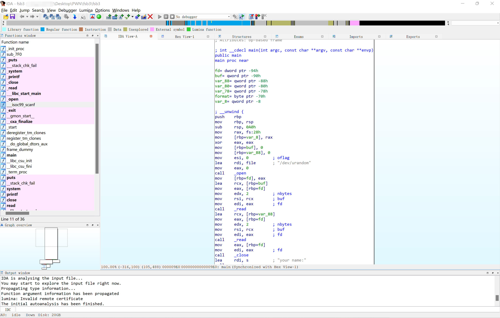
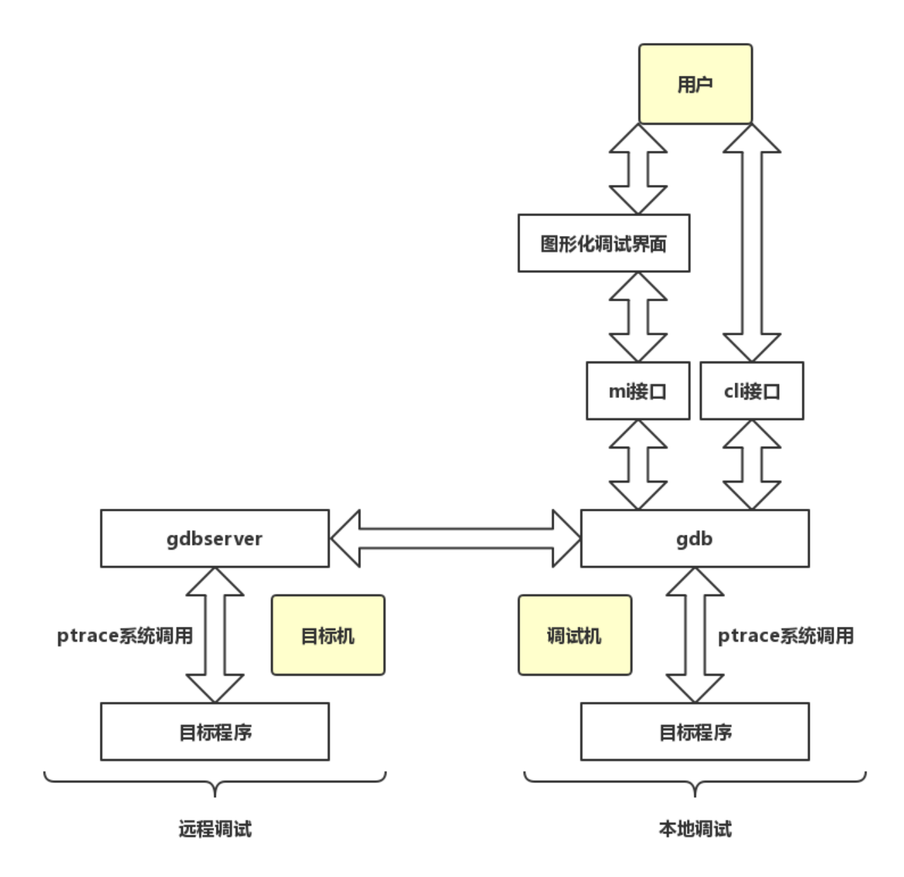

# PWN Tools | 分析工具

## 第 1 章 IDA Pro

### 1.1 主要介绍

IDA Pro 即专业交互式反编译器（Interactive Disassembler Professional），是 Hex-Rays 公司的商业产品，也是二进制研究人员的常用工具之一。

除 IDA Pro 外，功能类似的工具还有 Binary Ninja、JEB、Ghidra 等。

线性扫描和递归下降扫是两种主要的反汇编算法。GDB 采用的是线性扫描算法，而 IDA 采用的是递归下降算法，其主要优点是基于控制流，区分代码和数据的能力更强，很少会在反汇编过程中错误地将数据值作为代码处理。

#### 1.1.1 目录结构

IDA 的目录结构如下：

- cfg：包含各种配置文件，包括 IDA 基础配置文件 ida.cfg、GUI 配置文件 idagui.cfg 和文本模式用户界面配置文件 idatui.cfg。
- dbgsrv：包含远程调试的 server 端，包括 Android、macOS、Windows、Linux 等操作系统以及不同架构的调试器。
- idc：包含 IDA 内置脚本语言 idc 所需的核心文件。
- ids：包含一些符号文件（IDA 语法中的 IDS 文件），这些文件用于描述可被加载到 IDA 的二进制文件引用的共享库的内容。这些项目包含描述某个函数所需的参数类型和数量的信息、函数的返回类型（如果有）以及与该函数的调用约定有关的信息。
- loaders：包含在文件加载过程中用于识别和解析 PE/ELF 等已知文件格式的 IDA 扩展。
- platforms：包含 QT 的一个运行时库 qwindows.dll。
- plugins：插件安装目录。
- procs：包含所支持的处理器模块，提供了从机器语言到汇编语言的转换能力，并负责生成在 IDA 用户界面中显示的汇编代码。
- python：支持 64 位的 Python，包含 IDAPython 相关的库文件。
- sig：包含在各种模式匹配操作中利用的签名。通过模式匹配，IDA 能够将代码序列确定为已知的库代码，从而节省大量的分析时间。这些签名通过 IDA 的”快速的库识别和鉴定技术“（FLIRT）生成。
- til：包含一些类型库信息，记录了特定编译器库的数据结构。



#### 1.1.2 菜单结构

最上方为 IDA 菜单栏。IDA 的菜单结构如下：

- File：进行打开辅助脚本、导出 idc、创建档期那数据库快照等操作。
- Edit：修改 IDA 数据库，或者使用插件。
- Jump：跳转至指定位置。
- Search：搜索字符串、函数名等信息。
- View：打开不同的子窗口。
- Debugger：指定调试器来动态调试当前加载的可执行文件。
- Options：对 IDA 进行一些设置。
- Windows：调整当前显示的窗口。
- Help：打开帮助文件。

反汇编窗口也叫 IDA-View 窗口，有两种显示格式：默认的图形视图和面向文本的列表视图，使用快捷键”空格“进行切换。

函数的控制流图由许多个基本块构成，基本块之间用不同颜色的箭头连接：

- 蓝色箭头：执行下一个基本块。
- 红色箭头：跳转到判断条件为假的分支。
- 绿色箭头：跳转到判断条件为真的分支。

交叉引用是 IDA 最强大的功能之一，有两种类型：代码交叉引用和数据交叉引用。首先选择一个函数，使用交叉引用（快捷键 X）可以快速地找到该函数被调用的地方。同理，选择一个数据，也可以快速找到该数据被使用的位置。

点击 Options 菜单的 general 可以对显示的内容进行调整，例如 Line prefixes（graph）给控制流图加上地址，Auto comments 给指令加上注释。

#### 1.1.3 数据库文件

在 IDA 进行分析的过程中会创建一个数据库，其组件分别保存在 4 个文件中，这些文件的名称与可执行文件名相同，扩展名分别是 .id0、.id1、.nam、.til。

- .id0：是一个二叉树形式的数据库。
- .id1：包含了描述每个程序字节的标记。
- .nam：包含与 IDA 的 Names 窗口中显示的给定程序位置有关的索引信息。
- .til：用于存储一个给定数据库的本地类型定义有关的信息。

以上文件直到关闭 IDA 时才会让用户选择是否将其打包保存。32 位的 IDA 以 idb 格式保存数据库，64 位的 IDA以 i64 格式保存数据库。保存数据库时的选项含义如下：

- Don't pack database：不打包数据库。该选项仅仅刷新对 4 个数据库组件文件所做的更改，在关闭桌面前并不创建 IDB 文件。
- Pack database(Store)：打包数据库（存储）。该选项会将 4 个数据库组件文件存到一个 IDB 文件中。之前的任何 IDB 不经确认即被覆盖，另外，该选项不会进行压缩。
- Pack database(Deflate)：打包数据库（压缩）。该选项等同于 Store 选项，唯一的差别在于会进行压缩。
- Collect garbage：收集垃圾。勾选后 IDA 会在关闭数据库之前，从数据库中删除任何没有用的内存页。同时，如果选择 Deflate 选项，可以创建尽可能小的 IDB 文件。
- DON'T SAVE the database：不保存数据库。该选项不会保存数据库文件，有时这是撤销备份的唯一选择。注意，IDA 对数据库文件没有撤销操作，因此需要做好备份，并且谨慎操作，也可以使用 File 菜单的 take database snapshot 对数据库做快照。

### 1.2 基本使用

#### 1.2.1 函数修正

一般以 push ebp/rbp 指令开头的地址为一个函数的起始地址，但有时候 IDA 没有将其正确识别为函数，此时需要手动将其创建为函数。创建函数之后，通常就能对该函数进行反编译操作。

创建函数的方式为：在函数的起始地址的汇编代码处，点击右键，选择 Create Function，对应的快捷键为 P。

#### 1.2.2 指令修正

在 IDA 中，如果某些指令或者数据识别有误，可以进行手动修正。

在地址处使用快捷键 D 将其转换为数据，使用快捷键 C 将其转换为代码。

#### 1.2.3 数据修正

在数据段中，一个数据的长度可能为 1、2、4、8 字节，此时可以通过快捷键 D 来修改对应的类型。

如果数据段中的某个部分为一个字符串，但是 IDA 并没有正确识别，那么可以使用快捷键 A 将其转换为一个 ASCII 字符串。

#### 1.2.4 重命名

在使用 IDA 分析程序的时候，经常会修改程序中的变量名或者函数名等信息，点击右键，选择 Rename 即可进行重命名，快捷键为 N。

#### 1.2.5 二进制程序的 patch

选择菜单栏中的 Edit -> Patch program -> Change byte 功能进行修改。

### 1.3 远程调试

IDA Pro 是一个反汇编器，也是一个调试器，支持 Windows 32/64-bit、Linux 32/64-bit、OSX x86/x64、IOS、Android 等平台的本地或者远程调试。

远程调试是通过 TCP/IP 网络在本地机器上调试远程机器上的程序，因此需要两部分组件：

- 客户端：运行 IDA 的机器。
- 服务端：运行目标程序的机器。

以下为 IDA 自带的服务端程序，其他平台可以通过 gdbserver 进行扩展：

| File name          | Target system      | Debugged programs   |
| ------------------ | ------------------ | ------------------- |
| android_server     | ARM Android        | 32-bit ELF files    |
| android_server64   | AArch64 Android    | 64-bit ELF files    |
| android_x64_server | x86 Android 32-bit | 32-bit ELF files    |
| android_x86_server | x86 Android 64-bit | 64-bit ELF files    |
| armlinux_server    | ARM Linux          | 32-bit ELF files    |
| linux_server       | Linux 32-bit       | 32-bit ELF files    |
| linux_server64     | Linux 64-bit       | 64-bit ELF files    |
| mac_server         | Mac OS X           | 32-bit Mach-O files |
| mac_server64       | Mac OS X           | 64-bit Mach-O files |
| win32_remote.exe   | MS Windows 32-bit  | 32-bit PE files     |
| win64_remote64.exe | MS Windows 64-bit  | 64-bit PE files     |

#### 1.3.1 使用 IDA 的 Linux 服务端程序

将 linux_server64 复制到 Linux 中启动运行，默认在本地 23946 端口进行监听：

```
$ ./linux_server64 --help
IDA Linux 64-bit remote debug server(ST) v7.5.26. Hex-Rays (c) 2004-2020
Usage: linux_server64 [options]
  -p ...  (--port-number ...) Port number
  -i ...  (--ip-address ...) IP address to bind to (default to any)
  -s      (--use-tls) Use TLS
  -c ...  (--certchain-file ...) TLS certificate chain file
  -k ...  (--privkey-file ...) TLS private key file
  -v      (--verbose) Verbose mode
  -P ...  (--password ...) Password
  -k      (--on-broken-connection-keep-session) Keep debugger session alive when connection breaks
  -K      (--on-stop-kill-process) Kill debuggee when closing session
```

```
$ ./linux_server64 
IDA Linux 64-bit remote debug server(ST) v7.5.26. Hex-Rays (c) 2004-2020
Listening on 0.0.0.0:23946...
```

点击 IDA 的 Debugger 菜单栏，选择 Remote Linux debugger，在 Process options 窗口中输入服务端文件路径、IP、端口等信息。点击 Start Process 启动进程（点击 attach to process 则可以调试正在运行的进程），IDA 会自动将目标程序发送到服务端相同路径下运行，并触发断点，在 debug 模式主窗口可以看到程序指令、寄存器、共享库、线程以及栈等信息。

#### 1.3.2 使用 gdbserver

将目标程序绑定到 0.0.0.0:6666 端口，客户端设置同上。

```
$ gdbserver 0.0.0.0:6666 ./fsb
Process ./fsb created; pid = 3757
Listening on port 6666
```

```
$ gdbserver --multi 0.0.0.0:6666		# 不指定目标程序
$ gdbserver --multi 0.0.0.0:6666 --attach 3757		# 指定目标程序 PID
```

### 1.4 常用插件

对于 Windows 系统 IDA Pro 插件的安装，一般情况只需要把 dll/python 文件复制到 plugins 目录下即可，对于一些复杂的插件，按照官方文档安装。

- FRIEND：提供了指令和寄存器的文档查看功能。
- BinCAT：静态二进制代码分析工具包，通过追踪寄存器和内存值，可以进行污点分析、类型识别和传播、前后向切片分析等。
- BinDiff：用于二进制文件分析和对比，快速发现汇编代码的差异或相似之处，常用于分析 patch、病毒变种等。
- Keypatch：利用 keystone 框架修改二进制可执行文件。
- heap-viewer：漏洞利用开发辅助插件，主要关注 Linux glibc（ptmalloc2）的堆管理实现，辅助解决 CTF Pwn 题目。
- deREferencing：重写了 IDA 在调试时的寄存器和栈窗口，增加了指针解引用的数据显示，类似 GDB 插件 PEDA/GEF。
- IDArling：解决多个用户在同一个数据库上协同工作的问题。

### 1.5 快捷键

#### 1.5.1 常用操作

```
Ctrl+1：打开快捷菜单
Shift+F12：打开 Strings 窗口
Tab：在临近的窗口间切换
Esc：后退到上一个位置
Ctrl+Enter：前进到下一个位置
Ctrl+S：跳转到某一区段，例如 .got.plt
G：跳转到某一地址
F2：设置断点
F5：生成伪代码
F9：启动程序
/：反汇编窗口中注释
分号：汇编窗口中注释
Y：修改变量类型
N：修改变量名称
R：将数字转为 ASCII 码显示
H：将数字转化为十六进制显示
```

#### 1.5.2 窗口操作

- Strings 窗口：按 Shift+F12 组合键即可打开，可以识别程序中的字符串，双击即可在反汇编窗口中定位到目标字符串。
- 十六进制窗口：默认打开，可以按 F2 键对数据库中的数据进行修改，修改后再次按 F2 键即可应用修改。

#### 1.5.3 函数操作

- 删除函数：在函数窗口中选中函数后，按 Delete 键。
- 定义函数：在反汇编窗口中选中对应行后，按 P 键。
- 修改函数参数：在函数窗口中选中并按 Ctrl+E 组合键，或在反汇编窗口的函数内部按 Alt+P 组合键。

#### 1.5.4 导航操作

- 后退到上一位置：快捷键 Esc。
- 前进到下一位置：快捷键 Ctrl+Enter。
- 跳转到某一个特定位置：快捷键 G，然后可以输入地址/已经定义的名称。
- 跳转到某一区段：快捷键 Ctrl+S，然后选择区段即可。

#### 1.5.5 数据操作

##### 定义数据类型

- U（Undefine）键：取消一个地方已有的数据类型定义。
- D（Data）键：让某一个位置编程数据。
- C（Code）键：让某一个位置变成指令。
- A（ASCII）键：以该位置为起点定义一个以 `\0` 结尾的字符串类型。
- `*` 键：将此处定义为一个数组，此时弹出一个对话框，用来设置数组的属性。
- O（Offset）键：将此处定义为一个地址偏移。

##### 切换数据显示格式

- Hexadecimal：十六进制显示，快捷键为 `H` 键，可以将各种其他显示格式转换回数字。
- Octal：八进制表示。
- Char：将常量转换为形如 `A` 的形式，快捷键为 `R` 键。
- Enum：将常量转为枚举中的一个值，快捷键为 `M` 键。
- Invert sign：将常量按照补码解析为负数，快捷键为 `_` 键。
- Bitwise negate：将常量按位取反，形如 C 语言中的 `~0xF0`，快捷键为 `~` 键。

## 第 2 章  GDB

GDB 是 GNU 项目的调试器，是一个终端调试器，一般用于在 Linux 系统中动态调试程序。

### 2.1 组成架构

GDB 的组成架构如图硕士，主要通过 ptrace 系统调用实现，使用 cli 接口或者 mi 接口的图形化界面，可以对程序进行调试。

调试本地目标程序时直接使用本地 gdb，调试远程目标程序则需要使用 gdbserver。

注意，为了避免非预期错误，需要保持 gdbserver 和 gdb 版本一致，必要时手动编译一份。如果需要调试非 x86/x64 架构的程序（例如 arm），则需要安装 gdb-multiarch，并在启动后通过命令 `set architecture arm` 设置目标架构。



### 2.2 工作原理

GDB 通过 ptrace 系统调用来接管一个程序的执行。ptrace 系统调用提供了一种方法使得父进程可以观察和控制其他进程的执行，检查和改变其核心映像以及寄存器，主要用来实现断点调试和系统调用跟踪。

ptrace 系统调用同样被封装到 libc 中，使用时需要引入 ptrace.h 文件，通过传入一个请求参数和一个进程 ID 来调用。

#### 2.2.1 GDB 调试方式

GDB 三种调试方式如下。

方式一，运行并调试一个**新进程**：

- 运行GDB，通过命令行或 `file` 命令指定目标程序；
- 输入 `run` 命令，GDB 将执行以下操作：
  - 通过 `fork()` 系统调用创建一个新进程；
  - 在新创建的子进程中执行操作：`ptrace(PTRACE_TRACEME,0,0,0)`；
  - 在子进程中通过 `execv()` 系统调用加载用户指定的可执行文件。

方式二，attach 并调试一个**已经运行的进程**：

- 用户确定需要进行调试的进程 PID；
- 运行 GDB，输入 `attach <pid>`，对该进程执行操作：`ptrace(PTRACE_ATTACH,pid,0,0)`；

方式三，**远程调试**目标机上新创建的进程：

- gdb 运行在调试机上，gdbserver 运行在目标机上，两者之间的通信数据格式由 GDB 远程串行协议（Remote Serial Protocol）定义；
- RSP 协议数据的基本格式为：`$.........#xx`；
- gdbserver 的启动方式相当于运行并调试一个新创建的进程。

在将 GDB attach 到一个进程时，可能会出现 `Operation not permitted` 的问题，这是因为设置了内核参数 `ptrace_scope=1`（表示 True），此时普通用户进程是不能对其他进程进行 attach 操作的，可以用 root 权限启动 GDB，也可以修改参数：

```
$ cat /proc/sys/kernel/yama/ptrace_scope 
1

# echo 0 > /proc/sys/kernel/yama/ptrace_scope	# 临时修改

# cat /etc/sysctl.d/10-ptrace.conf 	# 永久修改
kernel.yama.ptrace_scope = 0
```

ptrace 不仅可以用于调试，也可以用于反调试。一种常见的方法是使用 ptrace 的 PTRACE_TRACEME 请求参数，让程序对自身进程进行追踪，由于同一进程同一时间只能被一个 tracer 追踪，所以当调试器试图将 ptrace 附加到该进程上时，就会报错 `Operation not permitted`。绕过方式：设置 LD_PRELOAD 环境变量，使程序加载一个假的 ptrace 命令。

#### 2.2.2 断点实现

硬件断点是通过硬件实现的，软件断点是通过内核信号实现的。

### 2.3 增强插件

GDB 启动时，会在当前用户的主目录中寻找一个名为 .gdbinit 的文件。

可选的 GDB 增强工具有 PEDA、gef 和 pwndbg 等。pwndbg 不可以和其他插件一起使用。

pwndbg 的安装：

```
git clone https://github.com/pwndbg/pwndbg
cd pwndbg
./setup.sh
```

### 2.4 基本指令（GDB）

#### break / b

```
break	#不带参数时，在所选栈帧中执行的下一条指令处下断点
break <function>	#在函数体入口处下断点
break <line>	#在当前源码文件指定行的开始处下断点
break -N break +N	#在当前源码行前面或后面的 N 行开始处下断点，N为正整数
break <file:line>	#在源码文件 file 的 line 行处下断点
break <file:function>	#在源码文件 file 的 function 函数入口处下断点
break <address>	#在程序指令地址处下断点
break ... if <cond>	#设置条件断点，...代表上述参数之一（或无参数），cond 为条件表达式，仅在 cond 值非零时断下程序
```

```
b *(0x123456)	#在程序指令地址 0x123456 处下断点
break fun if $rdi==5 #条件断点，rdi值为5的时候才断下程序
```

#### info / i

```
info breakpoints [list...] #查看断点，观察点和捕获点的列表
info break [list...]	# list...用来指定若干个断点的编号（可省略），可以是2、1-4、3 5等
info display	#打印自动显示的表达式列表，每个表达式都带有项目编号
info reg	#查看当前寄存器的信息
info threads	#打印所有线程的信息，包含 Thread ID、Target ID 和 Frame
info frame	#打印指定栈帧的详细信息
info proc	#查看 proc 里的进程信息
```

```
i b	#同 info breakpoints
i r #同 info reg
```

#### disable / dis

```
disable [breakpoints] [list...]	#禁用断点，不带参数时禁用所有断点；breakpoints 是 disable 的子命令（可省略）
```

#### enable 

```
enable [breakpoints] [list...]	#启用指定的断点（或所有定义的断点）
enable [breakpoints] once list...	#临时启用断点，这些断点在停止程序后会被禁用
enable [breakpoints] delete list...	#指定的断点启用一次，然后删除，一旦程序停止，GDB 就会删除这些断点，等效于用 tbreak 命令设置的临时断点
```

#### clear

```
clear	#清除指定行或函数处的断点。参数可以是行号、函数名称或 *address。不带参数时，清除所选栈帧在源码中的所有断点
clear <function>	#清除 file 的 function 入口处设置的任何断点
clear <file:function>	#清除 file 的 function 入口处设置的任何断点
clear <line>	#清除 file 的 line 代码中设置的任何断点
clear <file:line>	#清除 file 的 line 代码中设置的任何断点
clear <address>	#清除程序指令地址处的断点
```

#### delete / d

```
delete [breakpoints] [list...]	#删除断点，不带参数时删除所有断点
```

#### watch

```
watch [-l|-location] <expr>	#对 expr 设置观察点，每当表达式的值改变时，程序就会停止；此外，rwatch 命令用于在访问时停止，awatch 命令用于在访问和改变时都停止
```

#### step / s / si

```
step [N]	#单步步进，参数 N 表示执行 N 次（或直到程序停止）；此外，reverse-step [N] 用于反向步进
```

```
s	#源码层面
si	#汇编层面
```

#### next / n / ni

```
next [N]	#单步步过，与 step 不同，当调用子程序时，此命令不会进入子程序，而是将其视为单个源代码执行；everse-next [N] 用于反向步过
```

```
n	#源码层面
ni	#汇编层面
```

#### return

```
return <expr>	#取消函数调用的执行，将 expr 作为函数返回值并使函数直接返回
```

#### finish / fin

```
finish	#执行程序直到指定的栈帧返回
```

#### until / u

```
until <location>	#执行程序直到大于当前栈帧或当前栈帧中的指定位置的源码行。此命令常用于快速通过一个循环，以避免单步执行
```

#### continue / c

```
continue [N]	#在信号或断点之后，继续运行被调试程序。如果从断点开始，可以使用数字 N 作为参数，这意味着将该断点的忽略计数设置为 N-1（以便断点在第 N 次到达之前不会中断）
```

#### print / p

```
print <function>	#打印 function 的地址
print [expr]	#求表达式 expr 的值并打印。可访问的变量是所选栈帧，以及范围为全局或整个文件的所有变量
print /f [expr]	#通过指定 /f 来选择不同的打印格式，其中 f 是一个指定格式的字母
```

```
p &a #查看变量 a 的地址
p *(0x123456) #查看 0x123456 地址的值
p $rdi #显示 rdi 寄存器的值
p *($rdi) #显示rdi指向的值
```

#### x

```
x/nfu <addr>	#查看内存，n、f、u 都是可选参数，用于指定要查看的内存以及如何格式化，addr 是起始地址的表达式
```

```
# n、f、u 参数含义
n：重复次数（默认值为 1），指定要查看多少个单位（由 u 指定）的内存值；
f：显示格式（初始默认值是 x），显示格式是 print('x','d','u','o','t','a','c','f','s')使用的格式之一，再加 i（机器指令）；
u：单位大小，b 表示单字节，h 表示双字节，w 表示四字节，g 表示八字节。
```

```
x /10gx 0x123456 #从 0x123456 开始每个单元八个字节，十六进制显示 10 个单元的数据
x /10xd $rdi #从 rdi 指向的地址向后打印 10 个单元，每个单元 4 字节的十进制数
x /10i 0x123456 #从 0x123456 处向后显示 10 条汇编指令
```

#### disassemble / disas

```
disas <func>	#反汇编指定函数
disas /r <addr>	#反汇编某地址所在函数，/r 显示机器码
disas <begin_addr> <end_addr>	#反汇编从开始地址到结束地址的部分
```

#### display

```
display/fmt <expr> | <addr>	#每次程序停止时打印表达式 expr 或者内存地址 addr 的值。fmt 用于指定显示格式；此外，undisplay 用于取消打印。
```

#### help / h

```
help <class>	#获取该类中某个命令的列表
help <command>	#获取某命令的帮助信息
```

#### attach

```
attach <pid>	#attach 到 GDB 以外的进程或文件。将进程 ID 或设备文件作为参数
```

#### run / r

```
run	#启动被调试程序。可以直接指定参数，也可以用 set args 设置（启动所需的）参数。还可以使用 > < >> 进行输入输出的重定向
```

#### backtrace / bt

```
bt	#打印整个栈的回溯，每个栈帧一行
bt N	#只打印最内层的 N 个栈帧
bt -N	#只打印最外层的 N 个栈帧
bt full N	类似于 bt N，增加打印局部变量的值
```

#### thread apply all bt

打印出所有线程的堆栈信息。

#### generate-core-file

将调试中的进程生成内核转储文件。

#### directory / dir

设置查找源文件的路径，或者使用 GDB 的 -d 选项，例如：

```
gdb a.out -d /search/code/
```

### 2.5 常用指令（GDB+pwndbg）

指令详细介绍查看 **2.4 基本指令（GDB）**。

#### 2.5.1 基本指令

```
help	#帮助
pwndbg -all #查看 pwndbg 所有命令
pwndbg heap	#查看 heap 相关所有命令
```

```
q	#quit，退出
```

```
i b	#info break，查看所有断点信息
i r #info reg，查看寄存器当前值
i f	#info function，查看所有函数名，需保留符号
```

```
show	#查看调试器基本信息
```

```
backtrace	#查看调用栈
```

#### 2.5.2 执行指令

```
s	#单步步入（源码层面）
si	#单步步入（汇编层面）
```

```
n	#单步步过（源码层面）
ni	#单步步过（汇编层面）
```

```
c	#continue，继续执行到断点
```

```
r	#run，重新开始执行
```

#### 2.5.3 断点指令

##### 设置断点

```
b *(0x123456) # 给 0x123456 地址处的指令下断点
b *$ rebase(0x123456) #$rebase 在调试开 PIE 的程序的时候可以直接加上程序的随机地址
b <function> #给函数 function 下断点，目标文件需保留符号
b <file:function>
b <file>:15 #给 file 的 15 行下断点，需源码
b +0x10 #在程序当前停住的位置后 0x10 下断点，同样可以 -0x10 ，就是前 0x10
break fun if $rdi==5 #条件断点，rdi 值为 5 的时候才断
```

##### 删除/禁用断点

```
i b	#info break，查看断点编号
```

```
delete	#删除所有断点
delete 5	#删除 5 号断点
```

```
disable 5	#禁用 5 号断点
enable 5	#启用 5 号断点
```

```
clear	#清除所有断点
```

##### 内存断点 watch

```
watch 0x123456 #0x123456 地址的数据改变的时候中断
watch a #变量 a 改变的时候中断
info watchpoints #查看 watch 断点信息
```

##### 捕获断点 catch

```
catch syscall #syscall 系统调用的时候中断
tcatch syscall #syscall 系统调用的时候中断，只断一次
info break #catch 的断点可以通过 i b 查看
```

除了 syscall 之外，还可以使用：

```
throw: 抛出异常
catch: 捕获异常
exec: exec被调用
fork: fork被调用
vfork: vfork被调用
load: 加载动态库
load libname: 加载名为 libname 的动态库
unload: 卸载动态库
unload libname: 卸载名为 libname 的动态库
syscall [args]: 调用系统调用，args 可以指定系统调用号，或者系统名称
```

#### 2.5.4 打印指令

##### 查看内存 

```
x /10gx 0x123456 #从 0x123456 开始每个单元八个字节，十六进制显示 10 个单元的数据
x /10xd $rdi #从 rdi 指向的地址向后打印 10 个单元，每个单元 4 字节的十进制数
x /10i 0x123456 #从 0x123456 处向后显示 10 条汇编指令
```

参数如下：

```
x：按十六进制格式显示变量
d：按十进制格式显示变量
u：按十六进制格式显示无符号整型
o：按八进制格式显示变量
t：按二进制格式显示变量
a：按十六进制格式显示变量
c：按字符格式显示变量
f：按浮点数格式显示变量
s：按字符串显示
b：按字符显示
i：显示汇编指令
```

##### 打印指令

```
p <function> #打印 function 的地址，需要保留符号
p 0x10-0x08 #计算 0x10-0x08 的结果
p &a #查看变量 a 的地址
p *(0x123456) #查看 0x123456 地址的值，注意和 x 指令的区别，x 指令查看地址的值不用星号
p $rdi #显示 rdi 寄存器的值，而不是rdi指向的值
p *($rdi) #显示 rdi 指向的值
```

##### 打印汇编指令

```
disass 0x123456 #显示 0x123456 前后的汇编指令
```

#### 2.5.5 修改和查找指令

##### 修改数据

```
set $rdi=0x10 #把rdi寄存器的值变为 0x10
set *(0x123456)=0x10 #0x123456 地址的值变为 0x10
```

##### 查找数据

```
search flag #从当前位置向后查包含 flag 字符的指令
```

```
ropgadget #查找 ropgadget（pwndbg only）
```

#### 2.5.6 栈操作指令

##### 查看栈信息

```
stack 20
```

#### 2.5.7 堆操作指令

##### 查看堆信息

```
arena	#打印 arena 基本信息
arenas #显示所有 arena 的列表
```

```
bins	#查看所有种类的堆块的链表情况
fastbins #单独查看fastbins的链表情况
largebins #单独查看largebins的链表情况
smallbins #单独查看smallbins的链表情况
unsortedbin #单独查看unsortedbin链表情况
tcachebins #同上，单独查看tcachebins的链表情况
tcache #查看tcache详细信息
```

```
heap #显示所有堆块
```

#### 2.5.7 pwndbg独有指令

##### 查看溢出大小

```
cyclic 200	#生成200个字符
cyclic -l 0x12345678	#根据 Invalid address 错误地址，查看溢出大小
```

##### 查看 plt/got 表

```
plt
```

```
got
```

## 第 3 章 Pwntools

Pwntools 是一个 CTF 框架和漏洞利用开发库，拥有本地执行、远程连接读写、shellcode 生成、ROP 链构建、ELF 解析、符号泄露等功能。

Pwntools 作为一个 pip 包进行安装，分为两个模块，一个是 pwn，简单使用 `from pwn import *` 即可将所有子模块和一些常用的系统库导入当前命名空间中，是专门针对 CTF 比赛优化的；另一个模块是 pwnlib，更适合根据需要导入子模块，常用于基于 Pwntools 的二次开发。

Pwntools 的一些常用子模块：

- pwnlib.tubes：与 sockets、processes、ssh 等进行连接；
- pwnlib.context：设置运行时变量；
- pwnlib.elf：操作 ELF 可执行文件和共享库；
- pwnlib.asm：汇编和反汇编，支持 i386/i686/amd64/thumb 等；
- pwnlib.shellcraft：shellcode 生成器；
- pwnlib.gdb：调试，与 GDB 配合使用；
- pwnlib.dynelf：利用远程信息泄露远程解析函数；
- pwnlib.fmtstr：格式化字符串利用工具；
- pwnlib.rop：ROP 利用工具，包括 rop、srop 等；
- pwnlib.util：一些使用小工具。

### 3.1 pwnlib 模块

- 所有示例基于 python3，ubuntu 16.04

#### pwnlib.tubes

pwnlib.tubes 模块用于与目标文件或者目标服务器进行交互。

```
# 进程
p = process("/bin/sh")	
```

```
# 套接字
l = remote("127.0.0.1",1080)
l = listen(1080)
```

```
# SSH
s = ssh(host="example.com",user="username",password="passwd")
```

常用函数如下：

```
interactive()	# 交互模式，能够同时读写管道，通常在获得 shell 之后调用
```

```
recv(numb=1096,timeout=default)	# 接收最多 numb 字节的数据
recv(numb,timeout=default)	# 接收 numb 字节的数据
recvall()	# 接收数据直到 EOF
recvline(keepends=True)	# 接收一行，可选择是否保留行尾的 \n
recvrepeat(timeout=default)	# 接收数据直到 EOF 或 timeout
recvuntil(delims,timeout=default)	# 接收数据直到 delims 出现
```

```
send(data)	# 发送数据
sendafter(delims,timeout=default)	# 相当于recvuntil(delims,timeout)和send(data)的组合
sendline(data)	# 发送一行，默认在行尾加 \n
sendlineafter(delims,data,timeout=default)	# 相当于recvuntil(delims,timeout)和sendline(data)的组合
```

```
close()	#关闭管道
```

##### 示例：端口交互

```python
In [1]: from pwn import *

In [2]: l = listen()
[x] Trying to bind to :: on port 0
[x] Trying to bind to :: on port 0: Trying ::
[+] Trying to bind to :: on port 0: Done
[x] Waiting for connections on :::46495

In [4]: r = remote("localhost", l.lport)
[x] Opening connection to localhost on port 46495
[x] Opening connection to localhost on port 46495: Trying 127.0.0.1
[+] Waiting for connections on :::46495: Got connection from ::ffff:127.0.0.1 on port 55728
[+] Opening connection to localhost on port 46495: Done

In [5]: c = l.wait_for_connection()

In [6]: r.send("hello\n")
  r.send("hello\n")

In [7]: c.recv()
Out[7]: b'hello\n'

In [8]: r.sendline("hello")
  r.sendline("hello")

In [9]: c.recvline()
Out[9]: b'hello\n'

In [10]: r.send("hello world")
  r.send("hello world")

In [11]: c.recvuntil("hello")
  c.recvuntil("hello")
Out[11]: b'hello'

In [12]: c.recv()
Out[12]: b' world'
```

##### 示例：进程交互

```python
In [1]: from pwn import *

In [2]: p = process("/bin/sh")
[x] Starting local process '/bin/sh'
[+] Starting local process '/bin/sh': pid 10040

In [3]: p.sendline("sleep 3; echo hello world;")
  p.sendline("sleep 3; echo hello world;")

In [4]: p.recvline(timeout=5)
Out[4]: b'hello world\n'

In [6]: p.interactive()
[*] Switching to interactive mode
whoami
ubuntu

In [7]: p.close()
```

#### pwnlib.context

pwnlib.context 模块用于设置运行时变量，例如目标系统、目标体系结构、端序、日志等。

##### 示例：设置运行时变量

```python
In [1]: from pwn import *

In [2]: context.clear()	# 恢复默认值

In [3]: context.os = "linux"

In [4]: context.arch = "arm"

In [5]: context.bits = 32

In [6]: context.endian = "little"

In [7]: vars(context)
Out[7]: 
{'cache_dir': '/home/ubuntu/.cache/.pwntools-cache-3.8',
 'os': 'linux',
 'endian': 'little',
 'bits': 32,
 'arch': 'arm'}

In [8]: context.update(os="linux", arch="amd64", bits=64)	# 更新

In [9]: context.log_level = "debug"	# 日志等级

In [10]: context.log_file = "/tmp/pwnlog.txt"	# 日志文件

In [11]: vars(context)
Out[11]: 
{'cache_dir': '/home/ubuntu/.cache/.pwntools-cache-3.8',
 'os': 'linux',
 'endian': 'little',
 'bits': 64,
 'arch': 'amd64',
 'log_level': 10,
 'log_file': <_io.TextIOWrapper name='/tmp/pwnlog.txt' mode='a' encoding='UTF-8'>}
```

#### pwnlib.elf

pwnlib.elf 模块用于操作 ELF 文件，包括符号查找、虚拟内存、文件偏移，以及修改和保存二进制文件等功能。

常用函数如下：

```
asm(address, assembly)	# 汇编指令 assembly 并将其插入 ELF 的 address 地址处，需要使用 ELF.save() 函数来保存
bss(offset)	# 返回 .bss 段加上 offset 后的地址
checksec()	# 查看文件开启的安全保护
disable_nx()	# 关闭 NX
disasm(address, n_bytes)	# 返回对地址 address 反汇编 n 字节的字符串
offset_to_vaddr(offset)	# 将偏移 offset 转换为虚拟地址
vaddr_to_offset(address)	# 将虚拟地址 address 转换为文件偏移
read(address, count)	# 从虚拟地址 address 读取 count 个字节的数据
write(address, data)	# 在虚拟地址 address 写入 data
section(name)	# 获取 name 段的数据
debug()	# 使用gdb.debug() 进行调试
```

#### pwnlib.asm

pwnlib.asm 模块用于汇编和反汇编代码，需要安装对应体系结构的 binutils。

汇编模块 pwnlib.asm.asm 如下：

```
In [1]: from pwn import *

In [2]: asm("nop")
Out[2]: b'\x90'

In [4]: asm(shellcraft.nop())
Out[4]: b'\x90'

In [6]: asm("mov eax,1")
Out[6]: b'\xb8\x01\x00\x00\x00'
```

反汇编模块 pwnlib.asm.disasm 如下：

```
In [1]: from pwn import *

In [2]: print(disasm(b"\xb8\x01\x00\x00\x00"))
   0:   b8 01 00 00 00          mov    eax, 0x1
```

python3 中需要引入 codecs 模块：

```
In [5]: import codecs

In [7]: print(disasm(codecs.decode('6a0258cd80ebf9', 'hex')))
   0:   6a 02                   push   0x2
   2:   58                      pop    eax
   3:   cd 80                   int    0x80
   5:   eb f9                   jmp    0x0
```

##### 示例：构建 ELF 文件

构建具有二进制数据的 ELF 文件（pwnlib.asm.make_elf）：

```
In [8]: context.clear(arch="amd64")

In [9]: bin_sh = asm(shellcraft.amd64.linux.sh())

In [10]: filename = make_elf(bin_sh, extract=False)

In [11]: p = process(filename)
[x] Starting local process '/tmp/pwn-asm-iupzvp_a/step3-elf'
[+] Starting local process '/tmp/pwn-asm-iupzvp_a/step3-elf': pid 11682

In [12]: p.sendline("echo hello")
  p.sendline("echo hello")

In [13]: p.recv()
Out[13]: b'hello\n'
```

另一个函数 `pwnlib.asm.make_elf_from_assembly()` 则允许构建具有指定汇编代码的 ELF 文件，与 `make_elf()`不同，`make_elf_from_assembly()`直接从汇编文件生成 ELF 文件，并保留所有符号，例如标签和局部变量等。

```
In [14]: asm_sh = shellcraft.amd64.linux.sh()

In [15]: filename = make_elf_from_assembly(asm_sh)

In [16]: p = process(filename)
[x] Starting local process '/tmp/pwn-asm-ktudpgf3/step3'
[+] Starting local process '/tmp/pwn-asm-ktudpgf3/step3': pid 11719

In [17]: p.sendline("echo hello")
  p.sendline("echo hello")

In [18]: p.recv()
Out[18]: b'hello\n'
```

#### pwnlib.shellcraft

pwnlib.shellcraft 模块可以生成各种体系结构（aarch64、amd64、arm、i386、mips、thumb 等）的 shellcode 代码。

```
In [20]: print(shellcraft.amd64.linux.sh())
    /* execve(path='/bin///sh', argv=['sh'], envp=0) */
    /* push b'/bin///sh\x00' */
    push 0x68
    mov rax, 0x732f2f2f6e69622f
    push rax
    mov rdi, rsp
    /* push argument array ['sh\x00'] */
    /* push b'sh\x00' */
    push 0x1010101 ^ 0x6873
    xor dword ptr [rsp], 0x1010101
    xor esi, esi /* 0 */
    push rsi /* null terminate */
    push 8
    pop rsi
    add rsi, rsp
    push rsi /* 'sh\x00' */
    mov rsi, rsp
    xor edx, edx /* 0 */
    /* call execve() */
    push SYS_execve /* 0x3b */
    pop rax
    syscall
```

#### pwnlib.gdb

pwnlib.gdb 模块提供 GDB 动态调试支持，两个常用函数：

```
gdb.attach(target, gdbscript=None)	# 在一个新终端打开 GDB 并 attach 到指定 PID 的进程，或者一个 pwnlib.tubes 对象，可以使用 ps -aux 查看进程 PID
gdb.debug(args, gdbscript=None)	# 在新终端中使用 GDB 加载一个二进制文件
```

##### 示例：GDB 动态调试支持

```
In [21]: gdb.attach(11919)
[*] running in new terminal: ['/usr/local/bin/gdb', '-q', '/home/ubuntu/Desktop/PWN/rop', '11919']
[x] Waiting for debugger
[+] Waiting for debugger: Done
Out[21]: 11980
```

#### pwnlib.dynelf

pwnlib.dynelf 模块用来应对无 libc 情况下的漏洞利用。它首先找到 libc 的基地址，然后使用符号表和字符串表对所有符号进行解析，直到找到我们需要的函数的符号。

#### pwnlib.fmtstr

pwnlib.fmtstr 模块用于格式化字符串漏洞的利用。

#### pwnlib.rop

pwnlib.rop 模块分为两个子模块：

- pwnlib.rop.rop：普通 rop 模块，可以辅助构建 ROP 链。
- pwnlib.rop.srop：提供了针对 SROP 的利用能力。

> SROP 与 ROP 类似，通过一个简单的栈溢出，覆盖返回地址并执行 gadgets 控制执行流。不同的是，SROP 使用能够调用 sigreturn 的 gadget 覆盖返回地址，并将一个伪造的 sigcontext 结构体放到栈中。

##### 示例：查看 ROP 栈

```
In [26]: context.clear(arch="amd64")

In [28]: assembly = "pop rdx; pop rdi; pop rsi; add rsp,0x20; ret; target:ret"

In [29]: binary = ELF.from_assembly(assembly)
[*] '/tmp/pwn-asm-9d0rc3sm/step3'
    Arch:     amd64-64-little
    RELRO:    No RELRO
    Stack:    No canary found
    NX:       NX disabled
    PIE:      No PIE (0x10000000)
    RWX:      Has RWX segments

In [30]: rop = ROP(binary)
[*] Loading gadgets for '/tmp/pwn-asm-9d0rc3sm/step3'

In [31]: rop.target(1,2,3)

In [32]: print(rop.dump())
0x0000:       0x10000000 pop rdx; pop rdi; pop rsi; add rsp, 0x20; ret
0x0008:              0x3 [arg2] rdx = 3
0x0010:              0x1 [arg0] rdi = 1
0x0018:              0x2 [arg1] rsi = 2
0x0020:      b'iaaajaaa' <pad 0x20>
0x0028:      b'kaaalaaa' <pad 0x18>
0x0030:      b'maaanaaa' <pad 0x10>
0x0038:      b'oaaapaaa' <pad 0x8>
0x0040:       0x10000008 target
```

#### pwnlib.util

pwnlib.util 是模块的集合，包括了一些实用小工具，此处介绍两个，分别是 packing 和 cyclic。

packing 模块用于将整数打包和解包。使用 p32()、p64()、u32() 和 u64() 函数可以分别对 32 位和 64 位整数打包和解包，也可以使用 pack() 函数自己定义长度，添加参数 endian 和 signed 设置端序以及是否带符号。

-  p32()、p64()：将数字转换为字符。
-  u32()、u64()：将字符转换为数字。

```
# python2

In [1]: from pwn import *

In [2]: p32(0xdeadbeef)
Out[2]: '\xef\xbe\xad\xde'

In [3]: p32(0xdeadbeef).encode("hex")
Out[3]: 'efbeadde'

In [4]: p64(0xdeadbeef).encode("hex")
Out[4]: 'efbeadde00000000'

In [5]: p32(0xdeadbeef, endian="big", sign="unsigned")
Out[5]: '\xde\xad\xbe\xef'

In [6]: u32("1234")
Out[6]: 875770417

In [7]: u32("1234", endian="big", sign="signed")
Out[7]: 825373492

In [8]: u32("\xef\xbe\xad\xde")
Out[8]: 3735928559
```

cyclic 模块在缓冲区溢出中用于帮助生成模式字符串（de Bruijn 序列），也可以查找偏移，以确定返回地址。

```
In [9]: cyclic(20)
Out[9]: 'aaaabaaacaaadaaaeaaa'

In [10]: cyclic_find(0x61616162)
Out[10]: 4
```

