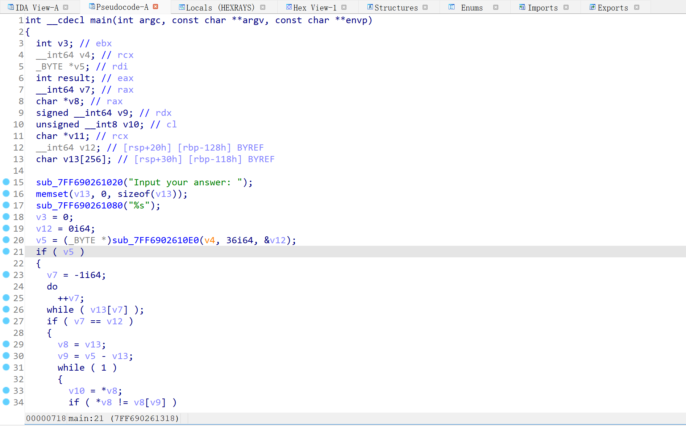

# Assembly-Language | 汇编语言

## 第 1 章 基础知识

### 1.1 机器语言

机器语言是机器指令的集合。机器指令展开来讲就是一台机器可以正确执行的命令。电子计算机的机器指令是一列二进制数字。计算机将之转变为一系列高低电平，以使计算机的电子器件受到驱动，进行运算。

早期的程序设计均使用机器语言。程序员们将用 0、1 数字编成的程序代码打在纸带或卡片上，1 打孔，0 不打孔，再将程序通过纸带机或卡片机输入计算机，进行运算。

### 1.2 汇编语言

汇编语言发展至今，有以下 3 类指令组成：

1. 汇编指令：机器码的助记符，有对应的机器码。
2. 伪指令：没有对应的机器码，由编译器执行，计算机并不执行。
3. 其他符号：如`+`、`-`、`*`、`/`等，由编译器识别，没有对应的机器码。

### 1.3 指令和数据

指令和数据是应用上的概念。在内存或磁盘上，指令和数据没有任何区别，都是二进制信息。CPU 在工作的时候把有的信息看作指令，有的信息看作数据，为同样的信息赋予了不同的意义。

例如，内存中的二进制信息 1000100111011000，计算机可以把它看作大小为 89D8H 的数据来处理，也可以将其看作指令 mov ax,bx 来执行。

```
1000100111011000	->	89D8H （数据）
1000100111011000	->	mov ax,bx（程序）
```

### 1.4 存储单元

8 个 bit 组成一个 Byte，即一个字节。微型机存储器的存储单元可以存储一个 Byte，即 8 个二进制位。

一个存储器有 128 个存储单元，它可以存储 128 个 Byte。

1KB=1024B		1MB=1024KB 

### 1.5 CPU 对存储器的读写

CPU 要进行数据的读写，需要和外部器件（芯片）进行下面 3 类信息的交互：

- 存储单元的地址（地址信息）
- 器件的选择，读或写的命令（控制信息）
- 读或写的数据（数据信息）

### 1.6 总线

地址总线的宽度决定了 CPU 的寻址能力。地址总线上能传送多少个不同的信息，CPU 就可以对多少个存储单元进行寻址。

数据总线的宽度决定了 CPU 与其他器件进行数据传送时的一次数据传送量。8 根数据总线一次可以传送一个 8 位二进制数据（一个字节）。

控制总线的宽度决定了 CPU 对系统中其他器件的控制能力。有多少根控制总线，就意味着 CPU 提供了对外部器件的多少种控制。

### 1.7 存储器芯片

随机存储器（RAM）：可读可写，带电存储，关机后存储的内容丢失。

只读存储器（ROM）：只读不写，关机后内容不丢失。

## 第 2 章 寄存器

一个典型的 CPU 由运算器、控制器、寄存器等器件构成，这些器件靠内部总线相连。

内部总线实现 CPU 内部各个器件之间的联系，外部总线实现CPU和主板上其他器件之间的联系。

### 2.1 通用寄存器

8086CPU（x86架构）的所有寄存器都是16位的，可以存放两个字节。

AX、BX、CX、DX 这4个寄存器通常用来存放一般性的数据，被称为通用寄存器。

这 4 个寄存器可分为两个独立使用的 8 位寄存器：

- AX 可分为 AH 和 AL；
- BX 可分为 BH 和 BL；
- CX 可分为 CH 和CL；
- DX 可分为 DH 和 DL；

例如，AX 的低 8 位（0 位\~7 位）构成了 AL 寄存器，高 8 位（8 位\~15 位）构成了 AH 寄存器。AH 和 AL寄存器是可以独立使用的 8 位寄存器。

| 寄存器 | 寄存器中的数据  | 所表示的值   |
| ------ | --------------- | ------------ |
| AX     | 100111000100000 | 20000(4E20H) |
| AH     | 01001110        | 78(4EH)      |
| AL     | 00100000        | 32(20H)      |

### 2.2 字在寄存器中的存储

出于对兼容性的考虑，8086CPU 可以一次性处理以下两种尺寸的数据：

- 字节：byte，一个字节 = 8个bit，可以存在 8 位寄存器中。
- 字：word，一个字 = 两个字节，分别称为这个字的高位字节和低位字节。


可用 3 种不同的进制表示图中 AX 里的数据：

- 十进制：20000
- 十六进制：4E20H
- 二进制：0100111000100000B

十六进制数的一位相当于二进制数的四位，如 0100111000100000 可表示成：4(0100)、E(1110)、2(0010)、0000(0000)四位十六进制数。

一个数据的十六进制形式左移 1 位，相当于乘以 16；一个数据的十进制形式左移 1 位，相当于乘以 10；一个 X 进制的数据左移 1 位，相当于乘以 X。

### 2.3 几条汇编指令

示例一：

| 汇编指令  | 控制 CPU 完成的操作                      | 用高级语言的语法描述 |
| --------- | ---------------------------------------- | -------------------- |
| mov ax,18 | 将 18 送入寄存器 AX                      | AX=18                |
| mov ah,78 | 将 78 送入寄存器 AH                      | AH=78                |
| add ax,8  | 将寄存器 AX 中的数值加上 8               | AX=AX+8              |
| mov ax,bx | 将寄存器 BX 中的数据送入寄存器 AX        | AX=BX                |
| add ax,bx | 将 AX 和 BX 中的数值相加，结果存在 AX 中 | AX=AX+BX             |

示例二：

原 AX 中的值：0000H，原 BX 中的值：0000H

| 程序段中的指令 | 指令执行后 AX 中的数据 | 指令执行后 BX 中的数据 |
| -------------- | ---------------------- | ---------------------- |
| mov ax,4E20H   | 4E20H                  | 0000H                  |
| add ax,1406H   | 6226H                  | 0000H                  |
| mov bx,2000H   | 6226H                  | 2000H                  |
| add ax,bx      | 8226H                  | 2000H                  |
| mov bx,ax      | 8226H                  | 8226H                  |
| add ax,bx      | 044CH                  | 8226H                  |

示例三：

原 AX 中的值：0000H，原 BX 中的值：0000H

| 程序段中的指令 | 指令执行后 AX 中的数据 | 指令执行后 BX 中的数据 |
| -------------- | ---------------------- | ---------------------- |
| mov ax,001AH   | 001AH                  | 0000H                  |
| mov bx,0026H   | 001AH                  | 0026H                  |
| add al,bl      | 0040H                  | 0026H                  |
| add ah,bl      | 2640H                  | 0026H                  |
| add bh,al      | 2640H                  | 4026H                  |
| mov ah,0       | 0040H                  | 4026H                  |
| add al,85H     | 00C5H                  | 4026H                  |
| add al,93H     | 0158H                  | 4026H                  |

示例四：

| 程序段中的指令 | 指令执行后相关寄存器中的数据 |
| -------------- | ---------------------------- |
| mov ax,62627   | AX=F4A3H                     |
| mov ah,31H     | AX=31A3H                     |
| mov al,23H     | AX=3123H                     |
| add ax,ax      | AX=6246H                     |
| mov bx,826CH   | BX=826CH                     |
| mov cx,ax      | CX=6246H                     |
| mov ax,bx      | AX=826CH                     |
| add ax,bx      | AX=04D8H                     |
| mov al,bh      | AX=0482H                     |
| mov ah, bl     | AX=6C82H                     |
| add ah,ah      | AX=D882H                     |
| add al,6       | AX=D888H                     |
| add al,al      | AX=D810H                     |
| mov ax,cx      | AX=6246H                     |

### 2.4 物理地址

CPU 访问内存单元时，要给出内存单元的地址。所有的内存单元构成的存储空间是一个一维的线性空间，每一个内存单元在这个空间中都有唯一的地址，这个唯一的地址被称为物理地址。

CPU 通过地址总线送入存储器的，必须是一个内存单元的物理地址。在 CPU 向地址总线上发出物理地址之前，不需要再内部先形成这个物理地址。

地址加法器采用 **物理地址=段地址×16+偏移地址**的方法合成物理地址。段地址×16 可以看作是基础地址，即**物理地址=基础地址+偏移地址**。

示例一：

段地址 1230H，偏移地址 00C8H，则：

物理地址=段地址×16+偏移地址= 12300H + 00C8H = 123C8H

CPU 可以用不同的段地址和偏移地址形成同一个物理地址。例如，CPU 要访问 21F60H 单元，则它给出的段地址 SA 和偏移地址 EA 满足 SA×16+EA = 21F60H 即可。

示例二：

| 物理地址 | 段地址 | 偏移地址 |
| -------- | ------ | -------- |
| 21F60H   | 2000H  | 1F60H    |
|          | 2100H  | 0F60H    |
|          | 21F0H  | 0060H    |
|          | 21F6H  | 0000H    |
|          | 1F00H  | 2F60H    |

### 2.5 段寄存器

8086CPU 有 4 个段寄存器：CS、DS、SS、ES。当 8086CPU 要访问内存时，这 4 个段寄存器提供内存单元的段地址。

CS 和 IP 是8086CPU 中两个最关键的寄存器，指示了 CPU 当前要读取指令的地址。CS 为代码寄存器，IP 为指令寄存器。在 8086PC 机中，任意时刻，设 CS 中的内容为 M，IP 中的内容为 N，8086CPU 将从内存 M×16+N 单元开始，读取一条指令并执行，即 CPU 将CS:IP 指向的内容当作指令执行。

mov 指令被称作传送指令，mov 指令不能用于设置 CS、IP 的值。转移指令可以改变 CS、IP 的内容，jmp 指令是最简单的偏移指令。

若想同时修改 CS、IP 的内容，使用 `jmp 段地址:偏移地址` 指令，功能为：从指令中给出的段地址修改 CS，偏移地址修改 IP。

若想只修改 IP 的内容，使用 `jmp 某一合法寄存器` 指令，功能为：用寄存器中的值修改 IP。

示例一：

jmp 2AE3:3，执行后：CS=2AE3H，IP=0003H，CPU 将从 2AE33H 处读取指令。

jmp ax，执行前：ax=1000H，CS=2000H，IP=0003H，执行后：ax=1000H，CS=2000H，IP=1000H。

示例二：

将一段代码存放在 123B0H~123B9H 内存单元中，将其定义为代码段，如果要让这段代码得到执行，可以设 CS=123BH、IP=0000H。

## 第3章 寄存器（内存访问）

### 3.1 内存中字的存储

CPU 中，用 16 位寄存器来存储一个字。高 8 位存放高位字节，低 8 位存放低位字节。图中用 0、1 两个内存单元存放数据 20000(4E20H)。0、1 两个内存单元用来存储一个字，可以看作一个起始地址为 0 的字单元（存放一个字的内存单元，由 0、1 两个字节单元组成）。

示例一：

存放数据 20000(4E20H) 和 18(0012H)。


### 3.2 DS 和 [address]

CPU 要读写一个内存单元的时候，必须先给出这个内存单元的地址，在 8086PC 中，内存地址由段地址和偏移地址组成。

8086CPU 中有一个 DS 寄存器，通常用来存放要访问数据的段地址。例如将10000H(1000:0) 中的内容读取到AL中，可以用如下的程序段进行：

```
mov bx,1000H
mov ds,bx
mov al,[0]
```

可以使用 mov 指令将一个内存单元中的内容送入一个寄存器中。指令格式为 `mov 寄存器名,内存单元地址`。

`[address]` 表示一个偏移地址为 address 的内存单元，例如，`[0]`  中的 0 表示内存单元的偏移地址。但只有偏移地址是不能定位一个内存单元的，指令执行时，CPU 自动取 ds 中的数据作为内存单元的段地址。

8086CPU 不支持将数据直接送入段寄存器的操作，ds 是一个段寄存器，需要先将 1000H 先送入 bx 这样的一般寄存器，再将 bx 中的内容送入 ds。

### 3.3 字的传送

示例一：


内存中的情况如图所示，指令执行后寄存器 ax、bx、cx 中的值：

```
mov ax,1000H		
mov ds,ax			
mov ax,[0]
mov bx,[2]
mov cx,[1]
add bx,[1]
add cx,[2]
```

| 程序段中的指令 | 指令执行后相关寄存器中的数据 |
| -------------- | ---------------------------- |
| mov ax,1000H   | ax=1000H                     |
| mov ds,ax      | ds=1000H                     |
| mov ax,[0]     | ax=1123H                     |
| mov bx,[2]     | bx=6622H                     |
| mov cx,[1]     | cx=2211H                     |
| add bx,[1]     | bx=8833H                     |
| add cx,[2]     | cx=8833H                     |

### 3.4 mov指令

mov 指令可以有以下几种形式：

| 指令形式               | 示例                                        |
| ---------------------- | ------------------------------------------- |
| mov 寄存器，数据       | mov ax,8                                    |
| mov 寄存器，寄存器     | mov ax,bx                                   |
| mov 寄存器，内存单元   | mov ax,[0]                                  |
| mov 内存单元，寄存器   | mov [0],ax                                  |
| mov 段寄存器，寄存器   | mov ds,ax                                   |
| mov 寄存器，段寄存器   | mov ax,ds                                   |
| mov 内存单元，段寄存器 | mov ax,1000H<br />mov ds,ax<br />mov [0],cs |
| mov 段寄存器，内存单元 | mov ax,1000H<br />mov ds,ax<br />mov ds,[0] |

### 3.5 数据段

用 123B0H~123B9H这段内存空间来存放数据，段地址为 123BH，长度为 10 个字节。

累加这个数据段中的前 3 个单元中的数据，代码如下：

```
mov ax,123BH	
mov ds,ax		;将 123BH 送入ds中，作为数据段的段地址
mov al,0		;用 al 存放累加结果
add al,[0]		;将数据段第一个单元（偏移地址为 0）中的数值加到 al 中
add al,[1]		;将数据段第二个单元（偏移地址为 1）中的数值加到 al 中
add al,[2]		;将数据段第三个单元（偏移地址为 2）中的数值加到 al 中
```

累加这个数据段中的前 3 个字型数据，代码如下：

```
mov ax,123BH	
mov ds,ax		;将 123BH 送入ds中，作为数据段的段地址
mov ax,0		;用 ax 存放累加结果
add ax,[0]		;将数据段第一个单元（偏移地址为 0）中的数值加到 ax 中
add ax,[2]		;将数据段第二个单元（偏移地址为 2）中的数值加到 ax 中
add ax,[4]		;将数据段第三个单元（偏移地址为 4）中的数值加到 ax 中
```

注意，一个字型数据占两个单元，所以偏移地址是0、2、4。

### 3.6 push、pop 指令

栈的操作规则：LIFO(Last In First Out，后进先出)。

8086CPU 提供入栈和出栈指令，最基本的两个是 PUSH（入栈） 和 POP（出栈）。出栈和入栈操作都是以字为单位进行的。

8086CPU 中有两个寄存器，段寄存器 SS 和寄存器 SP，栈顶的段地址存放在 SS 中，偏移地址存放在 SP 中。**任意时刻，SS:SP 指向栈顶元素**。栈顶的变化范围最大为：0~FFFFH。一个栈段的容量最大为 64KB。

push 指令的执行步骤：

- SP=SP-2
- 向 SS:SP 指向的字单元中送入数据

pop 指令的执行步骤：

- 从 SS:SP 指向的字单元中读取数据
- SP=SP+2

push 和 pop 指令可以有以下几种形式：

| 指令形式      | 说明                                                     |
| ------------- | -------------------------------------------------------- |
| push 寄存器   | 将一个寄存器中的数据入栈                                 |
| pop 寄存器    | 出栈，用一个寄存器接收出栈的数据                         |
| push 段寄存器 | 将一个段寄存器中的数据入栈                               |
| pop 段寄存器  | 出栈，用一个段寄存器接收出栈的数据                       |
| push 内存单元 | 将一个内存字单元处的字入栈（注意：栈操作都是以字为单位） |
| pop 内存单元  | 出栈，用一个内存子单元接收出栈的数据                     |

示例一：

将 10000H~1000FH 这段空间当作栈，初始状态栈是空的，将AX、BX、DS 中的数据入栈。

```
mov ax,1000H
mov ss,ax
mov sp,0010H

push ax
push bx
push ds
```

示例二：

将 10000H~1000FH 这段空间当作栈，初始状态栈是空的，设置 AX=001AH，BX=001BH，利用栈，交换 AX 和 BX 中的数据。

```
mov ax,1000H
mov ss,ax
mov sp,0010H

mov ax,001AH
mov bx,001BH

push ax
push bx

pop ax
pop bx
```

示例三：

在 10000H 处写入字型数据 2266H，使用 mov 指令：

```
mov ax,1000H
mov ds,ax
mov ax,2266H
mov [0],ax
```

在 10000H 处写入字型数据 2266H，但**不使用 `mov 内存单元,寄存器`** 指令：

```
mov ax,1000H
mov ss,ax
mov sp,2
mov ax,2266H
push ax
```

### 3.7 段的综述

我们可以用一个段存放数据，将它定义为“数据段”；可以用一个段存放代码，将它定义为“代码段”；可以用一个段当作栈，将它定义为“栈段”。

对于数据段，将段地址放在 DS 中，使用 mov、add、sub等访问内存单元的指令。

对于代码段，将段地址放在 CS 中，将段中第一条指令的偏移地址放在 IP 中。

对于栈段，将段地址放在 SS 中，将栈顶单元的偏移地址放在 SP 中，使用 pop、push 指令进行栈操作。

## 第 4 章 [BX] 和 loop 指令

### 4.1 [bx]

[bx] 表示一个内存单元，它的偏移地址在 bx 中。例如，如下指令：

```
mov ax,[bx]
```

将一个内存单元的内容送入 ax，这个内存单元的长度为 2 字节（字单元），存放一个字，偏移地址在 bx 中，段地址在 ds 中。

```
mov al,[bx]
```

将一个内存单元的内容送入 al，这个内存单元的长度为 1 字节（字节单元），存放一个字节，偏移地址在 bx 中，段地址在 ds 中。 

### 4.2 loop 指令

loop指令的格式是：`loop 标号`。用 cx 和 loop 指令配合实现循环功能的程序框架如下：

```
	mov cx,循环次数
s:
	循环执行的程序段
	loop s
```

CPU 执行 loop 指令的时候，要进行两步操作：

- (cx)=(cx)-1
- 判断 cx 中的值，不为零则转至标号处执行程序，如果为零则向下执行

### 4.3 段前缀

```
mov ax,ds:[bx]
```

以上代码将一个内存单元的内容送入 ax，这个内存单元的长度为 2 字节（字单元），存放一个字，偏移地址在 bx 中，段地址在 ds 中。

```
mov ax,cs:[bx]
```

以上代码将一个内存单元的内容送入 ax，这个内存单元的长度为 2 字节（字单元），存放一个字，偏移地址在 bx 中，段地址在 cs 中。

这些出现在访问内存单元的指令中，用于显式地指明内存单元的段地址的 `ds:` 、`cs:` 、`ss:` 、`es:` ，在汇编语言中称为段前缀。

## 第 5 章 x86/x64 寄存器

### 5.1 x86 架构

一般的 IA-32（Intel Architecture，32-bit）即 x86 架构的处理器中包含以下寄存器：

- 通用寄存器 EAX、EBX、ECX、EDX、ESI、EDI。
- 栈顶指针寄存器 ESP、栈底指针寄存器 EBP。
- 指令计数器 EIP（保存下一条即将执行的指令的地址）。
- 段寄存器 CS、DS、SS、ES、FS、GS。

### 5.2 x64 架构

x86-64 架构在以上这些寄存器的基础上，将前缀的 E 改成 R，以标记 64 位，同时增加了 R8~R15 这8个通用寄存器。

R8~R15 进行拆分时的明明规则为 R8d（低 32 位）、 R8w（低 16 位）、 R8b（低 8 位）。

对于 16 位的情况，将前缀 E 全部去掉。

## 第 6 章 标志寄存器

8086CPU 的标志寄存器有 16 位，其中存储的信息通常被称为程序状态字（PSW）。

标志寄存器是按位起作用的，每一位都有专门的含义，记录特定的信息。

### 6.1 ZF 标志

ZF：零标志（Zero Flag），当运算结果全零时置 1。

它记录相关指令执行后，其结果是否为 0。

### 6.2 PF 标志

PF：奇偶校验标志（Parity Flag），当运算结果的最低有效字节有偶数个 1 时置 1。

它记录相关指令执行后，其结果的所有 bit 位中 1 的个数是否为偶数。

### 6.3 SF 标志

SF：符号标志（Sign Flag），有符号整形的符号位为 1 时置 1，代表这是一个负数。

它记录相关指令执行后，其结果是否为负。

### 6.4 CF 标志

CF：进位标志（Carry Flag），运算结果向最高位以上进位时置 1，用来判断无符号数的溢出。

在进行无符号数运算的时候，它记录了运算结果的最高有效位向更高位的进位值，或者从更高位的借位值。

### 6.5 OF 标志

OF：溢出标志（Overflow Flag），运算结果在被操作数是有符号数且溢出时置 1。

它记录了有符号数运算的结果是否发生了溢出。

### 6.6 AF 标志

AF：辅助进位标志（Auxiliary Carry Flag），当运算结果在第 3 位进位时置 1。

## 第 7 章 寻址方式

在 X86/x64 架构中，寄存器间间接寻址、基址寻址、变址寻址、基址加变址这 4 种寻址方式在实现的功能方便几乎相同，但语义上是由区别的。

在 16 位时代，这 4 种寻址方式不可混用。

在现代编译器中，编译器会根据语义和优化选择合适的寻址方式。

### 7.1 立即寻址

例如 1000H，表示 1000H 这个数字。

### 7.2 直接寻址

例如 [1000H]，表示地址为 1000H 的内存单元。

### 7.3 寄存器寻址

例如 RAX，表示 RAX 这个寄存器。

### 7.4 寄存器间接寻址

例如 [RAX]，表示以 RAX 中存放的数作为地址的内存单元。

### 7.5 基址寻址

例如 [RBP+10H]，表示将 RBP 中存放的数作为基址，加上 10H，访问这个运算后地址的内存单元。

### 7.6 变址寻址

例如 [RDI+10H]，表示将 RDI 作为变址寄存器，将其中的数字加上 10H，访问这个运算后地址的内存单元。

### 7.7 基址加变址寻址

例如 [RBX+RSI+10H]，同上。

## 第 8 章 汇编指令

x86/x64 汇编指令的基本格式如下：

```
操作码 [操作数 1] [操作数 2] 
```

常见的汇编指令：

| 指令类型   | 操作码 | 指令示例                | 对应作用                             |
| ---------- | ------ | ----------------------- | ------------------------------------ |
| 数据传送   | mov    | mov rax,rbx             | rax=rbx                              |
| 数据传送   | mov    | mov qword ptr [rdi],rax | *(rdi)=rax                           |
| 取地址     | lea    | lea rax,[rsi]           | rax=&*(rsi)                          |
| 算数运算   | add    | add rax,rbx             | rax +=rbx                            |
| 算数运算   | add    | add qword ptr [rdi],rax | *(rdi)+=rax                          |
| 算数运算   | sub    | sub rax,rbx             | rax-=rbx                             |
| 逻辑运算   | and    | and rax,rbx             | rax &=rbx                            |
| 逻辑运算   | xor    | xor rax,rbx             | rax ^=rbx                            |
| 函数调用   | call   | call 0x401000           | 执行 0x40100 地址的函数              |
| 函数返回   | ret    | ret                     | 函数返回                             |
| 比较       | cmp    | cmp rax,rbx             | 根据 rax 与 rbx 比较的结果改变标志位 |
| 无条件跳转 | jmp    | jmp 0x40100             | 跳到 0x401000 地址执行               |
| 栈操作     | push   | push rax                | 将 rax 的值压入栈中                  |
| 栈操作     | pop    | pop rax                 | 从栈上弹出一个元素放入 rax           |

汇编语言中的条件跳转指令有很多，它们会根据标志位的情况进行条件跳转。在条件跳转指令前往往存在用于比较的 cmp 指令，会根据比较结果对标志位进行相应设置。

常见的条件跳转指令：

| 指令        | 全称                                       | cmp a,b 条件      | flag 条件 |
| ----------- | ------------------------------------------ | ----------------- | --------- |
| jz/je       | jump if zero/equal                         | a = b             | ZF = 1    |
| jnz/jne     | jump if not zero/equal                     | a !=b             | ZF = 0    |
| jb/jnae/jc  | jump if below/not above or equal/carry     | a < b，无符号数   | CF = 1    |
| ja/jnbe     | jump if above/not below or equal           | a > b，无符号数   |           |
| jna/jbe     | jump if not above/below or equal           | a <=b，无符号数   |           |
| jnc/jnb/jae | jump if not carry/not below/above or equal | a >= b，无符号数  | CF = 0    |
| jg/jnle     | jump if greater/not less or equal          | a > b，有符号数   |           |
| jge/jnl     | jump if greter or equal/not less           | a  >= b，有符号数 |           |
| jl/jnge     | jump if less/not greater or equal          | a < b，有符号数   |           |
| jle/jng     | jump if less or equal/not greater          | a <= b，有符号数  |           |
| jo          | jump if overflow                           |                   | OF = 1    |
| js          | jump if signed                             |                   | SF = 1    |

# Reverse Engineering | 逆向工程

## 第 1 章 基础知识

### 1.1 可执行文件

绝大多数正常的可执行文件，都是通过高级语言编译生成的。一般来说，编译时会发生以下流程：

- 用户将一组用高级语言编写的源代码作为编译器输入。
- 编译器解析输入，并为每个源代码文件产生对应的汇编代码。
- 汇编器接收编译器生成的汇编代码，并继续执行汇编操作，将生成的每份机器代码临时存于各对象文件中。
- 链接器将分散的各对象文件相互链接，经过处理后融合成完整的程序。按照可执行文件的格式，填入各种指定程序运行环境的参数，最后形成一个完整的可执行文件。

在编译阶段，一般会丢弃掉源代码中的注释信息。

在汇编阶段，可能会丢弃汇编代码中的 label（标签）名称。

在链接阶段，可能丢弃函数名、类型名等符号信息。

### 2.1 不同格式的可执行文件

Windows 系统使用 PE（Portable Executable）可执行文件。PE 文件由 DOS 头、 PE 文件头、节表及各节数据组成。如果需要引用外部的动态链接库，则有导入表；如果自己可以提供函数给其他程序来动态链接（常见于 DLL 文件），则有导出表。

Linux 系统使用 ELF（Executable and Linkable Format）可执行文件。 ELF 文件由 ELF 头、各节数据、节表、字符串段、符号表组成。

节（Section）是程序中各部分的逻辑划分，一般有特定名称，例如 `.text` 或 `.code` 代表代码节、`.data` 代表数据节等。

在运行时，可执行文件的各节会被加载到内存的各位置，一个或多个节会被映射到一个段（Segment）中。段的划分是根据这部分内存需要的权限（读、写、执行）来进行的。如果在相应的段内进行了非法操作，如在只能读取和执行的代码段进行了写操作，则会产生段错误（Segmentation Fault）。

### 2.2 汇编语言

汇编语言基础知识详见 Assembly Language | 汇编语言。

### 2.3 反汇编

反汇编是将机器代码翻译回汇编语言的过程。

在汇编过程中，label 信息会丢失。因为 label 用于标识跳转位置，它决定着程序执行时可能执行到的位置，即汇编语句的起始位置。所以，还原出正确的 label 信息对于正确还原程序执行流程至关重要。

尽管有信息丢失，仍然可以通过一些算法成功还原程序的流程，例如：线性扫描反汇编算法和递归下降反汇编算法。

### 2.4 调用约定

在编译器出现后，人们为编译器创立了一些规定各函数之间参数传递段地约定，称为调用约定。

x86 32 位架构的调用约定：

- `__cdecl`：参数从右向左依次压入栈中，调用完毕，由调用者负责清理压入的参数，返回值置于 EAX 中。绝大多数 x86 平台的 C 语言程序都在使用这种约定。
- `__stdcall`：参数同样从右向左依次压入栈中，调用完毕，由被调用者负责清理压入的参数，返回值同样置于 EAX 中。Windows 的很多 API 都是用这种方式提供的。
- `__thiscall`：为类方法专门优化的调用约定，将类方法的 this 指针放在 ECX 寄存器中，然后将其余参数压入栈中。
- `__fastcall`：为加速调用而生的调用约定，将第 1 个参数放在 ECX 中，将第 2 个参数放在 EDX 中，然后将后续的参数从右至作压入栈中。

x86 64 位架构的调用约定：

- Microsoft x64位（x86-64）调用约定：在 Windows 上使用，依次（从左至右）将前 4 个参数放入 RCX、RDX、R8、R9 这 4 个寄存器，然后将剩下的参数从右至左压入栈中。
- System V x64 调用约定：在 Linux、MacOS 上使用，比 Microsoft 的版本多了两个寄存器，使用 RDI、RSI、RDX、RCX、R8、R9 这 6 个寄存器传递前 6 个参数，剩下的从右至左压栈。

### 2.5 局部变量

每个函数在被调用的时候都会产生局部变量的区域、存储返回地址的区域和参数的区域。这些区域被称为帧，而这些帧都在栈上，又被称为栈帧。但是，栈的内存区域并不一定是固定的，而且随着每次调用段地路径不同，栈帧的位置也会不同。

虽然站的内容随着进栈和出栈会一直不断变化，但是一个函数中每个局部变量相对于该函数栈帧的偏移都是固定的。因此引入一个寄存器来专门存储当前栈帧的位置，即 ebp，称为栈指针。

程序在函数初始化阶段赋值 ebp 为栈帧中间的某个位置，这样可以用 ebp 引用所有的局部变量。由于上一层的父函数也要使用 ebp，因此要在函数开始时先保存 ebp，再赋值 ebp 为自己的栈帧的值，这样的流程在汇编代码中：

```
push ebp
mov ebp，esp
```

现在每个函数的栈帧便由局部变量、父栈帧的值、返回地址、参数四部分构成。

### 2.6 常用工具

- IDA Pro
- OllyDbg（64位环境下不能使用）和 x64dbg
- GNU Binary Utilities
- GDB（GNU Debugger）

## 第 2 章 静态分析

### 2.1 IDA 使用

#### 2.1.1 打开文件

IDA Pro 使用的是递归下降反汇编算法。

在打开文件前需要选择正确的架构版本（32 bit/64 bit）。

#### 2.1.2 加载文件

进入反汇编界面后，IDA 会为文件生成一个数据库（IDB），将整个文件所需的内容存入其中，以后的分析中就不再需要访问输入文件了，对数据库的各种修改也会独立于输入的文件。


界面被分为以下部分：

- 导航栏：显示程序的不同类型数据（普通含函数、未定义函数的代码、数据、未定义等）的分布情况。
- 反汇编的主窗口：显示反汇编的结果、控制流图等，可以进行拖动、选择等操作。
- 函数窗口：显示所有的函数名称和地址（拖动下方滚动条即可查看到），可以通过 Ctrl+F 组合键进行筛选。
- 输出窗口：显示运行过程中 IDA 的日志，也可以在下方的输入框中输入命令并执行。
- 状态指示器：显示为 `AU:idle` 即代表 IDA 已经完成了对程序的自动化分析。

#### 2.1.3 数据类型操作

用户可以根据地址的颜色来分辨某个位置的数据类型。标注为代码的位置，为黑色显示；标注为数据的位置，为灰色显示；未定义数据类型的位置则显示为黄色。

IDA 定义数据类型的快捷键（光标需要在对应行上才能生效）：

- U（Undefine）键：取消一个地方已有的数据类型定义，此时会弹出确认对话框，单击“Yes”按钮即可。
- D（Data）键：让某一个位置编程数据。一直按 D 键，这个位置的数据类型将会以 1 字节（byte/db）、2 字节（word/dw）、4 字节（dword/dd）、8 字节（qword/dq）进行循环。IDA 为了防止误操作，如果定义数据的操作会影响到已有数据类型的位置，IDA 会弹出确认对话框；如果操作的位置及其附近完全是 Undefined，则不会弹出确认对话框。
- C（Code）键：让某一个位置变成指令。确认对话框的弹出时机也与 D 键类似。在定义为指令后，IDA 会自动以此为起始位置进行递归下降反汇编。

IDA 还内建了各种数据类型，如数组、字符串等：

- A（ASCII）键：会以该位置为起点定义一个以 `\0` 结尾的字符串类型。
- `*` 键：将此处定义为一个数组，此时弹出一个对话框，用来设置数组的属性。
- O（Offset）键：将此处定义为一个地址偏移。

#### 2.1.4 函数操作

IDA 处理函数的操作：

- 删除函数：在函数窗口中选中函数后，按 Delete 键。
- 定义函数：在反汇编窗口中选中对应行后，按 P 键。
- 修改函数参数：在函数窗口中选中并按 Ctrl+E 组合键，或在反汇编窗口的函数内部按 Alt+P 组合键。

#### 2.1.5 导航操作

IDA 有导航历史的功能，类似资源管理器和浏览器的历史记录，可以后退或者前进到某次浏览的地方：

- 后退到上一位置：快捷键 Esc。
- 前进到下一位置：快捷键 Ctrl+Enter。
- 跳转到某一个特定位置：快捷键 G，然后可以输入地址/已经定义的名称。
- 跳转到某一区段：快捷键 Ctrl+S，然后选择区段即可。

#### 2.1.6 类型操作

IDA 开发了一套类型分析系统，用来处理 C/C++ 语言的各种数据类型（函数声明、变量声明、结构体声明等），并且允许用户自由指定。

选中变量、函数后按 Y 键，弹出 “Please enter the tyoe declaration” 对话框，从中输入正确的 C 语言类型，IDA 就可以解析并自动应用这个类型。

#### 2.1.7 IDA 的其他功能

IDA 的菜单栏 “View -> Open subviews” 下可以打开各种类型的窗口。


- Strings 窗口：按 Shift+F12 组合键即可打开，可以识别程序中的字符串，双击即可在反汇编窗口中定位到目标字符串。
- 十六进制窗口：默认打开，可以按 F2 键对数据库中的数据进行修改，修改后再次按 F2 键即可应用修改。

### 2.2 HexRays 反编译器入门

HexRays 作为 IDA 的插件运行，利用 IDA 确定的函数局部变量和数据类型，优化后生成类似 C 语言的伪代码。用户可以浏览生成的伪代码、添加注释、重命名其中的标识符，也可以修改变量类型、切换数据的显示格式等。

#### 2.2.1 生成伪代码

在反汇编窗口中定位到目标函数，按 F5 键即可。

#### 2.2.2 修改标识符

HexRays 为用户提供了更改标识符名称的功能：将光标移动到标识符上，然后按 N 键，弹出更改名称的对话框，在输入框中输入一个合法的名称，单击 “OK” 按钮即可。修改后的伪代码更加便于阅读和分析。

#### 2.2.3 切换数据显示格式

重命名标识符后，伪代码已经基本还原。但是很多常量没有以正确的格式显示，例如，源代码中的 0x66 变为了十进制数 102，a 和 A 被转化为其 ASCII 编码对应的十进制数 97 和 65。

HexRays 并不能自动标注这些常量，但是提供了将常量显示为各种格式的功能。将光标移动到一个常量上，然后单击右键，在弹出的快捷菜单中选择对应的格式。


- Hexadecimal：十六进制显示，快捷键为 `H` 键，可以将各种其他显示格式转换回数字。
- Octal：八进制表示。
- Char：将常量转换为形如 `A` 的形式，快捷键为 `R` 键。
- Enum：将常量转为枚举中的一个值，快捷键为 `M` 键。
- Invert sign：将常量按照补码解析为负数，快捷键为 `_` 键。
- Bitwise negate：将常量按位取反，形如 C 语言中的 `~0xF0`，快捷键为 `~` 键。

HexRays 的快捷键有时触发不了，可以在失败时尝试使用右键快捷菜单。

#### 2.2.4 修改变量类型

同样的源代码，GCC 编译器开启 O3 优化开关后编译生成可执行文件，经过复杂的编译器优化流程后，生成的伪代码可能发生相当大的变化。


在要修改类型的标识符上按 Y 键，即可调出对话框来修改类型。例如，修改 v6，将光标移动到 v6 上，然后按 Y 键，输入 `char[28]`，弹出是否覆盖后续变量的确认对话框，单击 “Yes” 按钮即可。

### 2.3 IDA 和 HexRays 进阶

#### 2.3.1 如何寻找 main 函数

在 Windows 和 Linux 下，很多可执行文件都不是直接从 main() 函数开始执行的，而是经过 CRT（C语言运行时）的初始化，再转到 main() 函数。

找 main() 函数的技巧如下：

- main() 函数经常在可执行文件的靠前位置，因为很多链接器是先处理对象文件后处理静态库。
- VC 的入口点（IDA 中的 start() 函数）会直接调用 main() 函数，在 start() 函数中被调用的函数有 3 个参数，并且返回值被传入 exit() 函数的，可以重点查看。
- GCC 将 main() 函数的地址传入  `__libc_start_main` 来调用 main() 函数，查看调用的参数即可找到 main() 函数的地址。

#### 2.3.2 处理 HexRays 失败情况

HexRays 经常会出现各种失败情况，尤其是对于没有符号、优化等级较高的程序。

绝大多数出错的原因是与这个函数相关的某些参数设置错误，如这个函数中调用其他函数的调用约定出现错误，导致参数解析失败或调用前后栈不平衡。

错误一：call analysis failed

- 原因：反编译器在寻找函数调用的参数时出现了错误。
- 修复：根据报错信息前面的地址，找到出错的位置（例如 0x271006 ），按 G 键跳转到目标地址，修复函数的原型声明即可。

错误二：sp-analysis failed

- 原因：某个函数调用的调用约定出错，或该函数的参数个数出错，导致 IDA 算错了栈指针的变化量。
- 修复：选择 “Options -> General” 菜单命令，在弹出的对话框中勾选 “Stack pointer”。此时，反编译窗口每行的地址旁边会多出一列，即 IDA 分析的函数执行到每个地址时栈的偏移量。找到有问题的地方进行修改。

## 第 3 章 动态调试和分析

### 3.1 OllyDBG 和 x64DBG 调试

OllyDBG 和 x64DBG 都是调试 Windows 平台可执行文件的调试器。x64DBG 支持 32 位 和 64 位程序的调试，并且在不断开发、添加新的功能。OllyDBG 仅支持 32 位的程序，且已经停止更新。

#### 3.1.1 打开文件


打开文件后，各窗口中会有内容出现。x64DBG 与 OD 的布局相同，左上区域为反汇编结果的显示区域，左下区域为浏览程序内存数据的区域，右下区域为栈数据的显示区域，右上区域为寄存器的显示区域。

#### 3.1.2 控制程序运行

按 Ctrl+G 组合键，可以跳转到目标地址；在反汇编窗口中，按 F2 键为切换当前地址的断点状态，按 F8 键为单步步过，按 F7 键为单步步入，按 F4 键为运行到光标处位置，按 F9 键为运行。

常见的断点位置包括程序内的某个地址、程序调用的某个 API。此外，可以让程序在操作（读取/写入/执行）特定的某一小段内存时终端，其原理为使用 CPU 内建的硬件断点机制或使用 Windows 提供的异常处理机制的内存断点。

x64DBG 在内存窗口/栈窗口中选定目标地址，单击右键，选择 “断点 -> 硬件断点” 或 “读取/写入 -> 选择长度”，可以设置硬件读取和硬件写入断点；在反汇编窗口中，右击目标地址，选择 “断点 -> 设置硬件断点（执行）”，设置硬件执行断点。

#### 3.1.3 动态脱壳

“壳” 是一种特殊的程序，对另一个程序进行变换后，利用变换的结果重新生成可执行文件。在运行时，它全部或部分还原存储在可执行文件中的变换结果，然后恢复原程序的执行。

压缩壳是为了减小程序体积，加密壳是为了加大破解者的逆向难度。通常，加密壳需要配合压缩壳，加密壳会导致程序体积变大。

按照变换操作的不同，可以进行如下分类：

- 注重代码压缩：生成更小的可执行文件，如 UPX、ASPack 等。
- 注重代码保护：阻碍逆向者进行分析，如 VMP、ASProtect 等。

“脱壳” 即将 “壳” 去除，还原最初程序。加密壳在 CTF 中较少。

UPX 壳使用最广泛，脱壳 UPX 的两种方法如下：

- 静态方法：UPX 本身即提供脱壳器，使用命令行参数 -d 即可，但是有时会失败，需要切换使用正确的 UPX 版本。Windows 下内置多个 UPX 版本的第三方图形化界面 UPXShell 工具，可以方便地切换版本。
- 动态方法：虽然 UPX 本身可以脱壳，但是 UPX 是基于加壳后可执行文件内存储的标识来查找并操作的，由于 UPX 是开源的，软件保护者可以任意修改这些标识，从而导致官方标准版本的 UPX 脱壳失败。这时通常采用动态脱壳。

#### 3.1.4 查壳/脱壳工具

查壳工具：

- ExeinfoPE：https://github.com/ExeinfoASL/ASL/raw/master/exeinfope.zip
- PEiD：https://www.aldeid.com/wiki/PEiD

脱壳工具：

- UPX：https://github.com/upx/upx

### 3.2 GDB 调试

#### 3.2.1 GDB 环境配置

Linux 系统中通常使用 GDB 进行调试。GDB 插件有：Gef、peda、Pwndbg 等。

#### 3.2.2 Pwndbg安装

CTF 中不同的题目有不同的环境要求，可能涉及 Ubuntu 16、Ubuntu 18、Ubuntu20。

原版的 Ubuntu 16 默认安装的是 gdb7、python3.5，这两个环境在目前的 Pwndbg 中均不适用（2023.04，“Pwndbg is supported on Ubuntu 18.04, 20.04, and 22.04 with GDB 8.1 and later”）。解决方案：

- 重新编译 Python，此处 Python 为 Python 版本为 3.8.15。
- 使用 Python 3.8.15 编译 GDB，此处 GDB 版本为 11.2。
- 下载 Pwndbg，不需要运行 setup.sh，直接安装依赖即可。

下载链接：

- Python：https://mirrors.cloud.tencent.com/macports/distfiles/python38/Python-3.8.15.tar.xz
- GDB：https://mirrors.aliyun.com/gnu/gdb/gdb-11.2.tar.xz

- Pwndbg：https://github.com/pwndbg/pwndbg 

相关安装命令：

```
# 解压压缩包
apt-get update
apt-get install build-essential	 texinfo git vim
xz -dk gdb-11.2.tar.xz
xz -dk Python-3.8.15.tar.xz
tar -xvf Python-3.8.15.tar
tar -xvf gdb-11.2.tar.xz

# 升级 Python
sudo apt install -y wget build-essential libreadline-dev libncursesw5-dev libssl-dev libsqlite3-dev tk-dev libgdbm-dev libc6-dev libbz2-dev libffi-dev zlib1g-dev
cd Python-3.8.15
./configure --prefix=/usr/local/python3
make & make install
rm /usr/bin/python3
rm /usr/bin/python
rm /usr/bin/pip3
rm /usr/bin/pip
ln -s /usr/local/python3/bin/python3.8 /usr/bin/python3
ln -s /usr/local/python3/bin/python3.8 /usr/bin/python 
ln -s /usr/local/python3/bin/pip3.8 /usr/bin/pip3   
ln -s /usr/local/python3/bin/pip3.8 /usr/bin/pip 

# 编译 GDB
apt-get install libgmp-dev libncurses5-dev
cd gdb-11.2
mkdir build
cd build
../configure --with-python=/usr/bin/python3 
make && make install

# 安装 Pwndbg
git clone https://github.com/pwndbg/pwndbg.git
pip install -r requirements.txt
echo "source /<your-path>/pwndbg/gdbinit.py" > ~/.gdbinit

# 编码问题解决方法
vim  /etc/profile
	export LANG=C.UTF-8 
source /etc/profile
```

#### 3.2.3 打开文件

GDB 打开文件的方式与图形化工具不同，完全由命令控制，而不是快捷键。

方式 1：在 GDB 的命令行后直接接可执行文件，例如 “gdb ./crackme”（适用于不需参数的程序）。

方式 2：使用 GDB 的 --args 参数执行，例如 “gdb --args ./ping -c 10 127.0.0.1”。

方式 3：打开 GDB，使用file命令指定可执行文件。

#### 3.2.4 调试程序

GDB 的调试方式和图形化工具不同，完全由命令控制，而不是快捷键。

控制程序执行：

- r（run）：启动程序。
- c（continue）：让暂停的程序继续执行。
- si（step instruction）：汇编指令层面上的单步步入。
- ni（next instruction）：汇编层面上的单步步过。
- finish：执行到当前函数返回。

查看内存、表达式等：

- x/dddFFF：ddd 代表长度， FFF 代表格式，例如 `x/10gx`，具体格式列表见 https://visualgdb.com/gdbreference/commands/x
- p（print）：输出一个表达式的值，例如 `p 1+1`，p 命令也可以添加指定格式，例如 `p/x 1112222`。

断点相关：

- b（break）：b *location，location 可以为十六进制数、名称等，例如 `b *0x8005a0`、`b *main`。其中，`*` 是指中断在指定的地址，而不是对应的源代码行。
- info b 或 info bl：列出所有断点，每个断点会有自己的序号。
- del（delete）：删除指定序号的断点，例如 `del 1`。
- clear：删除指定位置的断点，如 `clear *main`。

修改数据：

- 修改寄存器：`set $rax = 0x100000`。
- 修改内存：set {要赋值的类型}地址 = 值，例如 `set {int}0x405000 = 0x12345`。

GDB 不会在入口点处暂停程序，所以需要在程序执行前设置好断点。GDB 不会自动保存断点数据，需要用户每次重新设置断点。

在 GDB 的命令行中，五输入直接回车代表重复上一条命令。

#### 3.2.5 IDA 整合

Pwndbg 提供了 IDA 的整合脚本，只需要在 IDA 中运行 Pwndbg 目录的 ida_script.py，然后 IDA 会监听 http://127.0.0.1:31337，本机 Pwndbg 链接到 IDA 上，并使用 IDA 的各种功能。

可以修改脚本中的 127.0.0.1 为 0.0.0.0 来允许虚拟机连接。在 GDB 中执行 `config ida-rpc-host 主机 IP`，重启 GDB 即可生效。

### 3.3 IDA 调试器

#### 3.3.1 选择 IDA 调试后端


Windows 版本 IDA 可以直接调试 Windows 下 32 bit 和 64 bit 的程序。Linux 版本则需要远程调试器。

#### 3.3.2 本地调试启动方法

载入 IDA ，本地调试启动方法：

- 选择后端。选择调试器后端为 Local Windows debugger，即可使用 IDA 内置的调试器。
- 开始调试。按 F9 快捷键启动程序，确认对话框中点击 Yes，即可开始调试。
- 被调试文件默认的路径为输入文件的路径，若目标文件不存在，或因其他原因加载失败，IDA 均会弹出警告对话框，确认后进入 Debug application setup 设置的对话框。如有需要，也可以通过 Debugger -> Process options 菜单进入。

IDA 不会在入口点处设置断点，需要提前设置好。

#### 3.3.3 断点设置

IDA 的断点可以通过快捷键 F2 设置，也可以在图形化界面中单击左侧小蓝点进行设置。在切换为断点后，对应行的底色将会变成红色以突出显示。


#### 3.3.4 查看变量

在中断后，选择 Debugger -> Debugger windows -> Locals 菜单命令，打开查看局部变量窗口。

设置断点，单步执行，Locals 窗口中红色的部分代表这些变量的值被修改过。



以上程序中，v5 是一个字符串，存放着正确输入。那么，如何获取 v5 的内容，找到内存中的 flag 呢？

方式 1：

- 在 Locals 窗口的 Location 栏中可以看到 v5 的位置为 RDI。


- 在寄存器窗口可以看到 RDI 的值，单击其值右侧的按钮，即可在反汇编窗口中跳转到对应的位置。


- 按 a 键将其转为字符串显示。

方式 2：

- 在伪代码窗口中按 Y 键，修改 v5 的类型，从 `_BYTE*` 修改为 `char *`，此时 HexRays 会认为 v5 是一个字符串，从而将其在 Locals 中显示出来。在 Locals 窗口中右键单击 Refresh 刷新。


#### 3.3.5 远程调试配置方法

远程调试与本地调试相似，只不过要调试的可执行文件运行在远程计算机上，需要在远程计算机上运行 IDA 的远程调试服务器。IDA 的远程调试服务器位于 IDA 安装目录的 dbgsrv 目录下。


IDA 提供了从主流桌面系统 Windows、Linux、Mac 到移动端 Android 系统的调试服务器，用户根据系统和可执行文件架构选择对应的服务器。

以 linux_server64 为例，在 Linux 虚拟机中运行调试服务器，不带参数运行时，调试服务器将自动监听 0.0.0.0:23946。

在 IDA 中选择调试后端为 Remote Linux debugger，然后设置 Process options。所有路径必须是远程主机上的路径，此处将被调试的可执行文件放在 /tmp 目录下。设置好参数，单击 OK 按钮保存。


IDA 设置断点进行调试。注意，通过远程调试运行的程序与服务器程序共用一个控制台，直接在服务器端输入即可与被调试程序交互。


## 第 4 章 常见算法识别
