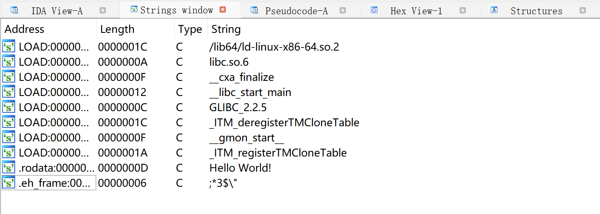
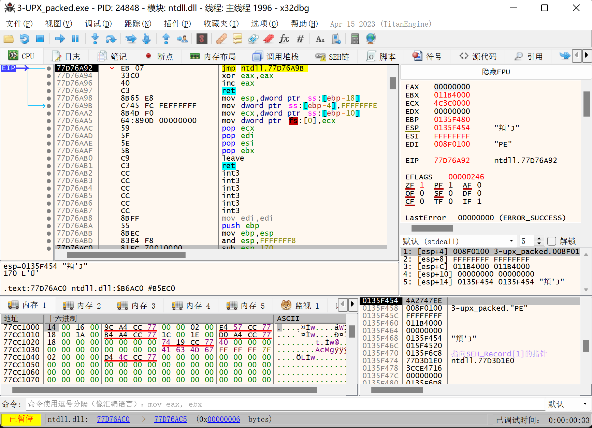
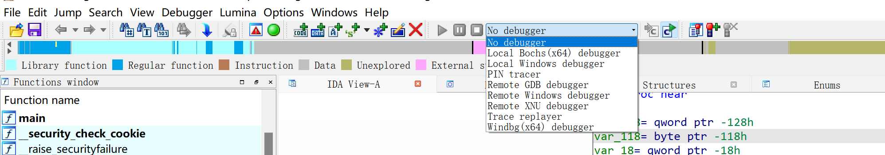

# Reverse-Engineering | 逆向工程

- [Reverse-Engineering | 逆向工程](#reverse-engineering--逆向工程)
	- [第 1 章 基础知识](#第-1-章-基础知识)
		- [1.1 可执行文件](#11-可执行文件)
		- [2.1 不同格式的可执行文件](#21-不同格式的可执行文件)
		- [2.2 汇编语言](#22-汇编语言)
		- [2.3 反汇编](#23-反汇编)
		- [2.4 调用约定](#24-调用约定)
		- [2.5 局部变量](#25-局部变量)
		- [2.6 常用工具](#26-常用工具)
	- [第 2 章 静态分析](#第-2-章-静态分析)
		- [2.1 IDA 使用](#21-ida-使用)
			- [2.1.1 打开文件](#211-打开文件)
			- [2.1.2 加载文件](#212-加载文件)
			- [2.1.3 数据类型操作](#213-数据类型操作)
			- [2.1.4 函数操作](#214-函数操作)
			- [2.1.5 导航操作](#215-导航操作)
			- [2.1.6 类型操作](#216-类型操作)
			- [2.1.7 IDA 的其他功能](#217-ida-的其他功能)
		- [2.2 HexRays 反编译器入门](#22-hexrays-反编译器入门)
			- [2.2.1 生成伪代码](#221-生成伪代码)
			- [2.2.2 修改标识符](#222-修改标识符)
			- [2.2.3 切换数据显示格式](#223-切换数据显示格式)
			- [2.2.4 修改变量类型](#224-修改变量类型)
		- [2.3 IDA 和 HexRays 进阶](#23-ida-和-hexrays-进阶)
			- [2.3.1 如何寻找 main 函数](#231-如何寻找-main-函数)
			- [2.3.2 处理 HexRays 失败情况](#232-处理-hexrays-失败情况)
	- [第 3 章 动态调试和分析](#第-3-章-动态调试和分析)
		- [3.1 OllyDBG 和 x64DBG 调试](#31-ollydbg-和-x64dbg-调试)
			- [3.1.1 打开文件](#311-打开文件)
			- [3.1.2 控制程序运行](#312-控制程序运行)
			- [3.1.3 动态脱壳](#313-动态脱壳)
			- [3.1.4 查壳/脱壳工具](#314-查壳脱壳工具)
		- [3.2 GDB 调试](#32-gdb-调试)
			- [3.2.1 GDB 环境配置](#321-gdb-环境配置)
			- [3.2.2 Pwndbg安装](#322-pwndbg安装)
			- [3.2.3 打开文件](#323-打开文件)
			- [3.2.4 调试程序](#324-调试程序)
			- [3.2.5 IDA 整合](#325-ida-整合)
		- [3.3 IDA 调试器](#33-ida-调试器)
			- [3.3.1 选择 IDA 调试后端](#331-选择-ida-调试后端)
			- [3.3.2 本地调试启动方法](#332-本地调试启动方法)
			- [3.3.3 断点设置](#333-断点设置)
			- [3.3.4 查看变量](#334-查看变量)
			- [3.3.5 远程调试配置方法](#335-远程调试配置方法)
	- [第 4 章 常见算法识别](#第-4-章-常见算法识别)
		- [4.1 特征值识别](#41-特征值识别)
		- [4.2 特征运算识别](#42-特征运算识别)
		- [4.3 第三方库识别](#43-第三方库识别)
			- [4.3.1 字符串识别](#431-字符串识别)
			- [4.3.2 函数签名识别](#432-函数签名识别)
			- [4.3.3 二进制比对识别](#433-二进制比对识别)
	- [第 5 章 二进制代码保护和混淆](#第-5-章-二进制代码保护和混淆)
		- [5.1 抵御静态分析](#51-抵御静态分析)
			- [5.1.1 花指令](#511-花指令)
			- [5.1.2 插入脏字节](#512-插入脏字节)
			- [5.1.3 指令替换](#513-指令替换)
			- [5.1.4 代码自修改](#514-代码自修改)
		- [5.2 加密](#52-加密)
		- [5.3 反调试](#53-反调试)
			- [5.3.1 Windows API](#531-windows-api)
			- [5.3.2 断点检测](#532-断点检测)
			- [5.3.3 时间间隔检测](#533-时间间隔检测)
			- [5.3.4 基于异常的反调试](#534-基于异常的反调试)
			- [5.3.5 TLS 反调试](#535-tls-反调试)
			- [5.3.6 特定调试器检测](#536-特定调试器检测)
			- [5.3.7 架构切换](#537-架构切换)
	- [第 6 章 高级语言逆向](#第-6-章-高级语言逆向)
		- [6.1 Rust 和 Go](#61-rust-和-go)
		- [6.2 C# 和 Python](#62-c-和-python)
		- [6.3 C++ MFC](#63-c-mfc)
	- [第 7 章 现代逆向工程技巧](#第-7-章-现代逆向工程技巧)
		- [7.1 符号执行](#71-符号执行)
		- [7.2 二进制插桩](#72-二进制插桩)
		- [7.3 Pin](#73-pin)


## 第 1 章 基础知识

### 1.1 可执行文件

绝大多数正常的可执行文件，都是通过高级语言编译生成的。一般来说，编译时会发生以下流程：

- 用户将一组用高级语言编写的源代码作为编译器输入。
- 编译器解析输入，并为每个源代码文件产生对应的汇编代码。
- 汇编器接收编译器生成的汇编代码，并继续执行汇编操作，将生成的每份机器代码临时存于各对象文件中。
- 链接器将分散的各对象文件相互链接，经过处理后融合成完整的程序。按照可执行文件的格式，填入各种指定程序运行环境的参数，最后形成一个完整的可执行文件。

在编译阶段，一般会丢弃掉源代码中的注释信息。

在汇编阶段，可能会丢弃汇编代码中的 label（标签）名称。

在链接阶段，可能丢弃函数名、类型名等符号信息。

### 2.1 不同格式的可执行文件

Windows 系统使用 PE（Portable Executable）可执行文件。PE 文件由 DOS 头、 PE 文件头、节表及各节数据组成。如果需要引用外部的动态链接库，则有导入表；如果自己可以提供函数给其他程序来动态链接（常见于 DLL 文件），则有导出表。

Linux 系统使用 ELF（Executable and Linkable Format）可执行文件。 ELF 文件由 ELF 头、各节数据、节表、字符串段、符号表组成。

节（Section）是程序中各部分的逻辑划分，一般有特定名称，例如 `.text` 或 `.code` 代表代码节、`.data` 代表数据节等。

在运行时，可执行文件的各节会被加载到内存的各位置，一个或多个节会被映射到一个段（Segment）中。段的划分是根据这部分内存需要的权限（读、写、执行）来进行的。如果在相应的段内进行了非法操作，如在只能读取和执行的代码段进行了写操作，则会产生段错误（Segmentation Fault）。

### 2.2 汇编语言

汇编语言基础知识详见 Assembly Language | 汇编语言。

### 2.3 反汇编

反汇编是将机器代码翻译回汇编语言的过程。

在汇编过程中，label 信息会丢失。因为 label 用于标识跳转位置，它决定着程序执行时可能执行到的位置，即汇编语句的起始位置。所以，还原出正确的 label 信息对于正确还原程序执行流程至关重要。

尽管有信息丢失，仍然可以通过一些算法成功还原程序的流程，例如：线性扫描反汇编算法和递归下降反汇编算法。

### 2.4 调用约定

在编译器出现后，人们为编译器创立了一些规定各函数之间参数传递段地约定，称为调用约定。

x86 32 位架构的调用约定：

- `__cdecl`：参数从右向左依次压入栈中，调用完毕，由调用者负责清理压入的参数，返回值置于 EAX 中。绝大多数 x86 平台的 C 语言程序都在使用这种约定。
- `__stdcall`：参数同样从右向左依次压入栈中，调用完毕，由被调用者负责清理压入的参数，返回值同样置于 EAX 中。Windows 的很多 API 都是用这种方式提供的。
- `__thiscall`：为类方法专门优化的调用约定，将类方法的 this 指针放在 ECX 寄存器中，然后将其余参数压入栈中。
- `__fastcall`：为加速调用而生的调用约定，将第 1 个参数放在 ECX 中，将第 2 个参数放在 EDX 中，然后将后续的参数从右至作压入栈中。

x86 64 位架构的调用约定：

- Microsoft x64位（x86-64）调用约定：在 Windows 上使用，依次（从左至右）将前 4 个参数放入 RCX、RDX、R8、R9 这 4 个寄存器，然后将剩下的参数从右至左压入栈中。
- System V x64 调用约定：在 Linux、MacOS 上使用，比 Microsoft 的版本多了两个寄存器，使用 RDI、RSI、RDX、RCX、R8、R9 这 6 个寄存器传递前 6 个参数，剩下的从右至左压栈。

### 2.5 局部变量

每个函数在被调用的时候都会产生局部变量的区域、存储返回地址的区域和参数的区域。这些区域被称为帧，而这些帧都在栈上，又被称为栈帧。但是，栈的内存区域并不一定是固定的，而且随着每次调用段地路径不同，栈帧的位置也会不同。

虽然站的内容随着进栈和出栈会一直不断变化，但是一个函数中每个局部变量相对于该函数栈帧的偏移都是固定的。因此引入一个寄存器来专门存储当前栈帧的位置，即 ebp，称为栈指针。

程序在函数初始化阶段赋值 ebp 为栈帧中间的某个位置，这样可以用 ebp 引用所有的局部变量。由于上一层的父函数也要使用 ebp，因此要在函数开始时先保存 ebp，再赋值 ebp 为自己的栈帧的值，这样的流程在汇编代码中：

```
push ebp
mov ebp，esp
```

现在每个函数的栈帧便由局部变量、父栈帧的值、返回地址、参数四部分构成。

### 2.6 常用工具

- IDA Pro
- OllyDbg（64位环境下不能使用）和 x64dbg
- GNU Binary Utilities
- GDB（GNU Debugger）

## 第 2 章 静态分析

### 2.1 IDA 使用

#### 2.1.1 打开文件

IDA Pro 使用的是递归下降反汇编算法。

在打开文件前需要选择正确的架构版本（32 bit/64 bit）。

#### 2.1.2 加载文件

进入反汇编界面后，IDA 会为文件生成一个数据库（IDB），将整个文件所需的内容存入其中，以后的分析中就不再需要访问输入文件了，对数据库的各种修改也会独立于输入的文件。


界面被分为以下部分：

- 导航栏：显示程序的不同类型数据（普通含函数、未定义函数的代码、数据、未定义等）的分布情况。
- 反汇编的主窗口：显示反汇编的结果、控制流图等，可以进行拖动、选择等操作。
- 函数窗口：显示所有的函数名称和地址（拖动下方滚动条即可查看到），可以通过 Ctrl+F 组合键进行筛选。
- 输出窗口：显示运行过程中 IDA 的日志，也可以在下方的输入框中输入命令并执行。
- 状态指示器：显示为 `AU:idle` 即代表 IDA 已经完成了对程序的自动化分析。

#### 2.1.3 数据类型操作

用户可以根据地址的颜色来分辨某个位置的数据类型。标注为代码的位置，为黑色显示；标注为数据的位置，为灰色显示；未定义数据类型的位置则显示为黄色。

IDA 定义数据类型的快捷键（光标需要在对应行上才能生效）：

- U（Undefine）键：取消一个地方已有的数据类型定义，此时会弹出确认对话框，单击“Yes”按钮即可。
- D（Data）键：让某一个位置编程数据。一直按 D 键，这个位置的数据类型将会以 1 字节（byte/db）、2 字节（word/dw）、4 字节（dword/dd）、8 字节（qword/dq）进行循环。IDA 为了防止误操作，如果定义数据的操作会影响到已有数据类型的位置，IDA 会弹出确认对话框；如果操作的位置及其附近完全是 Undefined，则不会弹出确认对话框。
- C（Code）键：让某一个位置变成指令。确认对话框的弹出时机也与 D 键类似。在定义为指令后，IDA 会自动以此为起始位置进行递归下降反汇编。

IDA 还内建了各种数据类型，如数组、字符串等：

- A（ASCII）键：以该位置为起点定义一个以 `\0` 结尾的字符串类型。
- `*` 键：将此处定义为一个数组，此时弹出一个对话框，用来设置数组的属性。
- O（Offset）键：将此处定义为一个地址偏移。

#### 2.1.4 函数操作

IDA 处理函数的操作：

- 删除函数：在函数窗口中选中函数后，按 Delete 键。
- 定义函数：在反汇编窗口中选中对应行后，按 P 键。
- 修改函数参数：在函数窗口中选中并按 Ctrl+E 组合键，或在反汇编窗口的函数内部按 Alt+P 组合键。

#### 2.1.5 导航操作

IDA 有导航历史的功能，类似资源管理器和浏览器的历史记录，可以后退或者前进到某次浏览的地方：

- 后退到上一位置：快捷键 Esc。
- 前进到下一位置：快捷键 Ctrl+Enter。
- 跳转到某一个特定位置：快捷键 G，然后可以输入地址/已经定义的名称。
- 跳转到某一区段：快捷键 Ctrl+S，然后选择区段即可。

#### 2.1.6 类型操作

IDA 开发了一套类型分析系统，用来处理 C/C++ 语言的各种数据类型（函数声明、变量声明、结构体声明等），并且允许用户自由指定。

选中变量、函数后按 Y 键，弹出 “Please enter the tyoe declaration” 对话框，从中输入正确的 C 语言类型，IDA 就可以解析并自动应用这个类型。

#### 2.1.7 IDA 的其他功能

IDA 的菜单栏 “View -> Open subviews” 下可以打开各种类型的窗口。



- Strings 窗口：按 Shift+F12 组合键即可打开，可以识别程序中的字符串，双击即可在反汇编窗口中定位到目标字符串。
- 十六进制窗口：默认打开，可以按 F2 键对数据库中的数据进行修改，修改后再次按 F2 键即可应用修改。

### 2.2 HexRays 反编译器入门

HexRays 作为 IDA 的插件运行，利用 IDA 确定的函数局部变量和数据类型，优化后生成类似 C 语言的伪代码。用户可以浏览生成的伪代码、添加注释、重命名其中的标识符，也可以修改变量类型、切换数据的显示格式等。

#### 2.2.1 生成伪代码

在反汇编窗口中定位到目标函数，按 F5 键即可。

#### 2.2.2 修改标识符

HexRays 为用户提供了更改标识符名称的功能：将光标移动到标识符上，然后按 N 键，弹出更改名称的对话框，在输入框中输入一个合法的名称，单击 “OK” 按钮即可。修改后的伪代码更加便于阅读和分析。

#### 2.2.3 切换数据显示格式

重命名标识符后，伪代码已经基本还原。但是很多常量没有以正确的格式显示，例如，源代码中的 0x66 变为了十进制数 102，a 和 A 被转化为其 ASCII 编码对应的十进制数 97 和 65。

HexRays 并不能自动标注这些常量，但是提供了将常量显示为各种格式的功能。将光标移动到一个常量上，然后单击右键，在弹出的快捷菜单中选择对应的格式。


- Hexadecimal：十六进制显示，快捷键为 `H` 键，可以将各种其他显示格式转换回数字。
- Octal：八进制表示。
- Char：将常量转换为形如 `A` 的形式，快捷键为 `R` 键。
- Enum：将常量转为枚举中的一个值，快捷键为 `M` 键。
- Invert sign：将常量按照补码解析为负数，快捷键为 `_` 键。
- Bitwise negate：将常量按位取反，形如 C 语言中的 `~0xF0`，快捷键为 `~` 键。

HexRays 的快捷键有时触发不了，可以在失败时尝试使用右键快捷菜单。

#### 2.2.4 修改变量类型

同样的源代码，GCC 编译器开启 O3 优化开关后编译生成可执行文件，经过复杂的编译器优化流程后，生成的伪代码可能发生相当大的变化。


在要修改类型的标识符上按 Y 键，即可调出对话框来修改类型。例如，修改 v6，将光标移动到 v6 上，然后按 Y 键，输入 `char[28]`，弹出是否覆盖后续变量的确认对话框，单击 “Yes” 按钮即可。

### 2.3 IDA 和 HexRays 进阶

#### 2.3.1 如何寻找 main 函数

在 Windows 和 Linux 下，很多可执行文件都不是直接从 main() 函数开始执行的，而是经过 CRT（C语言运行时）的初始化，再转到 main() 函数。

找 main() 函数的技巧如下：

- main() 函数经常在可执行文件的靠前位置，因为很多链接器是先处理对象文件后处理静态库。
- VC 的入口点（IDA 中的 start() 函数）会直接调用 main() 函数，在 start() 函数中被调用的函数有 3 个参数，并且返回值被传入 exit() 函数的，可以重点查看。
- GCC 将 main() 函数的地址传入  `__libc_start_main` 来调用 main() 函数，查看调用的参数即可找到 main() 函数的地址。

#### 2.3.2 处理 HexRays 失败情况

HexRays 经常会出现各种失败情况，尤其是对于没有符号、优化等级较高的程序。

绝大多数出错的原因是与这个函数相关的某些参数设置错误，如这个函数中调用其他函数的调用约定出现错误，导致参数解析失败或调用前后栈不平衡。

错误一：call analysis failed

- 原因：反编译器在寻找函数调用的参数时出现了错误。
- 修复：根据报错信息前面的地址，找到出错的位置（例如 0x271006 ），按 G 键跳转到目标地址，修复函数的原型声明即可。

错误二：sp-analysis failed

- 原因：某个函数调用的调用约定出错，或该函数的参数个数出错，导致 IDA 算错了栈指针的变化量。
- 修复：选择 “Options -> General” 菜单命令，在弹出的对话框中勾选 “Stack pointer”。此时，反编译窗口每行的地址旁边会多出一列，即 IDA 分析的函数执行到每个地址时栈的偏移量。找到有问题的地方进行修改。

## 第 3 章 动态调试和分析

### 3.1 OllyDBG 和 x64DBG 调试

OllyDBG 和 x64DBG 都是调试 Windows 平台可执行文件的调试器。x64DBG 支持 32 位 和 64 位程序的调试，并且在不断开发、添加新的功能。OllyDBG 仅支持 32 位的程序，且已经停止更新。

#### 3.1.1 打开文件



打开文件后，各窗口中会有内容出现。x64DBG 与 OD 的布局相同，左上区域为反汇编结果的显示区域，左下区域为浏览程序内存数据的区域，右下区域为栈数据的显示区域，右上区域为寄存器的显示区域。

#### 3.1.2 控制程序运行

按 Ctrl+G 组合键，可以跳转到目标地址；在反汇编窗口中，按 F2 键为切换当前地址的断点状态，按 F8 键为单步步过，按 F7 键为单步步入，按 F4 键为运行到光标处位置，按 F9 键为运行。

常见的断点位置包括程序内的某个地址、程序调用的某个 API。此外，可以让程序在操作（读取/写入/执行）特定的某一小段内存时终端，其原理为使用 CPU 内建的硬件断点机制或使用 Windows 提供的异常处理机制的内存断点。

x64DBG 在内存窗口/栈窗口中选定目标地址，单击右键，选择 “断点 -> 硬件断点” 或 “读取/写入 -> 选择长度”，可以设置硬件读取和硬件写入断点；在反汇编窗口中，右击目标地址，选择 “断点 -> 设置硬件断点（执行）”，设置硬件执行断点。

#### 3.1.3 动态脱壳

“壳” 是一种特殊的程序，对另一个程序进行变换后，利用变换的结果重新生成可执行文件。在运行时，它全部或部分还原存储在可执行文件中的变换结果，然后恢复原程序的执行。

压缩壳是为了减小程序体积，加密壳是为了加大破解者的逆向难度。通常，加密壳需要配合压缩壳，加密壳会导致程序体积变大。

按照变换操作的不同，可以进行如下分类：

- 注重代码压缩：生成更小的可执行文件，如 UPX、ASPack 等。
- 注重代码保护：阻碍逆向者进行分析，如 VMP、ASProtect 等。

“脱壳” 即将 “壳” 去除，还原最初程序。加密壳在 CTF 中较少。

UPX 壳使用最广泛，脱壳 UPX 的两种方法如下：

- 静态方法：UPX 本身即提供脱壳器，使用命令行参数 -d 即可，但是有时会失败，需要切换使用正确的 UPX 版本。Windows 下内置多个 UPX 版本的第三方图形化界面 UPXShell 工具，可以方便地切换版本。
- 动态方法：虽然 UPX 本身可以脱壳，但是 UPX 是基于加壳后可执行文件内存储的标识来查找并操作的，由于 UPX 是开源的，软件保护者可以任意修改这些标识，从而导致官方标准版本的 UPX 脱壳失败。这时通常采用动态脱壳。

#### 3.1.4 查壳/脱壳工具

查壳工具：

- ExeinfoPE：https://github.com/ExeinfoASL/ASL/raw/master/exeinfope.zip
- PEiD：https://www.aldeid.com/wiki/PEiD

脱壳工具：

- UPX：https://github.com/upx/upx

### 3.2 GDB 调试

#### 3.2.1 GDB 环境配置

Linux 系统中通常使用 GDB 进行调试。GDB 插件有：Gef、peda、Pwndbg 等。

#### 3.2.2 Pwndbg安装

CTF 中不同的题目有不同的环境要求，可能涉及 Ubuntu 16、Ubuntu 18、Ubuntu20。

原版的 Ubuntu 16 默认安装的是 gdb7、python3.5，这两个环境在目前的 Pwndbg 中均不适用（2023.04，“Pwndbg is supported on Ubuntu 18.04, 20.04, and 22.04 with GDB 8.1 and later”）。解决方案：

- 重新编译 Python，此处 Python 为 Python 版本为 3.8.15。
- 使用 Python 3.8.15 编译 GDB，此处 GDB 版本为 11.2。
- 下载 Pwndbg，不需要运行 setup.sh，直接安装依赖即可。

下载链接：

- Python：https://mirrors.cloud.tencent.com/macports/distfiles/python38/Python-3.8.15.tar.xz
- GDB：https://mirrors.aliyun.com/gnu/gdb/gdb-11.2.tar.xz

- Pwndbg：https://github.com/pwndbg/pwndbg 

相关安装命令：

```
# 解压压缩包
apt-get update
apt-get install build-essential	 texinfo git vim
xz -dk gdb-11.2.tar.xz
xz -dk Python-3.8.15.tar.xz
tar -xvf Python-3.8.15.tar
tar -xvf gdb-11.2.tar.xz

# 升级 Python
sudo apt install -y wget build-essential libreadline-dev libncursesw5-dev libssl-dev libsqlite3-dev tk-dev libgdbm-dev libc6-dev libbz2-dev libffi-dev zlib1g-dev
cd Python-3.8.15
./configure --prefix=/usr/local/python3
make & make install
rm /usr/bin/python3
rm /usr/bin/python
rm /usr/bin/pip3
rm /usr/bin/pip
ln -s /usr/local/python3/bin/python3.8 /usr/bin/python3
ln -s /usr/local/python3/bin/python3.8 /usr/bin/python 
ln -s /usr/local/python3/bin/pip3.8 /usr/bin/pip3   
ln -s /usr/local/python3/bin/pip3.8 /usr/bin/pip 

# 编译 GDB
apt-get install libgmp-dev libncurses5-dev
cd gdb-11.2
mkdir build
cd build
../configure --with-python=/usr/bin/python3 
make && make install

# 安装 Pwndbg
git clone https://github.com/pwndbg/pwndbg.git
pip install -r requirements.txt
echo "source /<your-path>/pwndbg/gdbinit.py" > ~/.gdbinit

# 编码问题解决方法
vim  /etc/profile
	export LANG=C.UTF-8 
source /etc/profile
```

#### 3.2.3 打开文件

GDB 打开文件的方式与图形化工具不同，完全由命令控制，而不是快捷键。

方式 1：在 GDB 的命令行后直接接可执行文件，例如 “gdb ./crackme”（适用于不需参数的程序）。

方式 2：使用 GDB 的 --args 参数执行，例如 “gdb --args ./ping -c 10 127.0.0.1”。

方式 3：打开 GDB，使用file命令指定可执行文件。

#### 3.2.4 调试程序

GDB 的调试方式和图形化工具不同，完全由命令控制，而不是快捷键。

控制程序执行：

- r（run）：启动程序。
- c（continue）：让暂停的程序继续执行。
- si（step instruction）：汇编指令层面上的单步步入。
- ni（next instruction）：汇编层面上的单步步过。
- finish：执行到当前函数返回。

查看内存、表达式等：

- x/dddFFF：ddd 代表长度， FFF 代表格式，例如 `x/10gx`，具体格式列表见 https://visualgdb.com/gdbreference/commands/x
- p（print）：输出一个表达式的值，例如 `p 1+1`，p 命令也可以添加指定格式，例如 `p/x 1112222`。

断点相关：

- b（break）：b *location，location 可以为十六进制数、名称等，例如 `b *0x8005a0`、`b *main`。其中，`*` 是指中断在指定的地址，而不是对应的源代码行。
- info b 或 info bl：列出所有断点，每个断点会有自己的序号。
- del（delete）：删除指定序号的断点，例如 `del 1`。
- clear：删除指定位置的断点，如 `clear *main`。

修改数据：

- 修改寄存器：`set $rax = 0x100000`。
- 修改内存：set {要赋值的类型}地址 = 值，例如 `set {int}0x405000 = 0x12345`。

GDB 不会在入口点处暂停程序，所以需要在程序执行前设置好断点。GDB 不会自动保存断点数据，需要用户每次重新设置断点。

在 GDB 的命令行中，五输入直接回车代表重复上一条命令。

#### 3.2.5 IDA 整合

Pwndbg 提供了 IDA 的整合脚本，只需要在 IDA 中运行 Pwndbg 目录的 ida_script.py，然后 IDA 会监听 http://127.0.0.1:31337，本机 Pwndbg 链接到 IDA 上，并使用 IDA 的各种功能。

可以修改脚本中的 127.0.0.1 为 0.0.0.0 来允许虚拟机连接。在 GDB 中执行 `config ida-rpc-host 主机 IP`，重启 GDB 即可生效。

### 3.3 IDA 调试器

#### 3.3.1 选择 IDA 调试后端



Windows 版本 IDA 可以直接调试 Windows 下 32 bit 和 64 bit 的程序。Linux 版本则需要远程调试器。

#### 3.3.2 本地调试启动方法

载入 IDA ，本地调试启动方法：

- 选择后端。选择调试器后端为 Local Windows debugger，即可使用 IDA 内置的调试器。
- 开始调试。按 F9 快捷键启动程序，确认对话框中点击 Yes，即可开始调试。
- 被调试文件默认的路径为输入文件的路径，若目标文件不存在，或因其他原因加载失败，IDA 均会弹出警告对话框，确认后进入 Debug application setup 设置的对话框。如有需要，也可以通过 Debugger -> Process options 菜单进入。

IDA 不会在入口点处设置断点，需要提前设置好。

#### 3.3.3 断点设置

IDA 的断点可以通过快捷键 F2 设置，也可以在图形化界面中单击左侧小蓝点进行设置。在切换为断点后，对应行的底色将会变成红色以突出显示。


#### 3.3.4 查看变量

在中断后，选择 Debugger -> Debugger windows -> Locals 菜单命令，打开查看局部变量窗口。

设置断点，单步执行，Locals 窗口中红色的部分代表这些变量的值被修改过。


以上程序中，v5 是一个字符串，存放着正确输入。那么，如何获取 v5 的内容，找到内存中的 flag 呢？

方式 1：

- 在 Locals 窗口的 Location 栏中可以看到 v5 的位置为 RDI。


- 在寄存器窗口可以看到 RDI 的值，单击其值右侧的按钮，即可在反汇编窗口中跳转到对应的位置。


- 按 a 键将其转为字符串显示。

方式 2：

- 在伪代码窗口中按 Y 键，修改 v5 的类型，从 `_BYTE*` 修改为 `char *`，此时 HexRays 会认为 v5 是一个字符串，从而将其在 Locals 中显示出来。在 Locals 窗口中右键单击 Refresh 刷新。


#### 3.3.5 远程调试配置方法

远程调试与本地调试相似，只不过要调试的可执行文件运行在远程计算机上，需要在远程计算机上运行 IDA 的远程调试服务器。IDA 的远程调试服务器位于 IDA 安装目录的 dbgsrv 目录下。


IDA 提供了从主流桌面系统 Windows、Linux、Mac 到移动端 Android 系统的调试服务器，用户根据系统和可执行文件架构选择对应的服务器。

以 linux_server64 为例，在 Linux 虚拟机中运行调试服务器，不带参数运行时，调试服务器将自动监听 0.0.0.0:23946。

在 IDA 中选择调试后端为 Remote Linux debugger，然后设置 Process options。所有路径必须是远程主机上的路径，此处将被调试的可执行文件放在 /tmp 目录下。设置好参数，单击 OK 按钮保存。


IDA 设置断点进行调试。注意，通过远程调试运行的程序与服务器程序共用一个控制台，直接在服务器端输入即可与被调试程序交互。


## 第 4 章 常见算法识别

### 4.1 特征值识别

很多常见算法，如 AES、DES 等，在运算过程中会使用一些常量，为了提高运算效率，这些常量往往被硬编码在程序中。通过识别这些特征常量，可以对算法进行一个大致的快速判断。

常见算法需要使用的常量：

| 算法     | 特征值（如无特殊说明为十六进制）                             | 备注              |
| -------- | ------------------------------------------------------------ | ----------------- |
| TEA 系列 | 9e3779b9                                                     | Delta 值          |
| AES      | 63 7c 77 7b f2 6b 6f c5 ...                                  | S 盒              |
| AES      | 52 09 6a d5 30 36 a5 38 ...                                  | 逆 S 盒           |
| DES      | 3a 32 2a 22 1a 12 0a 02 ...                                  | 置换表            |
| DES      | 39 31 29 21 19 11 09 01 ...                                  | 密钥变换数组 PC-1 |
| DES      | 0e 11 0b 18 01 05 03 1c ...                                  | 密钥变换数组 PC-2 |
| DES      | 0e 04 0d 01 02 0f 0b 08 ...                                  | S 函数表格 1      |
| BlowFish | 243f6a88 85a308d3 13198a2e 03707344                          | P 数组            |
| MD5      | 67452301 efcdab89 98badcfe 10325476                          | 寄存器初始值      |
| MD5      | d76aa478 e8c7b756 242070db c1bdceee ...                      | Ti 数组常量       |
| SHA1     | 67452301 efcdab89 98badcfe 10325476 c3d2e1f0                 | 寄存器初始值      |
| CRC32    | 00000000 77073096 ee0e612c 990951ba                          | CRC 表            |
| Base64   | 字符串“ABCDEFGHIJKLMNOPQRSTUVWXYZabcdefghijklmnopqrstuvwxyz0123456789+/” | 字符集            |

相关的常量查找插件有：IDA 的 FindCrypt、PEiD 的 KANAL 等。

对这种分析方法的对抗是非常简单的，即故意对这些常量进行修改。因此，特征值识别只能作为一种快速判断的手段，做出判断后，还需要进行算法复现或动态调试，来验证算法的判断是否正确。

### 4.2 特征运算识别

当特征值不足以识别出算法时，可以通过分析程序是否使用了某些特征运算，来推测程序是否使用了某些算法。

CTF 逆向工程题目中常见算法的特征运算：

| 算法     | 特征运算（伪代码）                                           | 说明                                       |
| -------- | ------------------------------------------------------------ | ------------------------------------------ |
| RC4      | i = (i + 1) % 256;<br />j = (j + s[i]) % 256;<br />swap(s[i],s[j]);<br />t = (s[i] + s[j]) % 256; | 流密钥生成                                 |
| RC4      | j = (j + s[i] + k[i]) % 256;<br />swap(s[i],s[j]);<br />循环256次 | S 盒变换                                   |
| Base64   | b1 = c1 >>2;<br />b2 = ((c1 & 0x3) << 4) \| (c2 >> 4);<br />b3 = ((c2 & 0xF) << 2) \| (c3 >> 6);<br />b4 = c3 & 0x3F; | 8 位变 6 位                                |
| TEA 系列 | ((x << 4) + kx) ^ (y + sum) ^ ((y >> 5) + ky)                | 轮函数                                     |
| MD5      | ( X & Y) \| ((~X) & Z)<br />( X & Z) \| ( Y & (~Z))<br />X ^ Y ^ Z<br />Y ^ (X \| (~Z)) | F 函数<br />G 函数<br />H 函数<br />I 函数 |
| AES      | x[j] = s\[i][\(j+1) % 4]<br />循环 4 次<br />s\[i]\[j] = x\[j]<br />循环 4 次<br />整体循环 4 次 | 行移位                                     |
| DES      | L = R<br />R = F(R,K) ^ L                                    | Feistel 结构                               |

特征运算识别也是一种快速判断的方法，需要经过动态调试或算法复现等手段确认后才能得出结论。

### 4.3 第三方库识别

为了提高编程效率，对于一些常用的算法，很多人会选择使用现成的库，如系统库或第三方库。

对于动态链接的库，函数名的符号信息可以被轻易地识别；对于静态链接的第三方库，识别这些信息则比较困难。

#### 4.3.1 字符串识别

很多第三方库会将版权信息和该库使用的其他字符串（如报错信息等）以字符串的形式写入库中。在静态编译时，这些字符串会被一并放入二进制文件。通过寻找这些字符串，可以快速判断使用了哪些第三方库，以便进一步分析。

#### 4.3.2 函数签名识别

有时确定了程序所使用的库后，还需要进一步识别具体的函数。

每个二进制函数都可以有自己的签名，对于同样由二进制机器代码构成的第三方库函数来说，IDA 也可以通过对应签名库快速匹配函数名、参数等信息。IDA 中自带了很多除 C 语言运行库以外的常见库的签名文件，如 Visual C++ MFC 库等。

可以在 IDA 文件菜单中选择 “Load File -> FLIRT Signature file”。

如果 IDA 没有预置需要识别的库函数签名，可以在以下IDA FLIRT 签名库进行寻找：

- sig-database：https://github.com/push0ebp/sig-database
- FLIRTDB： https://github.com/Maktm/FLIRTDB

也可以利用 IDA SDK 中提供的 FLAIR 工具，根据已有的 `.a`、`.lib` 等静态库文件自己创建一份签名，放入 sig 文件夹，然后在 IDA 中加载。

#### 4.3.3 二进制比对识别

由于编译环境等各种情况的差异，签名有时无法完全匹配库函数，即使编译环境有一定区别，使用同一个库编译的二进制文件中的库函数也会存在许多相同之处。如果能够确定程序编写者使用了某个已知库，并且我们能够获得一份含有符号且同样使用了该库的静态编译二进制文件，则可以利用二进制比对的方法来具体确定每个库函数。

二进制比对的常用工具：

- BinDiff：https://www.zynamics.com/software.html

## 第 5 章 二进制代码保护和混淆

二进制代码的保护手段种类繁多：

- 对汇编指令进行一定程度的混淆变换，可以干扰静态分析中的反汇编过程。
- 在程序中穿插各种反调试技术，能有效地抵御动态分析。
- 对程序中的关键算法进行虚拟化保护。

### 5.1 抵御静态分析

反汇编结果正确与否将直接影响到例如 HexRays Decompiler 等工具反编译结果的正确性。因此，许多开发者会选择对汇编指令本身做一些处理，使得反编译器无法生成逻辑清晰的伪代码。

#### 5.1.1 花指令

干扰反汇编器最简单的方法就是在代码中增加花指令。

花指令，是指在程序中完全冗余，不影响程序功能却会对逆向工程产生干扰的指令。

花指令没有固定的形式，泛指用于干扰逆向工作的无用指令。

以下汇编代码为常见的函数头：

```
push ebp
mov ebp, esp
sub esp, 0x100
```

反汇编器经常以此作为判断函数起始地址的一句，也以此进行栈指针分配的计算。如果在其中加入一些相互抵消的操作，例如：

```
push ebp
push fd
add esp, 0xd
nop
sub esp, 0xd
pop fd
mov ebp, esp
sub esp, 0x100
```

那么，改代码的复杂度明显提升，但实际进行的操作效果并没有变化。注意，pushfd 和 popfd 等花指令会让一些解析栈指针的逆向工具产生错误。

#### 5.1.2 插入脏字节

在正常的指令中插入一个特定的字节，并在该字节前加入向该字节后的跳转语句，以保证实际执行的指令效果不变。这一特定的字节被称为脏字节，要求是一条较长指令的首字节（如 0xE8 为 call 指令的首字节）。

对于 OllyDBG 和 WinDBG 等线性扫描反汇编工具，可以使用一条无条件跳转指令实现脏字节的插入。示例同上，可以在第一条和第二条指令之间插入一个跳转指令，并且加入 0xE8 字节，例如：

```
	push ebp
	jmp addr1
	db 0xE8
addr1：
	mov ebp, esp
	sub esp, 0x100
```

根据线性扫描反汇编算法，当反汇编器解析完 jmp addr1 指令后，将紧接着从 0xE8 进行解析，而 0xE8 为 call 指令的首字节，会导致反编译器认为从 0xE8 开始的 5 字节为一条 call 指令，从而导致后续指令全部被错误解析。

对于 IDA 等递归下降反汇编工具，遇到无条件跳转时，会转向跳转的目标地址递归地继续解析指令，导致插入的 0xE8 字节被直接跳过。因此，可以将以上代码修改为：

```
	push ebp
	jz addr1
	jnz addr1
	db 0xE8
addr1：
	mov ebp, esp
	sub esp, 0x100
```

即将一条无条件跳转语句改为两条成功条件相反的条件跳转语句。

由于递归下降反汇编算法不能获取到程序运行中的上下文信息，遇到条件跳转语句时，它会递归地将跳转的分支与不跳转的分支都进行反汇编。在反汇编完 jnz 语句后，它不跳转的分支就是下一地址，从而使 0xE8 开头的 “指令” 被解析。

在实际操作过程中，为了达到更好的效果，往往会将这些跳转目标代码的顺序打乱，即 “乱序”，从而达到类似控制流混淆的效果，例如：

```
	push ebp
	jz addr2
	jnz addr2
	db 0xE8
addr3:
	sub esp, 0x100
	...
addr2:
	mov ebp, esp
	jmp addr3
```

#### 5.1.3 指令替换

指令替换又称为“变形”。在汇编语言中，大量的指令都可以设法使用其他指令来实现相同或类似的功能。例如，函数调用指令 call 可以使用其他指令替换，如以下指令：

```
call addr
```

可以替换为如下代码段：

```
push addr
ret
```

而函数返回指令 ret，可也可以替换为以下代码段：

```
push ecx
mov ecx, [esp+4]
add esp, 8
jmp ecx
```

注意，该替换破坏了 ecx 寄存器，因此需要保证此时 ecx 没有被程序使用。

#### 5.1.4 代码自修改

代码自修改（Self-Modifying Code，SMC）就是程序在执行过程中，将自己的可执行代码进行修改并执行的手段，能让真正执行的代码在静态分析中不出现。解决方式：

- 静态分析 SMC 代码的自修改流程，自行实现该 SMC 过程，并将代码 patch 为真正执行的代码，即可继续进行静态分析。
- 动态分析在代码已被解密完毕的位置设置断点，然后使用调试器跟踪真正执行的代码，或者 dump 已经解密完毕的代码，交给 IDA 进行静态分析。

### 5.2 加密

加密壳程序对二进制程序的加密大体上可以分为：数据加密、代码加密、算法加密。

- 数据加密：对程序中已有的数据进行加密的过程，一般会在合适的时机对数据进行解密（如在所有引用该数据的地方放置数据解密逻辑）。
- 代码加密：对程序代码段中的指令进行加密变换的过程，一般会等到真正需要执行目标代码时才对其进行解密（运用到 SMC 技术）。
- 算法加密：在 CTF 中更常见，偏重于算法的混淆、模糊与隐藏，其中最常见的方式是虚拟机保护。

虚拟机（Virtual Machine，VM）保护的大范围使用最早出现在加密壳软件中，是一些加密壳的最强保护手段，其中最具代表性的是 VMProtect。VMProtect 除了提供常规的数据加密、代码加密和其他反调试等功能，还能在汇编指令层面对程序逻辑进行虚拟化，将开发者指定的代码段中所有的汇编指令转变为自行编写的一套指令集中的指令，并在实际执行时由自行编写的虚拟机执行器进行模拟执行。

### 5.3 反调试

反调试（Anti-debugging）是指在程序代码中运用若干种反调试技术，干扰对某个进程进行动态调试、逆向分析的手段。

#### 5.3.1 Windows API

Windows 操作系统提供了大量可供检测进程状态的 API，通过调用这些 API，程序可以检测当前是否正在被调试。

- IsDebuggerPresent()
- CheckRemoteDebuggerPresent()
- NtQueryInformationProcess()

反反调试工具：

- ScyllaHide：https://github.com/x64dbg/ScyllaHide

#### 5.3.2 断点检测

软件断点往往通过修改内存而实现，对内存是否被修改进行检测，可以探测该类断点的存在。

对于 x86 架构，硬件断点是通过设置调试寄存器（Debug Registers，包括 DR0\~DR7）来实现的。当使用硬件断点时，需要将断点的地址设置到 DR0\~DR3 中（因此最多支持 4 个硬件断点），并将一些控制属性设置到 DR7 中，基于这个原理可以编写检测硬件端点的代码。

#### 5.3.3 时间间隔检测

在单步跟踪一段指令时，指令运行所耗费的事件与其未被跟踪时相差巨大。基于这个原理可以编写除反调试代码，但容易被绕过。

#### 5.3.4 基于异常的反调试

在 Windows 系统中，如果某进程正在被另一进程调试，则其运行过程中产生的异常将首先由其调试器进行处理，否则会直接由进程中注册的 SEH（Structured Exception Handling）处理函数进行处理。

因此，可以编写代码主动抛出异常（例如，执行一条非法指令或者访问一段非法内存），在我们注册的 SEH 处理函数中对该异常进行接管，接着处理该异常，也可以针对性地进行一些反调试操作。

#### 5.3.5 TLS 反调试

TLS（Thread Local Storage，线程本地存储），即线程本地存储，是为解决一个进程中多个线程同时访问全局变量而提供的机制。

可以在 TLS 回调函数中编写调试器检测代码，实现反调试。

#### 5.3.6 特定调试器检测

直接对特定调试器进行检测，例如，x64DBG 可以检测当前系统运行程序的可见窗口中是否包含 “x64dbg” 的窗口，或进程列表中是否存在名为 “x64dbg.exe” 的进程等，但容易被绕过。

#### 5.3.7 架构切换

64 位 Windows 操作系统可以运行 32 位的应用程序。

## 第 6 章 高级语言逆向

Rust、Go 等是无虚拟机的高级语言，Python、C# 等是基于虚拟机的高级语言。

### 6.1 Rust 和 Go

IDA 优化相关工具（Rust）：

- https://github.com/cha5126568/rust-reversing-helper

IDA 优化相关工具（Go）：

- https://github.com/strazzere/golang_loader_assist
- https://github.com/sibears/IDAGolangHelper

### 6.2 C# 和 Python

C#、Python 是基于虚拟机的高级语言，其可执行程序或文件中包含的字节码，并不是传统汇编指令的机器码，而是其本身虚拟机指令的字节码，所以这类程序不宜使用 IDA 分析。

C# 的逆向分析工具有：.NET Reflector、ILSpy/dnSpy、Telerik JustDecompile、JetBrains dotPeek 等，分析 C# 程序，只需用这些工具打开即可得到源码。对于有壳的程序，需要去壳后分析，去壳工具可以用 de4dot。

Python 的逆向是对 PYC 文件的逆向分析。对于没有混淆过的 PYC 文件，可以使用 Python 的 uncompyle2 将其还原为 PY 文件；对于混淆过的 PYC 文件，若无法去混淆，则只能分析其虚拟机指令。

### 6.3 C++ MFC

MFC 是微软开发的一套 C++ 类库，用来支撑 Windows 下部分 GUI 程序的运行。MFC 包装了 Windows GUI 的消息循环、消息处理流程，将消息用 C++ 的类封装，然后分发到绑定的对象上，方便开发人员快速编写程序。MFC 的多层封装，导致大量的消息处理函数没有直接的代码引用，而是被间接调用。

只要找到 MessageMap，就可以找到所有的消息处理函数，待找到消息处理函数后，即可使用一般的逆向分析技巧进行分析。可以使用以下方法：

- 利用 CWnd 的类和实例方法，动态获取目标窗口的 MessageMap 信息（工具：xspy）。
- 在 IDA 中利用引用关系寻找，在 IDA 中寻找 CDialog 字符串，然后寻找交叉引用，在其周围找到 AFX_MSGMAP。

## 第 7 章 现代逆向工程技巧

### 7.1 符号执行

符号执行（Symbolic Execution）是一种程序分析技术，可以通过分析程序来得到让特定代码区域执行的输入。使用符号执行分析一个程序时，该程序会使用符号值作为输入，而非一般执行程序时使用的具体值。在达到目标代码时，分析器可以得到相应的路径约束，然后通过约束求解器来得到可以出发目标代码的具体值。

在实际环境下，符号执行被广泛应用到自动化漏洞挖掘测试过程中。

在 CTF 中，符号执行适用于解决各种逆向题，只需让符号执行引擎自动分析，找到让程序执行到输出 flag 正确的位置，然后求解出所需的输入即可。

符号执行已经有很多现成的工具可以使用：

| 工具      | 适用范围                                            |
| --------- | --------------------------------------------------- |
| angr      | x86，x86-64，ARM，AARCH64，MIPS，MIPS64，PPC，PPC64 |
| S2E       | x86，x86-64，ARM 架构下用户态与内核态程序           |
| BE-PUM    | x86                                                 |
| Manticore | x86，x86-64，ARMv7，EVM                             |

最新版的 angr 主要分为 5 个模块：

- 主分析器 angr
- 约束求解器 claripy
- 二进制文件加载器 cle
- 汇编翻译器 pyvex（用于将二进制代码翻译为统一的中间语言）
- 架构信息库 archinfo（存放很多架构相关的信息，用于针对性地处理不同的架构）

### 7.2 二进制插桩

插桩（Instrumentation）是在保证程序原有逻辑完整性的基础上，在程序中插入探针，通过探针的执行来收集程序运行时信息的技术。插桩用于以下两方面：

- 程序分析，性能分析，错误检测、捕获和重放。
- 程序行为模拟，改变程序的行为，模拟不支持的指令。

插桩会向程序中插入额外的代码。根据实现插桩的方式，可分为：源码插桩（Source Code Instrumentation）、二进制插桩（Binary Instrumentation）。

- 源码插桩：需要程序的源代码，插桩框架会自动在源码中插入探针，记录程序的运行时信息。在对源码完成插桩后，需要重新编译链接，以生成插桩后的程序。
- 二进制插桩：不需要程序的源代码，可以对已经编译好的二进制程序进行插桩。

二进制插桩分为以下两种：

- 静态二进制插桩：在运行前插入额外的指令和数据并生成修改后的二进制文件。
- 动态二进制插桩：在程序运行时插入额外的代码和数据，不会修改当前的可执行文件。

### 7.3 Pin

Pin 是 Intel 开发的二进制动态插桩引擎，支持 32/64 位的 Windows、Linux、Mac、Android，提供了丰富的 C/C++ API 来开发自己的插桩工具 pintools。