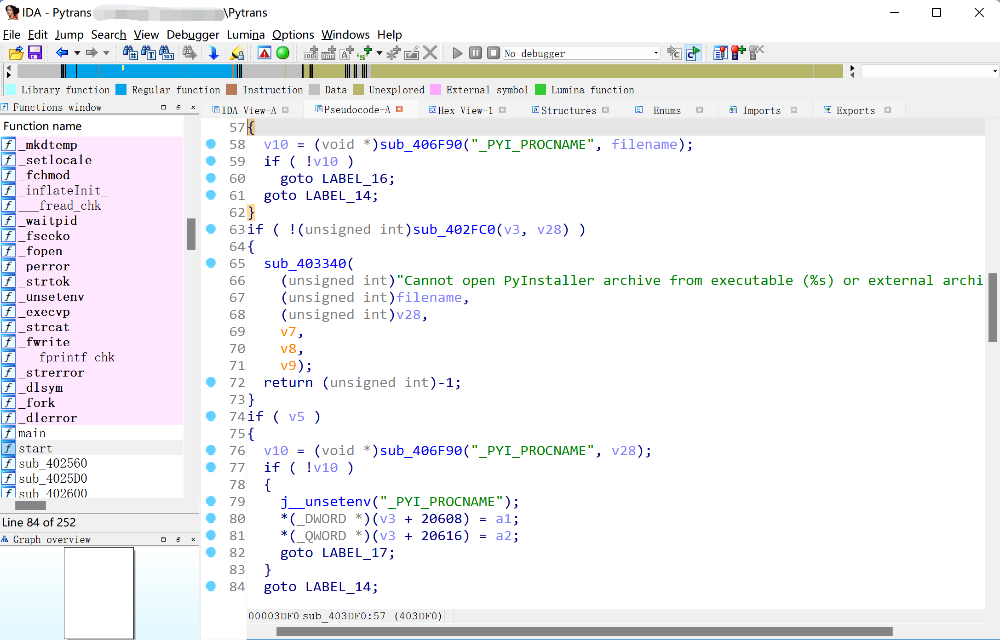
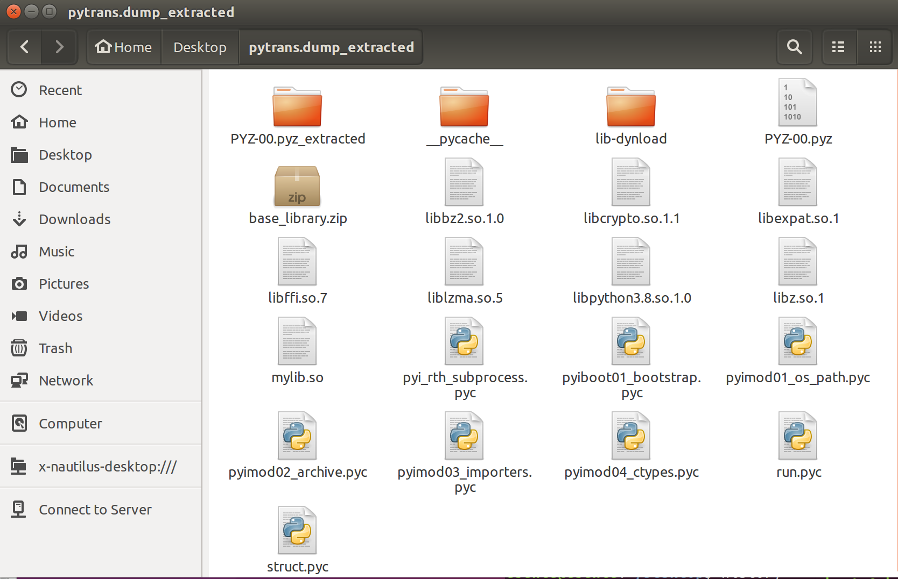
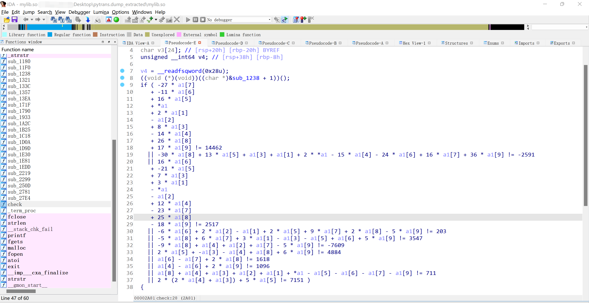
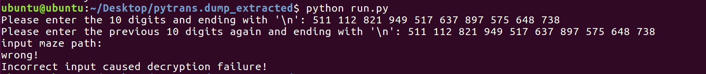

# Pytrans

```
@Name	: Pytrans
@Game	: 2023 年春秋杯网络安全联赛春季赛
@Time	: 2023/5/16 
@Type	: Reverse
@Desc	: pytrans最近又get了一个python知识点，但是当他深入学习的时候发现自己迷失了方向，你能帮他走出来并且拿到flag吗？
```

## 知识点

- pyinstaller 打包文件复原（pyinstxtractor）
- pyc 反编译（uncompyle6）
- python 机器码反编译（dis）
- 十元一次方程组求解
- 迷宫求解

## 工具

- pyinstxtractor：https://github.com/extremecoders-re/pyinstxtractor
- 在线求解线性方程组：http://www.yunsuan.info/matrixcomputations/solvelinearsystems.html

## WriteUp

IDA 打开文件 `Pytrans`，F5 生成伪代码，可见字符串 `Cannot open PyInstaller archive from executable (%s) or external archive (%s)\n`，猜测考点为 pyinstaller 打包 elf 文件复原。



使用 pyinstxtractor 解压文件 `Pytrans`：

```
python2 pyinstxtractor.py pytrans.dump
```



将 `run.pyc` 和 `struct.pyc` 两个 pyc 文件反编译：

```
uncompyle6 run.pyc > run.py
uncompyle6 struct.pyc > struct.py
```

 `run.py`：

```python
import base64, zlib, ctypes
try:
    mylib = ctypes.cdll.LoadLibrary('./mylib.so')
except:
    print('file no exit!')
else:
    a = []
try:
    sstr = input("Please enter the 10 digits and ending with '\\n': ").split(' ')
    if len(sstr) == 10:
        for i in sstr:
            a.append(int(i))

    mylib.check.argtypes = (
     ctypes.POINTER(ctypes.c_int), ctypes.c_int)
    mylib.check.restype = ctypes.c_char_p
    scrambled_code_string = mylib.check((ctypes.c_int * len(a))(*a), len(a))
    try:
        decoded_data = base64.b64decode(scrambled_code_string)
        uncompressed_data = zlib.decompress(decoded_data)
        exec(__import__('marshal').loads(uncompressed_data))
    except:
        print('Incorrect input caused decryption failure!')

except:
    pass
```

`struct.py`：

```python
__all__ = [
 "'calcsize'",  "'pack'",  "'pack_into'",  "'unpack'",  "'unpack_from'", 
 "'iter_unpack'", 
 "'Struct'", 
 "'error'"]
from _struct import *
from _struct import _clearcache
from _struct import __doc__
```

此时有 `run.py` 、 `struct.py` 、`mylib.so` 即可运行程序。根据 `run.py` 源码，程序最开始要输入 10 个数字，并调用了 `mylib.so` 中的 check 函数。

逆向 `mylib.so` 寻找这 10 个数字，IDA 打开，跟进 check 函数。



看到 check 函数最开始有一个条件判断，数组里共有十个数，分别是`a[0]`、`a[1]`...这段代码可以推出一个十元方程组，按照 `a0`、`a1`、`a2`...的顺序整理一下方程组，得到：

```
a0+2*a1-a2+8*a3-14*a4+16*a5-11*a6-27*a7+26*a8+17*a9=14462
2*a0+a1+a3-15*a4+13*a5-24*a6+16*a7-30*a8+36*a9=-2591
-a0+3*a1-a2+7*a3+12*a4-21*a5+16*a6-23*a7+25*a8-18*a9=2517
-a1+2*a2+2*a5-6*a6+9*a7+2*a8-5*a9=203
3*a1-a3-a5+a6+6*a7-5*a8+5*a9=3547
a2+a4+a7-9*a8-5*a9=-7609
-a3-a4+2*a5+a8+6*a9=4884
a6-a7+2*a8=1618
a4-a6+2*a9=1096
a0+a1+a2+a3+a4-a5-a6-a7+a8-a9=711
2*a3+4*a4+5*a5=7151
```

上述十元一次方程组的系数矩阵为：

```
1 2 -1 8 -14 16 -11 -27 26 17
2 1 0 1 -15 13 -24 16 -30 36
-1 3 -1 7 12 -21 16 -23 25 -18
0 -1 2 0 0 2 -6 9 2 -5
0 3 0 -1 0 -1 1 6 -5 5
0 0 1 0 1 0 0 1 -9 -5
0 0 0 -1 -1 2 0 0 1 6
0 0 0 0 0 0 1 -1 2 0
0 0 0 0 1 0 -1 0 0 2
1 1 1 1 1 -1 -1 -1 1 -1
0 0 0 2 4 5 0 0 0 0
```

右边向量为：

```
14462
-2591
2517
203
3547
-7609
4884
1618
1096
711
7151
```

求解十元方程组：

```
a0 = 511 
a1 = 112 
a2 = 821 
a3 = 949 
a4 = 517 
a5 = 637 
a6 = 897 
a7 = 575 
a8 = 648 
a9 = 738
```

运行 `run.py`，提示还需要输入一个 maze path：



查看源代码第 25 行：

```
23 decoded_data = base64.b64decode(scrambled_code_string)
24 uncompressed_data = zlib.decompress(decoded_data)
25 exec(__import__('marshal').loads(uncompressed_data))
```

通过 marshal 库加载了一段序列化数据 uncompressed_data，通过 `dis.dis(data)` 查看 Python 机器码：

```
data = marshal.loads(uncompressed_data)
print(dis.dis(data))
```

```
  2           0 LOAD_CONST               0 ('3qzqns4hj6\neeaxc!4a-%\nd735_@4l6g\nf1gd1v7hdm\n1+$-953}81\na^21vbnm3!\n-#*f-e1d8_\n2ty9uipok-\n6r1802f7d1\n9wez1c-f{0')
              2 STORE_NAME               0 (footprint)

  3           4 BUILD_LIST               0
              6 STORE_NAME               1 (xx0000)

  4           8 LOAD_NAME                0 (footprint)
             10 LOAD_METHOD              2 (split)
             12 LOAD_CONST               1 ('\n')
             14 CALL_METHOD              1
             16 STORE_NAME               3 (footprintlist)

  5          18 LOAD_NAME                4 (range)
             20 LOAD_NAME                5 (len)
             22 LOAD_NAME                3 (footprintlist)
             24 CALL_FUNCTION            1
             26 CALL_FUNCTION            1
             28 GET_ITER
        >>   30 FOR_ITER                22 (to 54)
             32 STORE_NAME               6 (i)

  6          34 LOAD_NAME                1 (xx0000)
             36 LOAD_METHOD              7 (append)
             38 LOAD_NAME                8 (list)
             40 LOAD_NAME                3 (footprintlist)
             42 LOAD_NAME                6 (i)
             44 BINARY_SUBSCR
             46 CALL_FUNCTION            1
             48 CALL_METHOD              1
             50 POP_TOP
             52 JUMP_ABSOLUTE           30

  8     >>   54 LOAD_CONST               2 (<code object xxxx000x0 at 0x7fb181923df0, file "sample.py", line 8>)
             56 LOAD_CONST               3 ('xxxx000x0')
             58 MAKE_FUNCTION            0
             60 STORE_NAME               9 (xxxx000x0)

 12          62 BUILD_LIST               0
             64 STORE_NAME              10 (oxooxxxxxoooo)

 13          66 LOAD_NAME               11 (input)
             68 LOAD_CONST               4 ("Please enter the previous 10 digits again and ending with '\\n': ")
             70 CALL_FUNCTION            1
             72 LOAD_METHOD              2 (split)
             74 LOAD_CONST               5 (' ')
             76 CALL_METHOD              1
             78 STORE_NAME              12 (xx0000000)

 14          80 LOAD_NAME                5 (len)
             82 LOAD_NAME               12 (xx0000000)
             84 CALL_FUNCTION            1
             86 LOAD_CONST               6 (10)
             88 COMPARE_OP               2 (==)
             90 POP_JUMP_IF_FALSE      152

 15          92 SETUP_FINALLY           28 (to 122)

 16          94 LOAD_NAME               12 (xx0000000)
             96 GET_ITER
        >>   98 FOR_ITER                18 (to 118)
            100 STORE_NAME               6 (i)

 17         102 LOAD_NAME               10 (oxooxxxxxoooo)
            104 LOAD_METHOD              7 (append)
            106 LOAD_NAME               13 (int)
            108 LOAD_NAME                6 (i)
            110 CALL_FUNCTION            1
            112 CALL_METHOD              1
            114 POP_TOP
            116 JUMP_ABSOLUTE           98
        >>  118 POP_BLOCK
            120 JUMP_ABSOLUTE          168

 18     >>  122 POP_TOP
            124 POP_TOP
            126 POP_TOP

 19         128 LOAD_NAME               14 (print)
            130 LOAD_CONST               7 ('err input!')
            132 CALL_FUNCTION            1
            134 POP_TOP

 20         136 LOAD_NAME               15 (exit)
            138 LOAD_CONST               8 (-1)
            140 CALL_FUNCTION            1
            142 POP_TOP
            144 POP_EXCEPT
            146 JUMP_ABSOLUTE          168
            148 END_FINALLY
            150 JUMP_FORWARD            16 (to 168)

 22     >>  152 LOAD_NAME               14 (print)
            154 LOAD_CONST               7 ('err input!')
            156 CALL_FUNCTION            1
            158 POP_TOP

 23         160 LOAD_NAME               15 (exit)
            162 LOAD_CONST               8 (-1)
            164 CALL_FUNCTION            1
            166 POP_TOP

 25     >>  168 LOAD_NAME                4 (range)
            170 LOAD_NAME                5 (len)
            172 LOAD_NAME               10 (oxooxxxxxoooo)
            174 CALL_FUNCTION            1
            176 CALL_FUNCTION            1
            178 GET_ITER
        >>  180 FOR_ITER                24 (to 206)
            182 STORE_NAME               6 (i)

 26         184 LOAD_NAME                8 (list)
            186 LOAD_NAME                9 (xxxx000x0)
            188 LOAD_NAME               10 (oxooxxxxxoooo)
            190 LOAD_NAME                6 (i)
            192 BINARY_SUBSCR
            194 CALL_FUNCTION            1
            196 CALL_FUNCTION            1
            198 LOAD_NAME               10 (oxooxxxxxoooo)
            200 LOAD_NAME                6 (i)
            202 STORE_SUBSCR
            204 JUMP_ABSOLUTE          180

 28     >>  206 LOAD_NAME               10 (oxooxxxxxoooo)
            208 STORE_NAME              16 (xx0000x000)

 29         210 LOAD_CONST               9 ((0, 0))
            212 UNPACK_SEQUENCE          2
            214 STORE_NAME              17 (x)
            216 STORE_NAME              18 (o)

 30         218 LOAD_NAME               17 (x)
            220 LOAD_NAME               18 (o)
            222 BUILD_TUPLE              2
            224 BUILD_LIST               1
            226 STORE_NAME              19 (xx00x00x0xxx00)

 31         228 LOAD_NAME                8 (list)
            230 LOAD_NAME               11 (input)
            232 LOAD_CONST              10 ('input maze path:')
            234 CALL_FUNCTION            1
            236 CALL_FUNCTION            1
            238 STORE_NAME              20 (xx00x00x0xxx00input)

 32         240 LOAD_CONST              11 (0)
            242 STORE_NAME              21 (count)

 33     >>  244 LOAD_NAME               17 (x)
            246 LOAD_NAME               18 (o)
            248 BUILD_TUPLE              2
            250 LOAD_CONST              12 ((9, 9))
            252 COMPARE_OP               3 (!=)
            254 EXTENDED_ARG             2
            256 POP_JUMP_IF_FALSE      686

 34         258 LOAD_NAME               21 (count)
            260 LOAD_NAME                5 (len)
            262 LOAD_NAME               20 (xx00x00x0xxx00input)
            264 CALL_FUNCTION            1
            266 COMPARE_OP               0 (<)
            268 EXTENDED_ARG             2
            270 POP_JUMP_IF_FALSE      668

 35         272 LOAD_NAME               20 (xx00x00x0xxx00input)
            274 LOAD_NAME               21 (count)
            276 BINARY_SUBSCR
            278 STORE_NAME              22 (xx0000x0xxx00)

 36         280 LOAD_NAME               22 (xx0000x0xxx00)
            282 LOAD_CONST              13 ('a')
            284 COMPARE_OP               2 (==)
            286 EXTENDED_ARG             1
            288 POP_JUMP_IF_FALSE      374

 37         290 LOAD_NAME               18 (o)
            292 LOAD_CONST              11 (0)
            294 COMPARE_OP               4 (>)
            296 EXTENDED_ARG             1
            298 POP_JUMP_IF_FALSE      354
            300 LOAD_NAME               16 (xx0000x000)
            302 LOAD_NAME               17 (x)
            304 BINARY_SUBSCR
            306 LOAD_NAME               18 (o)
            308 LOAD_CONST              14 (1)
            310 BINARY_SUBTRACT
            312 BINARY_SUBSCR
            314 LOAD_CONST              15 ('0')
            316 COMPARE_OP               2 (==)
            318 EXTENDED_ARG             1
            320 POP_JUMP_IF_FALSE      354

 38         322 LOAD_NAME               18 (o)
            324 LOAD_CONST              14 (1)
            326 INPLACE_SUBTRACT
            328 STORE_NAME              18 (o)

 39         330 LOAD_NAME               21 (count)
            332 LOAD_CONST              14 (1)
            334 INPLACE_ADD
            336 STORE_NAME              21 (count)

 40         338 LOAD_NAME               19 (xx00x00x0xxx00)
            340 LOAD_METHOD              7 (append)
            342 LOAD_NAME               17 (x)
            344 LOAD_NAME               18 (o)
            346 BUILD_TUPLE              2
            348 CALL_METHOD              1
            350 POP_TOP
            352 JUMP_FORWARD            16 (to 370)

 42     >>  354 LOAD_NAME               14 (print)
            356 LOAD_CONST              16 ('wrong!')
            358 CALL_FUNCTION            1
            360 POP_TOP

 43         362 LOAD_NAME               15 (exit)
            364 LOAD_CONST               8 (-1)
            366 CALL_FUNCTION            1
            368 POP_TOP
        >>  370 EXTENDED_ARG             2
            372 JUMP_ABSOLUTE          684

 44     >>  374 LOAD_NAME               22 (xx0000x0xxx00)
            376 LOAD_CONST              17 ('d')
            378 COMPARE_OP               2 (==)
            380 EXTENDED_ARG             1
            382 POP_JUMP_IF_FALSE      466

 45         384 LOAD_NAME               18 (o)
            386 LOAD_CONST              18 (9)
            388 COMPARE_OP               0 (<)
            390 EXTENDED_ARG             1
            392 POP_JUMP_IF_FALSE      448
            394 LOAD_NAME               16 (xx0000x000)
            396 LOAD_NAME               17 (x)
            398 BINARY_SUBSCR
            400 LOAD_NAME               18 (o)
            402 LOAD_CONST              14 (1)
            404 BINARY_ADD
            406 BINARY_SUBSCR
            408 LOAD_CONST              15 ('0')
            410 COMPARE_OP               2 (==)
            412 EXTENDED_ARG             1
            414 POP_JUMP_IF_FALSE      448

 46         416 LOAD_NAME               21 (count)
            418 LOAD_CONST              14 (1)
            420 INPLACE_ADD
            422 STORE_NAME              21 (count)

 47         424 LOAD_NAME               18 (o)
            426 LOAD_CONST              14 (1)
            428 INPLACE_ADD
            430 STORE_NAME              18 (o)

 48         432 LOAD_NAME               19 (xx00x00x0xxx00)
            434 LOAD_METHOD              7 (append)
            436 LOAD_NAME               17 (x)
            438 LOAD_NAME               18 (o)
            440 BUILD_TUPLE              2
            442 CALL_METHOD              1
            444 POP_TOP
            446 JUMP_FORWARD            16 (to 464)

 50     >>  448 LOAD_NAME               14 (print)
            450 LOAD_CONST              16 ('wrong!')
            452 CALL_FUNCTION            1
            454 POP_TOP

 51         456 LOAD_NAME               15 (exit)
            458 LOAD_CONST               8 (-1)
            460 CALL_FUNCTION            1
            462 POP_TOP
        >>  464 JUMP_FORWARD           200 (to 666)

 52     >>  466 LOAD_NAME               22 (xx0000x0xxx00)
            468 LOAD_CONST              19 ('w')
            470 COMPARE_OP               2 (==)
            472 EXTENDED_ARG             2
            474 POP_JUMP_IF_FALSE      558

 53         476 LOAD_NAME               17 (x)
            478 LOAD_CONST              11 (0)
            480 COMPARE_OP               4 (>)
            482 EXTENDED_ARG             2
            484 POP_JUMP_IF_FALSE      540
            486 LOAD_NAME               16 (xx0000x000)
            488 LOAD_NAME               17 (x)
            490 LOAD_CONST              14 (1)
            492 BINARY_SUBTRACT
            494 BINARY_SUBSCR
            496 LOAD_NAME               18 (o)
            498 BINARY_SUBSCR
            500 LOAD_CONST              15 ('0')
            502 COMPARE_OP               2 (==)
            504 EXTENDED_ARG             2
            506 POP_JUMP_IF_FALSE      540

 54         508 LOAD_NAME               21 (count)
            510 LOAD_CONST              14 (1)
            512 INPLACE_ADD
            514 STORE_NAME              21 (count)

 55         516 LOAD_NAME               17 (x)
            518 LOAD_CONST              14 (1)
            520 INPLACE_SUBTRACT
            522 STORE_NAME              17 (x)

 56         524 LOAD_NAME               19 (xx00x00x0xxx00)
            526 LOAD_METHOD              7 (append)
            528 LOAD_NAME               17 (x)
            530 LOAD_NAME               18 (o)
            532 BUILD_TUPLE              2
            534 CALL_METHOD              1
            536 POP_TOP
            538 JUMP_FORWARD            16 (to 556)

 58     >>  540 LOAD_NAME               14 (print)
            542 LOAD_CONST              16 ('wrong!')
            544 CALL_FUNCTION            1
            546 POP_TOP

 59         548 LOAD_NAME               15 (exit)
            550 LOAD_CONST               8 (-1)
            552 CALL_FUNCTION            1
            554 POP_TOP
        >>  556 JUMP_FORWARD           108 (to 666)

 60     >>  558 LOAD_NAME               22 (xx0000x0xxx00)
            560 LOAD_CONST              20 ('s')
            562 COMPARE_OP               2 (==)
            564 EXTENDED_ARG             2
            566 POP_JUMP_IF_FALSE      650

 61         568 LOAD_NAME               17 (x)
            570 LOAD_CONST              18 (9)
            572 COMPARE_OP               0 (<)
            574 EXTENDED_ARG             2
            576 POP_JUMP_IF_FALSE      632
            578 LOAD_NAME               16 (xx0000x000)
            580 LOAD_NAME               17 (x)
            582 LOAD_CONST              14 (1)
            584 BINARY_ADD
            586 BINARY_SUBSCR
            588 LOAD_NAME               18 (o)
            590 BINARY_SUBSCR
            592 LOAD_CONST              15 ('0')
            594 COMPARE_OP               2 (==)
            596 EXTENDED_ARG             2
            598 POP_JUMP_IF_FALSE      632

 62         600 LOAD_NAME               21 (count)
            602 LOAD_CONST              14 (1)
            604 INPLACE_ADD
            606 STORE_NAME              21 (count)

 63         608 LOAD_NAME               17 (x)
            610 LOAD_CONST              14 (1)
            612 INPLACE_ADD
            614 STORE_NAME              17 (x)

 64         616 LOAD_NAME               19 (xx00x00x0xxx00)
            618 LOAD_METHOD              7 (append)
            620 LOAD_NAME               17 (x)
            622 LOAD_NAME               18 (o)
            624 BUILD_TUPLE              2
            626 CALL_METHOD              1
            628 POP_TOP
            630 JUMP_FORWARD            16 (to 648)

 66     >>  632 LOAD_NAME               14 (print)
            634 LOAD_CONST              16 ('wrong!')
            636 CALL_FUNCTION            1
            638 POP_TOP

 67         640 LOAD_NAME               15 (exit)
            642 LOAD_CONST               8 (-1)
            644 CALL_FUNCTION            1
            646 POP_TOP
        >>  648 JUMP_FORWARD            16 (to 666)

 69     >>  650 LOAD_NAME               14 (print)
            652 LOAD_CONST              16 ('wrong!')
            654 CALL_FUNCTION            1
            656 POP_TOP

 70         658 LOAD_NAME               15 (exit)
            660 LOAD_CONST               8 (-1)
            662 CALL_FUNCTION            1
            664 POP_TOP
        >>  666 JUMP_ABSOLUTE          244

 72     >>  668 LOAD_NAME               14 (print)
            670 LOAD_CONST              16 ('wrong!')
            672 CALL_FUNCTION            1
            674 POP_TOP

 73         676 LOAD_NAME               15 (exit)
            678 LOAD_CONST               8 (-1)
            680 CALL_FUNCTION            1
            682 POP_TOP
        >>  684 JUMP_ABSOLUTE          244

 75     >>  686 LOAD_NAME               14 (print)
            688 LOAD_CONST              21 ('right! you maybe got it,flag is flag{the footprint of the maze path}')
            690 CALL_FUNCTION            1
            692 POP_TOP
            694 LOAD_CONST              22 (None)
            696 RETURN_VALUE

Disassembly of <code object xxxx000x0 at 0x7fb181923df0, file "sample.py", line 8>:
  9           0 LOAD_GLOBAL              0 (format)
              2 LOAD_FAST                0 (num)
              4 LOAD_CONST               1 ('010b')
              6 CALL_FUNCTION            2
              8 STORE_FAST               1 (xx000000)

 10          10 LOAD_FAST                1 (xx000000)
             12 RETURN_VALUE
```

按行依次反编译这段机器码，得到大致如下的代码：

```python
def main():
    footprint = '3qzqns4hj6\neeaxc!4a-%\nd735_@4l6g\nf1gd1v7hdm\n1+$-953}81\na^21vbnm3!\n-#*f-e1d8_\n2ty9uipok-\n6r1802f7d1\n9wez1c-f{0'
    xx0000 = []
    footprintlist = footprint.split('\n')
    for i in range(len(footprintlist)):
        xx0000.append(list(footprintlist[i]))
        
        def xxxx000x0(num):
                xx000000 = format(num,'010b')
                return xx000000

    oxooxxxxxoooo = []
    xx0000000 = input("Please enter the previous 10 digits again and ending with '\\n': ").split(' ')
    if len(xx0000000) == 10:
            try:
                    for i in xx0000000:
                            oxooxxxxxoooo.append(int(i))
            except:
                    print('err input!')
                    exit(-1)
    else:           
            print('err input!')
            exit(-1)  
    
    for i in range(len(oxooxxxxxoooo)):
            oxooxxxxxoooo[i] = list(xxxx000x0(oxooxxxxxoooo[i]))
            print(oxooxxxxxoooo)
            xx0000x000 = oxooxxxxxoooo
            x,o = (0,0)
            xx00x00x0xxx00 = (x,o)
    print(oxooxxxxxoooo) # oxooxxxxxoooo 即为迷宫的路径
    xx00x00x0xxx00input = list(input('input maze path:'))

    count = 0
    if (x,o) != (9,9):
        if count < len(xx00x00x0xxx00input):
            xx0000x0xxx00 = xx00x00x0xxx00input[count]
            if xx0000x0xxx00 == 'a':
                    if o > 0 and xx0000x000[x][o-1] == 0:
                        o = o-1
                        count = count + 1
                        xx00x00x0xxx00.append(x,o)
                    else:
                        print('wrong')
                        exit(-1)
            if xx0000x0xxx00 == 'd':
                    if o < 9 and xx0000x000[x][o-1] == 0:
                        count =count +1
                        o = o + 1
                        xx00x00x0xxx00.append(x,o)
                    else:
                        print('wrong')
                        exit(-1)
            if xx0000x0xxx00 == 'w':
                    if x > 0 and xx0000x000[x-1][o] == 0:
                        count = count + 1
                        x = x - 1
                        xx00x00x0xxx00.append(x,o)
                    else:
                        print('wrong')
                        exit(-1)
            if xx0000x0xxx00 == 's':
                    if x < 9 and xx0000x000[x-1][o] == 0:
                        count = count + 1
                        x =  x + 1
                        xx00x00x0xxx00.append(x,o)
                    else:
                        print('wrong')
                        exit(-1)
        else:
            print('wrong')
            exit(-1)
    else:
        print('wrong')
        exit(-1)

    print('right! you maybe got it,flag is flag{the footprint of the maze path}')


# print(__import__('dis').dis(main))
main()
```

得到迷宫 `oxooxxxxxoooo`：

```
0, 1, 1, 1, 1, 1, 1, 1, 1, 1
0, 0, 0, 1, 1, 1, 0, 0, 0, 0
1, 1, 0, 0, 1, 1, 0, 1, 0, 1
1, 1, 1, 0, 1, 1, 0, 1, 0, 1
1, 0, 0, 0, 0, 0, 0, 1, 0, 1
1, 0, 0, 1, 1, 1, 1, 1, 0, 1
1, 1, 1, 0, 0, 0, 0, 0, 0, 1
1, 0, 0, 0, 1, 1, 1, 1, 1, 1
1, 0, 1, 0, 0, 0, 1, 0, 0, 0
1, 0, 1, 1, 1, 0, 0, 0, 1, 0
```

解出迷宫的路径：

```
sddsdssdddwwwddsssssaaaaassddsddwdds
```

但是这里并不是最终的 flag，需要按相同的路径走一遍最开始定义的 footprint，得到最终的 flag：

```
3, q, z, q, n, s, 4, h, j, 6
e, e, a, x, c, !, 4, a, -, %
d, 7, 3, 5, _, @, 4, l, 6, g
f, 1, g, d, 1, v, 7, h, d, m
1, +, $, -, 9, 5, 3, }, 8, 1
a, ^, 2, 1, v, b, n, m, 3, !
-, #, *, f, -, e, 1, d, 8, _
2, t, y, 9, u, i, p, o, k, -
6, r, 1, 8, 0, 2, f, 7, d, 1
9, w, e, z, 1, c, -, f, {, 0
```

按照 `sddsdssdddwwwddsssssaaaaassddsddwdds` 走一遍迷宫，得到最终的路径 flag：

```
flag{3eea35d-953744a-6d838d1e-f9802c-f7d10}
```

